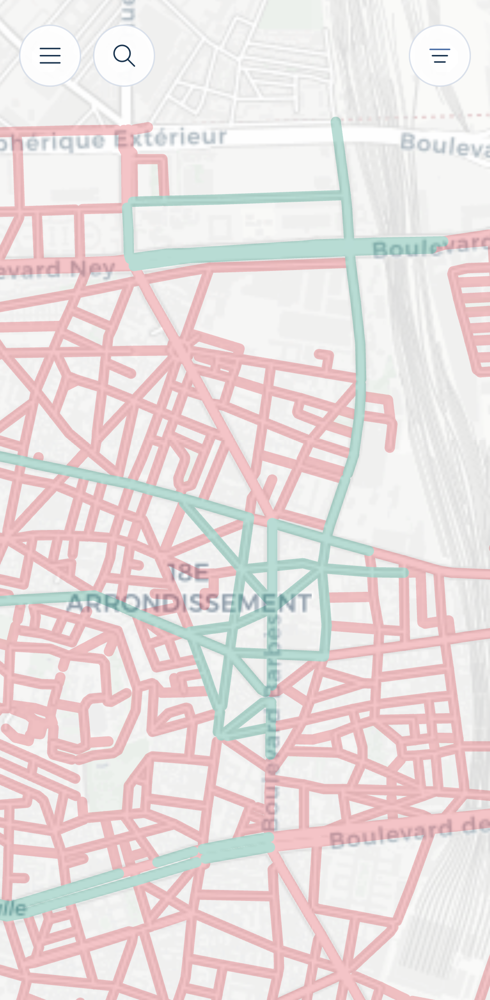
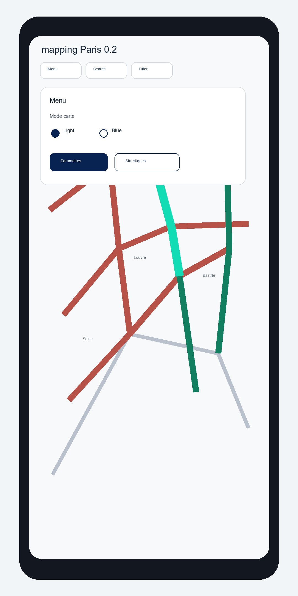
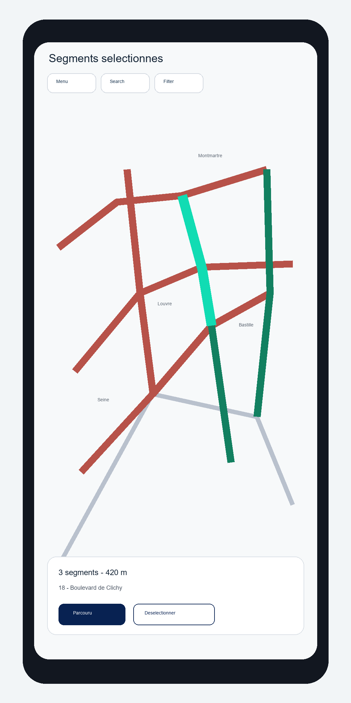
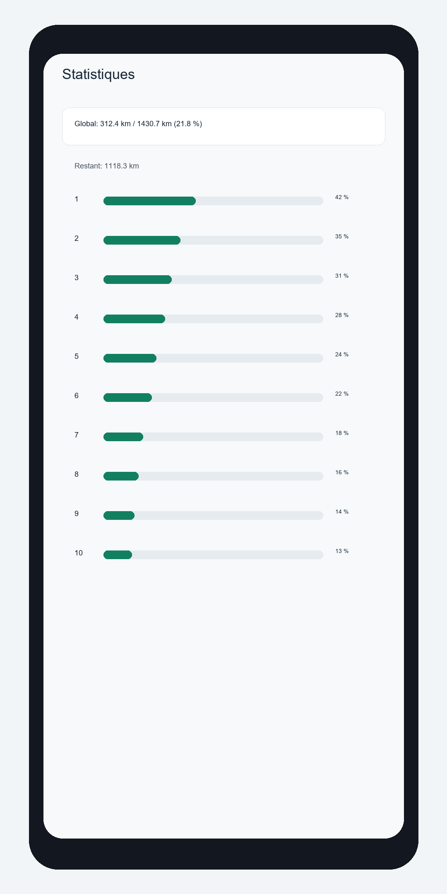

# mapping_Paris

`mapping_Paris` is a local-first personal app for tracking manually completed
street segments in Paris.

The project deliberately keeps three things separate:

- the source street segment dataset generated from OpenStreetMap;
- the user's completion or validation state;
- the Android app and local PWA inspection tooling.

The Android app remains local-first: there is no account system, no cloud sync,
and no automatic segment validation. A local Strava B2 backend prototype now
exists for manual proposal review, but accepted backend proposals do not update
local completion state yet.

## Current State

The repository now contains:

- an Android Kotlin / Jetpack Compose scaffold;
- a local Room database for user progress persistence;
- an osmdroid map integration in the Android app;
- a generated Paris street segment dataset at
  `data/generated/paris_segments.geojson`;
- the same generated dataset packaged in the Android asset
  `app/src/main/assets/paris_segments.geojson`;
- a local PWA tester in `pwa/` for visual inspection and manual validation;
- a repeatable OSM generation and validation pipeline in
  `tools/segment_pipeline/`;
- a small dependency-free Node dev server exposed through `npm run dev`.

The generated dataset currently contains `18,963` visible street geometries and
`18,001` logical clickable blocks.

## Version 0.2 Preview

Version 0.2 focuses on making the Android app usable as a map-first mobile
tool: a compact top-left menu, contextual bottom actions only when segments are
selected, import/export, search, filters, light/blue map modes, and refreshed
project visuals.

| Map | Menu |
| --- | --- |
|  |  |

| Selection | Statistics |
| --- | --- |
|  |  |

## Version 0.3 GPS Preview

Version 0.3 adds foreground GPS assistance to the Android app while keeping the
project local-first and manual-first.

The Android app can now:

- request foreground location permission when GPS is used;
- show the current position and accuracy radius on the map;
- recenter only when the GPS button is pressed;
- keep GPS-assisted behavior disabled by default on first install;
- expose GPS assistance and matching strictness in settings;
- expose a configurable GPS segment coverage threshold, default `70%`;
- use the foreground GPS path to propose likely covered segments as editable
  selections;
- require at least two GPS positions spanning the configured share of a segment
  before proposing it;
- keep final completion under explicit user control.

GPS data stays local to the device. When GPS assistance is enabled, the app can
keep tracking through a foreground service while the phone is locked. There is
no automatic segment completion, no route upload, and no cloud sync.

## Strava B2 Backend Preview

The repository also contains a local FastAPI backend prototype under
`backend/`. Android can now connect to this B2 backend from the in-app
`Propositions Strava B2` panel.

Run the backend locally from PowerShell:

```powershell
cd backend
.\.venv\Scripts\Activate.ps1
.\scripts\init-local-db.ps1
.\scripts\run-local-backend.ps1
```

Then configure the backend URL in the Android panel:

- Android emulator: `http://10.0.2.2:8000`
- physical phone: use the PC LAN IP, for example `http://192.168.x.x:8000`,
  with the phone and PC on the same Wi-Fi.

`localhost` on a physical phone means the phone itself, not the PC. The backend
must also be allowed through the local firewall if Windows blocks the port.

Current B2 Android scope:

- health/status checks;
- manual Strava sync trigger;
- manual proposal generation trigger;
- loading and highlighting proposed segments;
- validating a proposal with confirmation, which accepts it on the backend and
  marks the matching local logical segment as completed;
- ignoring a proposal on the backend without changing local progression;
- bulk actions for currently loaded proposals: `Tout valider` and
  `Tout ignorer`, both protected by confirmation.

Important: Strava B2 still does not automatically complete streets. Local
progress is changed only after an explicit Android user action. `Tout valider`
applies only to currently loaded proposed proposals, not every proposal that may
exist on the backend.

The Android review list is filtered before display. It only shows new segments
that can actually be validated locally:

- proposals recognized in the Android segment dataset;
- proposals mapped to a local logical segment;
- proposals whose local logical segment is not already completed;
- one best proposal per local logical segment.

Non-recognized proposals, already completed local segments, and duplicate
backend proposals stay hidden from the main review list. They are not deleted
from the backend silently.

The B2 panel includes diagnostics to explain proposal/map differences:
backend proposals loaded, non-recognized hidden proposals, already completed
hidden proposals, reviewable proposals, highlighted logical groups, and
highlighted local geometries. A large proposal list can collapse to fewer orange
highlights because several Strava activities can propose the same logical street
segment.

Local E2E checks:

```powershell
backend\scripts\e2e-check-local.ps1
```

Real Strava validation requires an untracked `backend/.env` containing
`TOKEN_ENCRYPTION_KEY`, `STRAVA_CLIENT_ID`, `STRAVA_CLIENT_SECRET`, and
`STRAVA_REDIRECT_URI`. See `backend/README.md` for the full checklist.

Remaining B2 work:

- backend deployment;
- release packaging;
- optional backend bulk endpoints if Android-side loops become too slow;
- matching threshold tuning after more route samples.

## Segment Dataset

The current V1 dataset is generated from OpenStreetMap and keeps streets whose
midpoint falls inside a pragmatic Boulevard Peripherique polygon.

Included OSM `highway` values:

- `primary`
- `secondary`
- `tertiary`
- `residential`
- `unclassified`
- `living_street`
- `pedestrian`

Excluded in the first inspection pass:

- `footway`
- `path`
- `steps`
- `cycleway`
- private, inaccessible, service-only, or irrelevant ways

This keeps the map close to the street network instead of tripling most streets
with separately mapped sidewalks or internal park/building paths. Private alleys
such as `Square de Port-Royal` and `Impasse de la Santé` are intentionally not
included while they remain tagged as private service alleys in OSM.

Regenerate the dataset:

```powershell
py -3 tools\segment_pipeline\generate_paris_segments.py --refresh
```

Validate the dataset:

```powershell
py -3 tools\segment_pipeline\validate_segments.py
```

## PWA Tester

The PWA is the current inspection surface for the generated segment mesh before
Android import.

Run it locally:

```powershell
npm run dev
```

Then open the URL printed by the server, normally:

```text
http://localhost:5173/pwa/
```

If port `5173` is already in use, the dev server automatically tries the next
available port and prints the final URL.

The tester supports:

- Leaflet canvas rendering of the full segment mesh;
- startup zoom directly on Paris;
- map bounds constrained around Paris / Ile-de-France;
- click-to-select one or more segments;
- validate or unvalidate the selected segment set;
- localStorage persistence for validation state;
- export of validated segment ids to JSON.

PWA checks:

```powershell
npm run check:pwa
py -3 tools\segment_pipeline\validate_pwa.py
```

## Android APK Build

The local machine has been prepared with:

- JDK 17 Temurin;
- Android SDK command line tools;
- `platform-tools`;
- `platforms;android-35`;
- `build-tools;35.0.0`.

The expected environment variables are:

```text
JAVA_HOME=C:\Program Files\Eclipse Adoptium\jdk-17.0.19.10-hotspot
ANDROID_HOME=C:\Users\Pmondou\AppData\Local\Android\Sdk
ANDROID_SDK_ROOT=C:\Users\Pmondou\AppData\Local\Android\Sdk
```

Build a debug APK:

```powershell
.\gradlew.bat assembleDebug
```

If a reused Gradle daemon hangs, use:

```powershell
.\gradlew.bat --no-daemon --stacktrace assembleDebug
```

Expected output:

```text
app\build\outputs\apk\debug\mapping-paris-<version>-debug.apk
```

### Debug Install And Signature Mismatch

Use the local helper to build and install the latest debug APK on a connected
Android device:

```powershell
cmd /c tools\build-and-install-debug-apk.cmd
```

If Android reports `INSTALL_FAILED_UPDATE_INCOMPATIBLE`, the phone already has
`com.jilanos.mappingparis` installed with a different signing key. This commonly
happens when a previous debug APK was built from another machine, another
checkout, or another debug keystore. Android will not update that app in place.

Do not uninstall blindly if the app contains progress you want to keep. First
open the app and export the progression. Then uninstall and reinstall:

```powershell
& "$env:LOCALAPPDATA\Android\Sdk\platform-tools\adb.exe" uninstall com.jilanos.mappingparis
cmd /c tools\build-and-install-debug-apk.cmd
```

Uninstalling deletes local Room data, settings, and any progression that has not
been exported.

## Validation Commands

Useful project checks:

```powershell
py -3 tools\segment_pipeline\validate_segments.py
py -3 tools\segment_pipeline\validate_pwa.py
npm run check:pwa
node --check tools\dev-server.mjs
.\gradlew.bat --no-daemon --stacktrace assembleDebug
```

## Documentation

Project documentation lives under `docs/`:

- `docs/product/` for product intent and scope;
- `docs/adr/` for architecture decisions;
- `docs/request/` for high-level requests;
- `docs/backlog/` for delivery slices;
- `docs/tasks/` for executable task tracking;
- `docs/data/` for dataset contracts and generation notes;
- `docs/development/` for local build and development notes.

## Non-Goals

The current V1 does not target:

- backend services;
- user accounts;
- cloud sync;
- automatic GPS validation;
- closed-app route history or cloud GPS tracking;
- Play Store publication;
- perfect GIS topology.
