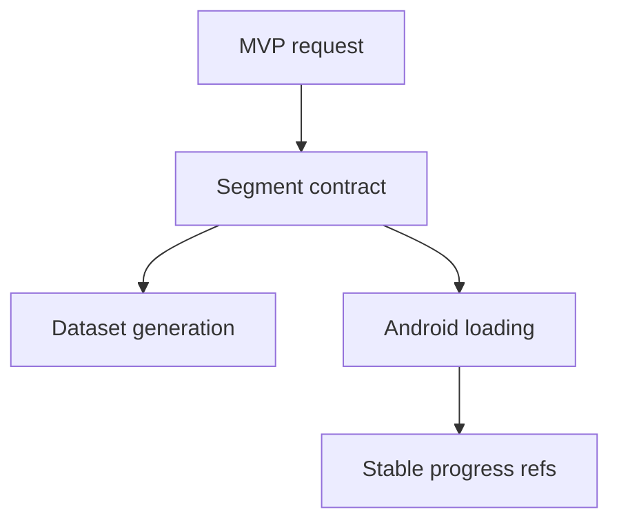

# Backlog 0002: MVP Segment Data Contract

From version: 0.0.0

Status: Ready

Understanding: 95%

Confidence: 90%

Progress: 0%

Complexity: Medium

Theme: Data

## Source

- Request: `docs/request/0001-deliver-manual-paris-segment-tracking-mvp.md`
- ADR: `docs/adr/0001-data-source-and-segment-model.md`
- Product brief: `docs/product/product-brief.md`

## Context

The Android app and the future OSM preprocessing pipeline need a shared segment contract before implementation starts.

## Description

Define the canonical source segment schema used by the generated dataset and consumed by the Android app.

## Scope

In:

- Define required segment fields.
- Define stable segment id expectations.
- Define geometry format expectations for a polyline.
- Define arrondissement attribution expectations.
- Define optional accessibility metadata.
- State explicitly that completion state is not part of source segment data.

Out:

- Implement the OSM pipeline.
- Create Android parsing code.
- Create a complete Paris dataset.

## Acceptance criteria

- The segment contract documents `id`, street name, arrondissement, length in meters, geometry polyline, and optional accessibility metadata.
- The contract states that `completed` is not present in the source dataset.
- The contract states that segment ids are predefined before app integration and are treated as stable references.
- The contract allows approximate arrondissement attribution when a segment is ambiguous.
- The contract allows simplified geometry when it remains useful for map display.
- The contract is usable by both the pipeline task and Android loading task.

## Priority

Priority: Must

Impact: High

Urgency: High

## Notes

This item should be completed before dataset generation and Android loading work.

## Risks

- If ids are not stable enough, local completion state may become hard to preserve across dataset refreshes.
- If the schema is too broad, V1 implementation may become slower than needed.
