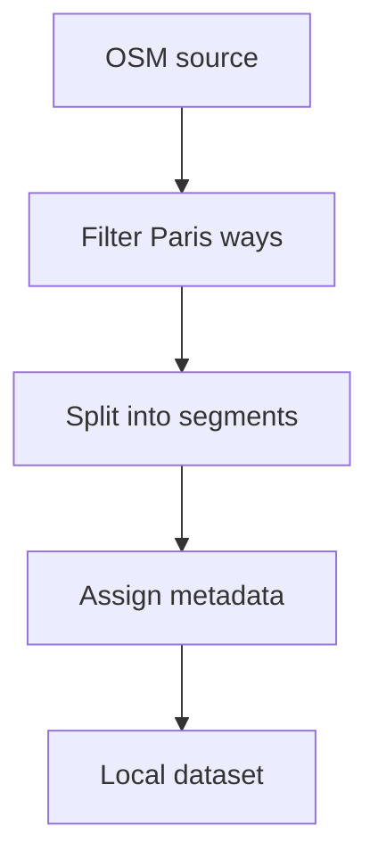

# Backlog 0003: MVP OSM Segment Dataset

From version: 0.0.0

Status: Done

Understanding: 90%

Confidence: 85%

Progress: 100%

Complexity: High

Theme: Data

## Source

- Request: `docs/request/0001-deliver-manual-paris-segment-tracking-mvp.md`
- Depends on: `docs/backlog/0002-mvp-segment-data-contract.md`
- ADR: `docs/adr/0001-data-source-and-segment-model.md`

## Context

The app needs a local preprocessed Paris segment file before it can render or track completion.

## Description

Prepare the first usable Paris intra-muros segment dataset from OpenStreetMap for the MVP.

## Scope

In:

- Define pragmatic OSM filtering rules for normal streets, pedestrian ways, and cycleable paths.
- Exclude clearly private, inaccessible, or irrelevant ways.
- Exclude the Bois de Boulogne and the Bois de Vincennes.
- Split streets into segments between intersections.
- Assign stable segment ids before app integration.
- Assign arrondissement metadata pragmatically.
- Export a local app-consumable file, probably GeoJSON.

Out:

- Offline map tiles.
- Perfect GIS completeness.
- GPS validation.
- Runtime geospatial processing inside Android.

## Acceptance criteria

- A local segment dataset exists for Paris intra-muros.
- The dataset excludes the Bois de Boulogne and the Bois de Vincennes.
- Each segment follows the contract from `docs/backlog/0002-mvp-segment-data-contract.md`.
- Segment ids are stable within the produced dataset.
- Geometry can be simplified but remains visually useful for the map.
- The dataset contains no user completion state.
- The generation approach is documented enough to be repeated.

## Priority

Priority: Must

Impact: High

Urgency: High

## Notes

This item can produce a simple first dataset. The filtering rules can be improved later after visual inspection.

## Task coverage

- `docs/tasks/0002-deliver-manual-paris-segment-tracking-mvp.md`

## Risks

- OSM tag filtering may initially include too many or too few ways.
- Segment splitting around complex intersections may need pragmatic simplifications.
