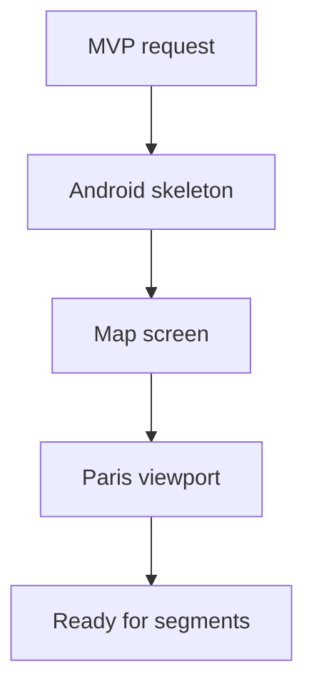

# Backlog 0004: MVP Android Map Foundation

From version: 0.0.0

Status: Blocked

Understanding: 95%

Confidence: 90%

Progress: 85%

Complexity: High

Theme: Android

## Source

- Request: `docs/request/0001-deliver-manual-paris-segment-tracking-mvp.md`
- Product brief: `docs/product/product-brief.md`

## Context

The MVP needs a minimal Android shell that can display Paris on an online OSM map before segment interaction is added.

## Description

Create the Android application foundation using Kotlin, Jetpack Compose, simple MVVM, and osmdroid.

## Scope

In:

- Initialize the Android project skeleton.
- Configure Kotlin and Jetpack Compose.
- Add osmdroid for the online OSM map.
- Create a simple map screen centered on Paris intra-muros.
- Keep architecture simple and compatible with MVVM.
- Keep APK generation possible from the project.

Out:

- Segment rendering.
- Completion storage.
- Statistics.
- Offline maps.
- Play Store configuration.

## Acceptance criteria

- The Android project builds locally.
- The app launches to a map screen.
- The map uses online OSM tiles.
- The initial viewport is centered on Paris intra-muros.
- No backend, account, cloud sync, GPS validation, or Play Store setup is introduced.
- The structure remains simple enough for future segment rendering and local persistence tasks.

## Priority

Priority: Must

Impact: High

Urgency: High

## Notes

This is the first Android implementation slice. Keep dependencies limited to what is needed for the MVP foundation.

## Task coverage

- `docs/tasks/0002-deliver-manual-paris-segment-tracking-mvp.md`

## Risks

- osmdroid and Compose integration may require a pragmatic interop layer.
- Early over-architecture would slow the MVP.
