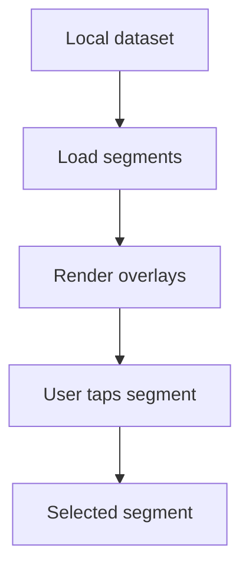

# Backlog 0005: MVP Segment Loading, Rendering, and Selection

From version: 0.0.0

Status: Ready

Understanding: 95%

Confidence: 85%

Progress: 0%

Complexity: High

Theme: Map UI

## Source

- Request: `docs/request/0001-deliver-manual-paris-segment-tracking-mvp.md`
- Depends on: `docs/backlog/0002-mvp-segment-data-contract.md`
- Depends on: `docs/backlog/0003-mvp-osm-segment-dataset.md`
- Depends on: `docs/backlog/0004-mvp-android-map-foundation.md`

## Context

The app becomes useful once it can load local segments, draw them over the map, and let the user select a segment.

## Description

Load the local segment dataset in the Android app, render the segments over the map, and support selecting one segment.

## Scope

In:

- Bundle or load the local segment dataset.
- Parse segment geometry and metadata.
- Render street segments on top of the OSM map.
- Provide visual states for default and selected segments.
- Support selecting one segment.
- Keep the interaction manual.

Out:

- Multi-selection.
- Completion persistence.
- Statistics.
- GPS validation.
- Dataset generation.

## Acceptance criteria

- The app loads the local segment dataset without network dependency for segment data.
- Rendered segments are visible on top of the OSM base map.
- Segment rendering remains understandable at normal Paris map zoom levels.
- The user can select one segment.
- The selected segment has a clear visual state.
- Selection uses the stable segment id from the source data.
- No completion state is written into the source dataset.

## Priority

Priority: Must

Impact: High

Urgency: High

## Notes

This item should avoid optimizing for every possible interaction pattern before the single-segment flow is reliable.

## Risks

- Rendering too many segments may affect performance.
- Tap selection may need tolerance tuning to feel usable.
