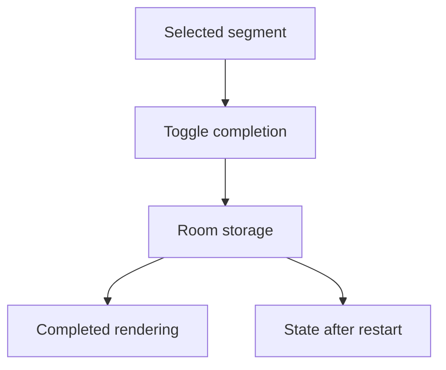

# Backlog 0006: MVP Local Completion State

From version: 0.0.0

Status: Ready

Understanding: 95%

Confidence: 90%

Progress: 0%

Complexity: Medium

Theme: Persistence

## Source

- Request: `docs/request/0001-deliver-manual-paris-segment-tracking-mvp.md`
- Depends on: `docs/backlog/0005-mvp-segment-loading-rendering-selection.md`
- ADR: `docs/adr/0001-data-source-and-segment-model.md`

## Context

Manual segment tracking only becomes durable when the app stores completion state locally and separately from the segment source dataset.

## Description

Add local completion persistence so the user can mark a selected segment as completed or not completed.

## Scope

In:

- Add Room for local progress storage.
- Store completion by stable segment id.
- Toggle completion manually for a selected segment.
- Reflect completion state in segment rendering.
- Preserve completion state after app restart.

Out:

- GPS validation.
- Cloud synchronization.
- User accounts.
- Editing source segment data.
- Multi-device sync.

## Acceptance criteria

- The user can mark a selected segment as completed.
- The user can mark a completed segment as not completed.
- Completion state is stored locally with Room or an equivalent local persistence layer.
- Completion state is keyed by stable segment id.
- Completion state persists after app restart.
- The source segment dataset remains read-only and contains no `completed` field.
- Completed and not completed segments are visually distinguishable.

## Priority

Priority: Must

Impact: High

Urgency: High

## Notes

This item completes the core manual tracking loop for one segment at a time.

## Risks

- If future dataset ids change, completion state may need migration support.
- Storage should stay simple until real migration needs appear.
