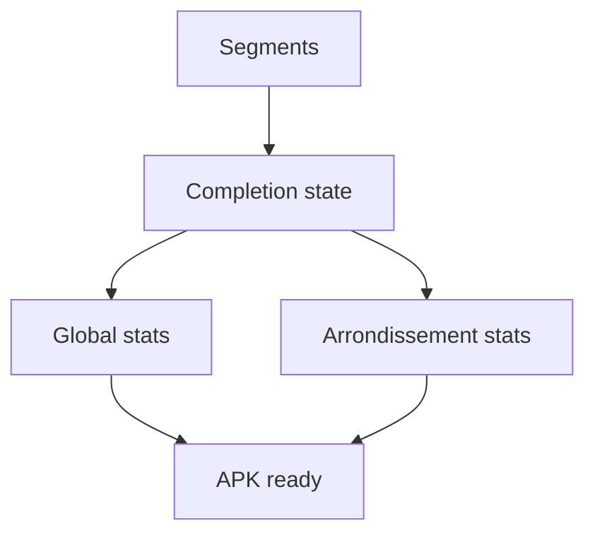

# Backlog 0007: MVP Statistics and APK

From version: 0.0.0

Status: Done

Understanding: 95%

Confidence: 90%

Progress: 100%

Complexity: Medium

Theme: Release

## Source

- Request: `docs/request/0001-deliver-manual-paris-segment-tracking-mvp.md`
- Depends on: `docs/backlog/0006-mvp-local-completion-state.md`

## Context

The MVP should provide visible progress feedback and be distributable as a local APK for personal use.

## Description

Compute useful progress statistics and prepare a local APK build for the first personal MVP.

## Scope

In:

- Compute completed distance and completion percentage globally.
- Compute completed distance and completion percentage by arrondissement.
- Display the statistics in a simple app view or panel.
- Ensure local APK generation works.
- Document the build command and produced artifact location.

Out:

- Play Store release.
- Analytics.
- Cloud reporting.
- Advanced charts.
- Offline map packaging.

## Acceptance criteria

- The app shows global completion distance and percentage.
- The app shows completion distance and percentage by arrondissement.
- Statistics use segment lengths from source data and completion state from local storage.
- Statistics remain consistent after app restart.
- A local APK can be generated.
- The APK is suitable for personal installation.
- No Play Store, backend, account, or cloud sync setup is introduced.

## Priority

Priority: Must

Impact: High

Urgency: Medium

## Notes

This item turns the manual tracking loop into a complete personal MVP deliverable.

## Task coverage

- `docs/tasks/0002-deliver-manual-paris-segment-tracking-mvp.md`

## Risks

- Statistics can be misleading if segment length data is missing or inconsistent.
- APK signing details should stay minimal until there is a real distribution need.
