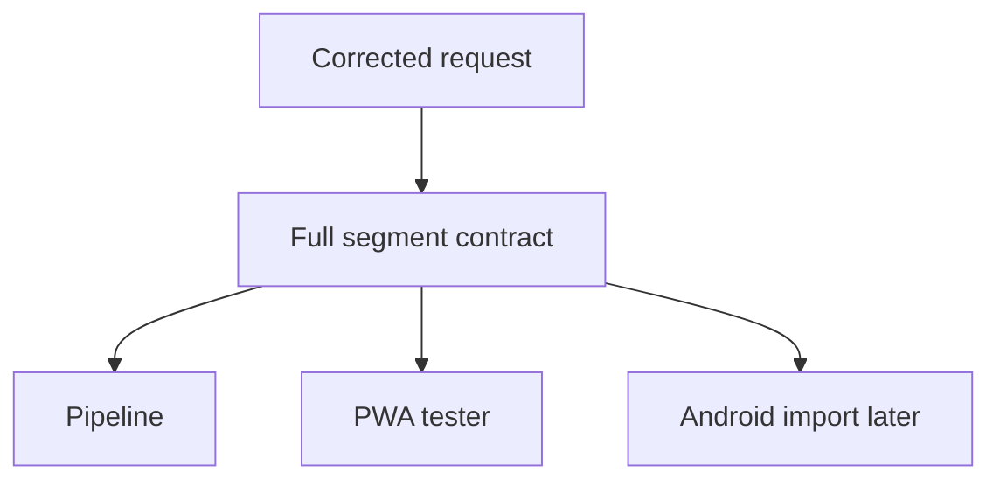

# Backlog 0008: Correct Full Segment Generation Contract

From version: 0.1.0

Status: Done

Understanding: 95%

Confidence: 90%

Progress: 100%

Complexity: Medium

Theme: Segment Generation

## Source

- Request: `docs/request/0002-generate-full-paris-segment-mesh-and-pwa-tester.md`
- Existing ADR to revise or supersede: `docs/adr/0001-data-source-and-segment-model.md`
- Existing contract to revise: `docs/data/segment-contract.md`

## Context

The current seed dataset was useful for proving Android loading, but it does not represent the target segment model. The project needs a corrected contract for a dense Paris street mesh where each generated segment is an individual clickable element.

## Description

Revise the segment contract so it describes the definitive full Paris segment dataset, not a small representative sample.

## Scope

In:

- Define the source dataset as a dense Paris intra-muros street mesh.
- Define segment identity, metadata, geometry, and source-debug fields.
- Define that every generated segment is a clickable unit.
- Define that source segment data contains no validation or user progress state.
- Define acceptable geometry simplification principles.
- Define expected scale: many segments per arrondissement, not one segment per arrondissement.
- Identify the ADR updates or superseding ADR needed for the corrected direction.

Out:

- Implement the OSM pipeline.
- Build the PWA tester.
- Replace the Android dataset.

## Acceptance criteria

- The contract explicitly rejects the one-segment-per-arrondissement model as target data.
- The contract states that the generated dataset must contain a dense mesh of individual segments.
- Each segment has a stable id, street metadata when available, length, simplified polyline geometry, and source-debug metadata.
- The contract states that validation/completion state is stored separately from source geometry.
- The contract is precise enough to guide the OSM pipeline and PWA tester backlog items.
- ADR impact is documented.

## Priority

Priority: Must

Impact: High

Urgency: High

## Notes

This item should happen before implementation work. It corrects the product and technical foundation.

Completed through `docs/data/segment-contract.md` and ADR updates. The contract now targets a dense generated Paris mesh and explicitly separates source geometry from validation state.

## Task coverage

- `docs/tasks/0003-generate-full-paris-segment-mesh-and-pwa-tester.md`

## Risks

- If the corrected contract is vague, downstream pipeline and PWA work may reproduce the wrong dataset shape.
