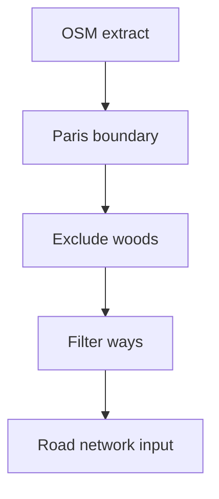

# Backlog 0009: Build OSM Extraction and Filtering Pipeline

From version: 0.1.0

Status: Done

Understanding: 90%

Confidence: 85%

Progress: 100%

Complexity: High

Theme: Pipeline

## Source

- Request: `docs/request/0002-generate-full-paris-segment-mesh-and-pwa-tester.md`
- Depends on: `docs/backlog/0008-correct-full-segment-generation-contract.md`

## Context

The project needs a repeatable way to obtain all relevant Paris intra-muros roads and streets from OpenStreetMap before simplification and segmentation.

## Description

Create the offline OSM extraction and filtering pipeline that produces the raw Paris road network input for segmentation.

## Scope

In:

- Select and document the Paris intra-muros boundary source.
- Exclude the Bois de Boulogne and Bois de Vincennes.
- Define initial included OSM `highway` values.
- Exclude clearly private, inaccessible, service-only, or irrelevant ways.
- Preserve useful source metadata for debugging.
- Produce a raw filtered road network artifact for the next segmentation step.
- Document the command sequence so it can be rerun.

Out:

- PWA tester UI.
- Android import.
- User completion state.
- Perfect GIS completeness.

## Acceptance criteria

- A repeatable pipeline command or script exists.
- The output covers Paris intra-muros roads and streets at dense scale.
- The output excludes the two woods.
- The output excludes clearly private or inaccessible ways.
- The output includes metadata needed for later debugging.
- The pipeline documentation explains inputs, filters, and outputs.

## Priority

Priority: Must

Impact: High

Urgency: High

## Notes

The pipeline may be Python or another pragmatic local tooling path, but it must be outside Android.

Implemented in `tools/segment_pipeline/generate_paris_segments.py`. The extraction uses Overpass, OSM highway filtering, access filtering, and a pragmatic Boulevard Peripherique polygon so valid intra-muros neighborhoods are not cut out by broad Bois exclusion boxes.

## Task coverage

- `docs/tasks/0003-generate-full-paris-segment-mesh-and-pwa-tester.md`

## Risks

- OSM tag filtering may need iterative visual inspection.
- Boundary and woods exclusion sources may introduce edge cases.
