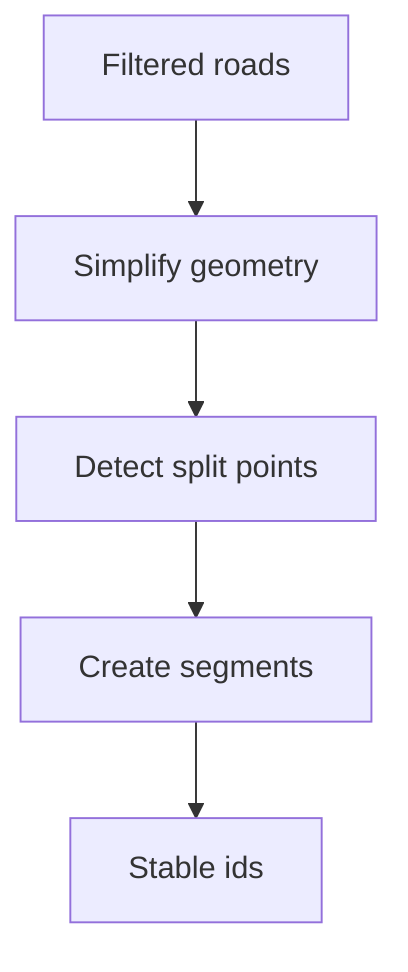

# Backlog 0010: Simplify and Segment Paris Street Mesh

From version: 0.1.0

Status: Ready

Understanding: 90%

Confidence: 80%

Progress: 0%

Complexity: High

Theme: Segmentation

## Source

- Request: `docs/request/0002-generate-full-paris-segment-mesh-and-pwa-tester.md`
- Depends on: `docs/backlog/0009-build-osm-extraction-filtering-pipeline.md`

## Context

The filtered road network must be transformed into a mesh of individual clickable segments. Each segment should remain visually close to the general road shape while avoiding unnecessary geometry noise.

## Description

Implement geometry simplification and mesh segmentation so each generated line segment becomes an individual data element.

## Scope

In:

- Define the simplification strategy and tolerance.
- Preserve the general visual shape of each road.
- Split the road network into individual segments.
- Assign stable ids to segments.
- Preserve street name and arrondissement metadata where available.
- Compute or preserve segment length in meters.
- Produce a dense generated segment dataset.

Out:

- PWA validation UI.
- Android import.
- User progress storage.
- Perfect topology for every exceptional intersection.

## Acceptance criteria

- The output contains many segments per arrondissement where street density requires it.
- Each generated segment is an independent element.
- Each segment has a stable id.
- Geometry simplification does not visibly destroy the general road shape.
- Segment length is available.
- The output can be loaded by the PWA tester item.
- The segmentation approach is documented.

## Priority

Priority: Must

Impact: High

Urgency: High

## Notes

The first acceptable version can be pragmatic. Visual inspection in the PWA will drive refinement.

## Risks

- Intersection splitting can be complex.
- Over-simplification could make segment selection misleading.
