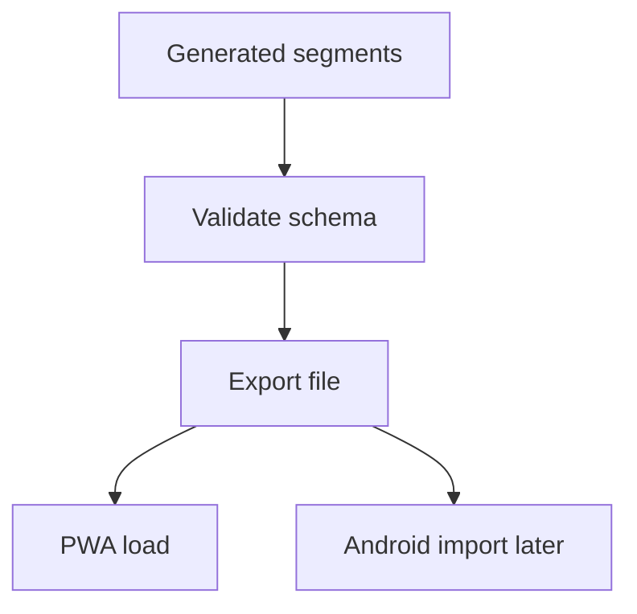

# Backlog 0011: Export Definitive Segment Dataset

From version: 0.1.0

Status: Ready

Understanding: 90%

Confidence: 85%

Progress: 0%

Complexity: Medium

Theme: Data Export

## Source

- Request: `docs/request/0002-generate-full-paris-segment-mesh-and-pwa-tester.md`
- Depends on: `docs/backlog/0010-simplify-and-segment-paris-street-mesh.md`

## Context

Once the full street mesh has been segmented, the project needs a stable exported dataset that the PWA tester can load and that Android can later import unchanged.

## Description

Define and produce the definitive segment dataset artifact for the generated Paris segment mesh.

## Scope

In:

- Choose the first definitive export format.
- Export all generated Paris intra-muros segments.
- Validate required properties.
- Keep source geometry separate from validation/completion state.
- Provide dataset counts and summary metadata.
- Document how Android should later import the file.

Out:

- PWA interaction implementation.
- Android replacement implementation.
- Backend synchronization.

## Acceptance criteria

- A generated dataset file exists and is loadable by local tooling.
- The file contains the full dense segment mesh, not the current seed sample.
- Required segment fields are present.
- No validation, completion, or user progress fields are present in the source dataset.
- Dataset summary includes total segment count and count by arrondissement when possible.
- The export format is documented.

## Priority

Priority: Must

Impact: High

Urgency: High

## Notes

GeoJSON is acceptable if it stays usable for PWA inspection and later Android import. A compact derived JSON can be considered later if size becomes a problem.

## Risks

- Large GeoJSON files may affect browser and mobile performance.
- Format changes after PWA validation could invalidate stable ids.
