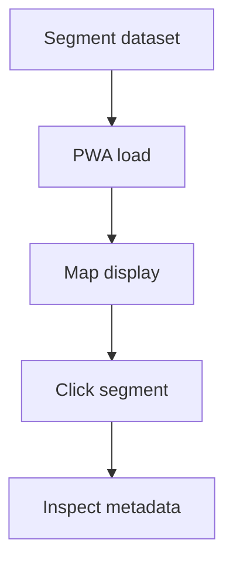

# Backlog 0012: Build Chrome PWA Segment Mesh Tester

From version: 0.1.0

Status: Ready

Understanding: 95%

Confidence: 85%

Progress: 0%

Complexity: High

Theme: PWA

## Source

- Request: `docs/request/0002-generate-full-paris-segment-mesh-and-pwa-tester.md`
- Depends on: `docs/backlog/0011-export-definitive-segment-dataset.md`

## Context

The generated segment mesh must be inspected in Chrome before it becomes the Android app dataset. The PWA is a local validation tool for generation quality and interaction behavior.

## Description

Build a local Chrome-compatible PWA that loads and displays the generated Paris segment mesh.

## Scope

In:

- Create a PWA test surface.
- Load the generated segment dataset.
- Display the full Paris segment mesh.
- Support zooming and panning.
- Support clicking an individual segment.
- Highlight selected, unvalidated, and validated segment states.
- Show segment metadata.
- Show basic counts such as total segments and selected segment id.

Out:

- Android UI work.
- Backend services.
- GPS validation.
- Final product styling.

## Acceptance criteria

- The PWA runs locally in Chrome.
- The PWA loads the generated segment dataset.
- The PWA displays the dense mesh without collapsing it into arrondissement-level samples.
- The user can click a segment.
- The clicked segment is highlighted.
- Segment metadata is visible after selection.
- The PWA remains usable enough for visual inspection at Paris scale.

## Priority

Priority: Must

Impact: High

Urgency: High

## Notes

The PWA should be utilitarian and inspection-focused. It does not need a polished consumer UI.

## Risks

- Browser rendering performance may require canvas/WebGL or tiled/vector strategies if SVG/DOM is too slow.
