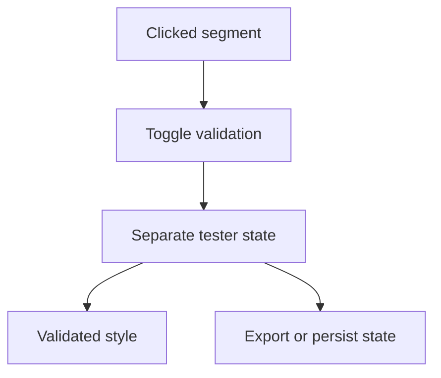

# Backlog 0013: Add PWA Segment Validation State

From version: 0.1.0

Status: Ready

Understanding: 95%

Confidence: 85%

Progress: 0%

Complexity: Medium

Theme: PWA

## Source

- Request: `docs/request/0002-generate-full-paris-segment-mesh-and-pwa-tester.md`
- Depends on: `docs/backlog/0012-build-chrome-pwa-segment-mesh-tester.md`

## Context

The PWA tester needs a separate validation state so the user can mark generated segments as accepted or not accepted while keeping source segment geometry immutable.

## Description

Add validation and unvalidation behavior to the PWA tester for individual segments.

## Scope

In:

- Toggle validation state for the selected segment.
- Keep validation state separate from the generated source dataset.
- Persist validation state locally in the browser or exportable file.
- Show validated and unvalidated segment counts.
- Allow unvalidating a previously validated segment.

Out:

- Android completion state.
- Cloud sync.
- Multi-user review.
- Editing source segment geometry directly.

## Acceptance criteria

- A clicked segment can be marked as validated.
- A validated segment can be unvalidated.
- Validation state is not written into the source dataset.
- Validation state survives page refresh or can be exported and reloaded.
- Validated and unvalidated segments are visually distinct.
- Counts update after toggling validation.

## Priority

Priority: Must

Impact: High

Urgency: High

## Notes

Browser local storage is acceptable for the first version if it can be reset and inspected. File export is preferable if validation evidence must be kept outside the browser.

## Risks

- Large validation maps may need a compact storage structure.
- A browser-only state can be lost if storage is cleared.
