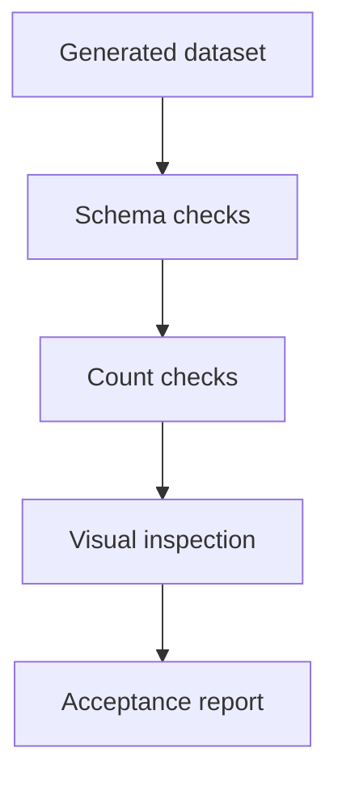

# Backlog 0014: Add Segment Dataset Quality Checks

From version: 0.1.0

Status: Ready

Understanding: 90%

Confidence: 80%

Progress: 0%

Complexity: Medium

Theme: Quality

## Source

- Request: `docs/request/0002-generate-full-paris-segment-mesh-and-pwa-tester.md`
- Depends on: `docs/backlog/0011-export-definitive-segment-dataset.md`
- Depends on: `docs/backlog/0013-add-pwa-segment-validation-state.md`

## Context

The generated dataset must be checked before it replaces the current Android seed dataset. Quality checks should detect obvious extraction, segmentation, id, and geometry issues.

## Description

Add automated and manual quality checks for the generated segment dataset and produce inspection evidence before Android import.

## Scope

In:

- Validate required fields.
- Validate unique stable ids.
- Check total segment count and count by arrondissement.
- Check that source data contains no validation or completion state.
- Check that excluded woods are absent.
- Check that geometry is present and non-empty.
- Add a visual inspection checklist for the PWA.
- Document whether the current seed dataset can be replaced or deprecated.

Out:

- Perfect GIS validation.
- Full manual review of every segment.
- Android import implementation.

## Acceptance criteria

- Automated dataset checks exist and can be run locally.
- Checks fail if segment ids are missing or duplicated.
- Checks fail if source data contains validation/completion state.
- Checks report total segment count and arrondissement distribution.
- Checks include explicit woods exclusion verification or documented limitation.
- A visual inspection report format exists for PWA review.
- The decision to replace or keep the current Android seed dataset is documented.

## Priority

Priority: Must

Impact: High

Urgency: Medium

## Notes

This item is the gate before the generated dataset becomes the app dataset.

## Risks

- Automated checks may miss visually bad segmentation.
- Visual review may be slow if the generated dataset is very large.
