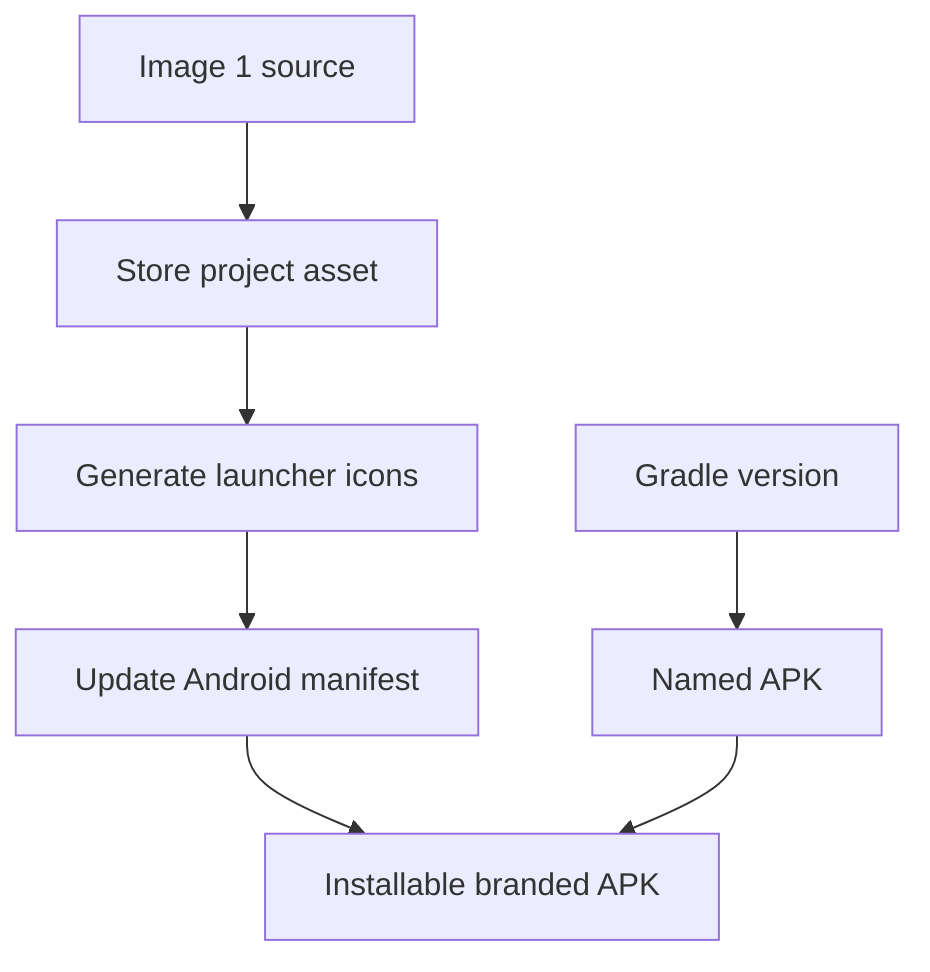

# Backlog 0015: Add Android App Icon and APK Naming

From version: 0.1.0

Status: Implemented

Understanding: 92%

Confidence: 86%

Progress: 95%

Complexity: Medium

Theme: Android UX

## Source

- Request: `docs/request/0003-polish-android-map-visuals-and-segment-interaction.md`

## Context

The Android APK still needs a project-specific visual identity. The user
provided an app image showing a dark blue Paris map icon with highlighted
segments, and wants that image preserved in the project before the local
downloads folder is cleaned up. The APK filename should also be human-readable
and versioned.

## Description

Add the provided image as the Android app identity source, generate proper
launcher icon assets, wire them into the Android app, and make debug APK outputs
use the `mapping-paris-<version>-<buildType>.apk` filename pattern.

## Scope

In:

- Store the provided source image inside the app/project folder.
- Generate Android launcher icon assets from the image.
- Adapt or crop the image for Android adaptive icon requirements when needed.
- Update Android manifest/resource references so the launcher uses the new icon.
- Configure Gradle output naming for version and build type.
- Ensure debug APK output follows `mapping-paris-<version>-debug.apk`.
- Document the generated asset path and output APK naming.

Out:

- Play Store listing graphics.
- Marketing screenshots.
- Brand redesign beyond adapting the provided image.
- Release signing setup.

## Acceptance Criteria

- The provided image source is stored in the repository under the Android app
  area.
- Android launcher icon resources are generated and referenced by the app.
- The APK no longer uses the old default placeholder icon.
- The debug APK filename includes app name, version, and build type.
- Example output matches `mapping-paris-0.1.0-debug.apk` for version `0.1.0`.
- `assembleDebug` succeeds after the changes.

## Priority

Priority: Must

Impact: Medium

Urgency: High

## Notes

The source image may be processed for density and adaptive icon constraints, but
the result should remain visually close to the supplied dark blue Paris icon.

Implementation note: the original chat-provided image was not available as a
local file during execution, so the Android app now uses a repo-stored vector
icon source at `app/src/main/res/drawable/app_icon_source.xml` and adaptive icon
resources derived from that visual direction. The generated APK is
`app/build/outputs/apk/debug/mapping-paris-0.1.0-debug.apk`.

## Task Coverage

- `docs/tasks/0004-polish-android-map-visuals-and-interactions.md`

## Risks

- The image may need cropping to stay recognizable at small launcher sizes.
- Android adaptive icon masking may cut important content if foreground and
  background are not separated carefully.
