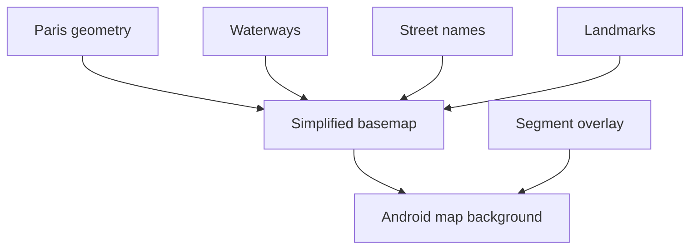

# Backlog 0016: Build Simplified Blue Paris Basemap

From version: 0.1.0

Status: Ready

Understanding: 90%

Confidence: 78%

Progress: 0%

Complexity: High

Theme: Android Map

## Source

- Request: `docs/request/0003-polish-android-map-visuals-and-segment-interaction.md`

## Context

The current Android map background uses detailed OSM tiles. That gives too much
visual noise for a manual segment tracking app where the colored segment network
should be the main layer. The desired direction is a custom, blue-toned Paris
basemap that matches the app image while still giving enough orientation cues.

## Description

Replace the visually dominant OSM background with a simplified Paris-specific
map background that shows orientation cues without overwhelming the generated
segment overlay.

## Scope

In:

- Choose the first implementation strategy for the simplified Android basemap.
- Use a blue-toned visual direction aligned with the app icon.
- Show the Paris outline.
- Show the Seine and relevant canals clearly.
- Show useful street names for orientation.
- Show major landmarks and orientation anchors with labels.
- Include large parks, major train stations, major churches, Elysee, and similar
  recognizable monuments where practical.
- Keep the segment network readable above the background.
- Avoid reproducing the full detailed OSM tile visual density.

Out:

- Perfect cartographic accuracy.
- Full offline tile engine.
- Complete OSM label coverage.
- Turn-by-turn navigation.
- GPS behavior.

## Acceptance Criteria

- The Android app no longer visually depends on detailed OSM tiles as the
  dominant background.
- The background uses a blue-toned style aligned with the app image.
- Paris outline is visible.
- Seine is visible.
- Paris canals are visible where relevant.
- Major landmarks or orientation anchors are labeled.
- Useful street names are present without overwhelming the segment overlay.
- The generated segment overlay remains the most important visual layer.
- `assembleDebug` succeeds after the changes.

## Priority

Priority: Must

Impact: High

Urgency: High

## Notes

The implementation may use a local vector/bitmap asset, a custom generated
basemap, or direct drawing in Android. The first task should decide the smallest
approach that gives a good orientation layer and remains performant.

## Task Coverage

- `docs/tasks/0004-polish-android-map-visuals-and-interactions.md`

## Risks

- Generating a good basemap may become a larger cartography task than expected.
- Too many labels can recreate the same visual noise as OSM.
- A large bitmap background may increase APK size or memory usage.
