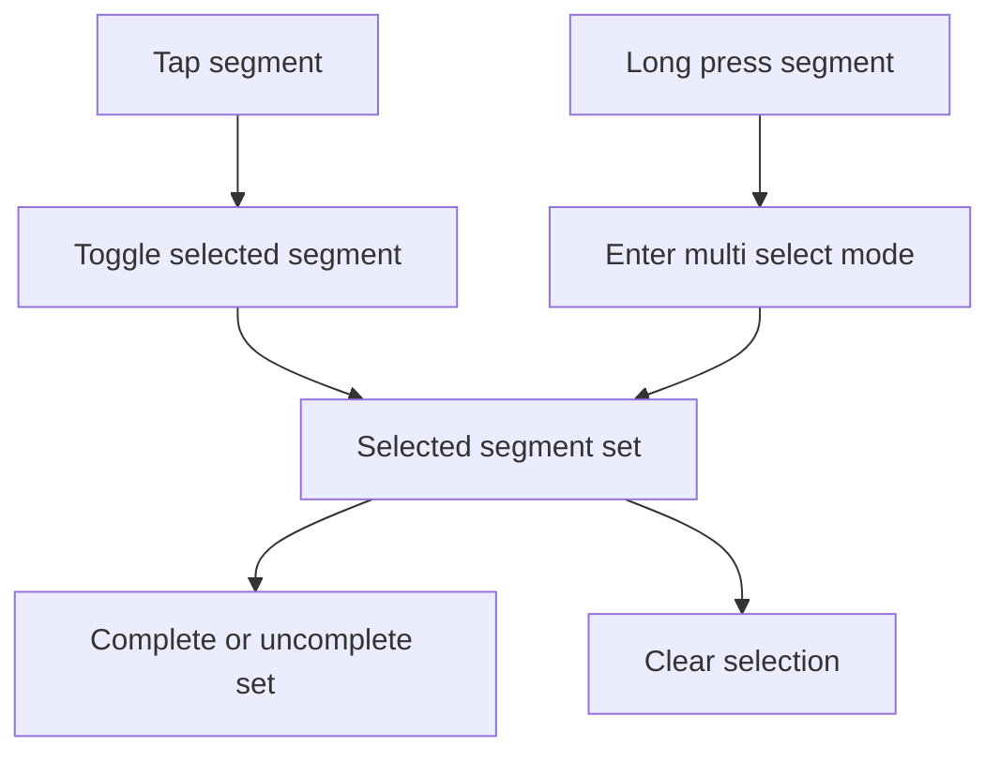

# Backlog 0017: Add Android Multi Segment Selection

From version: 0.1.0

Status: Ready

Understanding: 94%

Confidence: 88%

Progress: 0%

Complexity: Medium

Theme: Android UX

## Source

- Request: `docs/request/0003-polish-android-map-visuals-and-segment-interaction.md`
- Related behavior: `docs/development/pwa-segment-tester.md`

## Context

The PWA supports selecting several segments before validating them, but the
Android app still selects one segment at a time. On mobile, the intended
interaction should support both intuitive repeated taps and long-press entry
into multi-selection mode.

## Description

Bring multi-segment selection and batch completion behavior into the Android
app, using the PWA as the current behavior reference while adapting interaction
details for mobile.

## Scope

In:

- Support selecting multiple segments in Android.
- Support deselecting an already selected segment.
- Support long-press on a segment to enter multi-selection mode.
- Support repeated taps to build or adjust the selected set.
- Highlight all selected segments at once.
- Show selected count.
- Show total selected length.
- Show mixed arrondissement state when selected segments span multiple
  arrondissements.
- Complete all selected segments.
- If all selected segments are completed, allow marking the selected set
  incomplete.
- Clear the full selected set.
- Keep completion state separate from source GeoJSON.

Out:

- Drag/lasso selection.
- GPS validation.
- Editing source segment geometry.
- Cloud sync.

## Acceptance Criteria

- Tapping a segment can add it to the selected set.
- Tapping a selected segment can remove it from the selected set.
- Long-pressing a segment enters or supports multi-selection mode.
- Several selected segments remain highlighted at once.
- The UI displays selected count and total selected length.
- The UI can complete the full selected set.
- The UI can uncomplete the full selected set when all selected segments are
  already complete.
- Clearing selection resets the current selection without changing completion
  state.
- Completion state remains persisted locally and separately from source segment
  data.
- `assembleDebug` succeeds after the changes.

## Priority

Priority: Must

Impact: High

Urgency: High

## Notes

The first version should avoid drag/lasso selection. Tap and long-press cover
the interactions the user already tried intuitively.

## Task Coverage

- `docs/tasks/0004-polish-android-map-visuals-and-interactions.md`

## Risks

- Multi-selection could amplify the current map redraw delay unless the
  performance item is addressed.
- Long-press handling may conflict with osmdroid overlay gestures if not tested
  on device.
