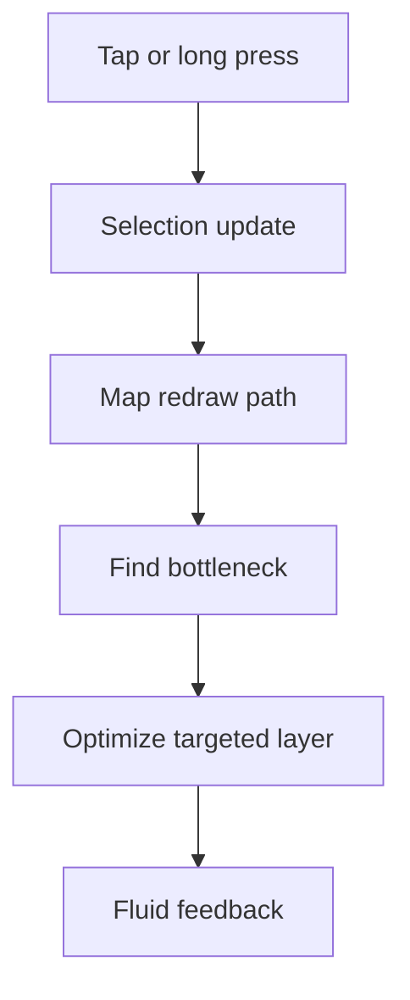

# Backlog 0018: Optimize Android Segment Selection Performance

From version: 0.1.0

Status: Ready

Understanding: 92%

Confidence: 84%

Progress: 0%

Complexity: High

Theme: Performance

## Source

- Request: `docs/request/0003-polish-android-map-visuals-and-segment-interaction.md`

## Context

The Android app has a noticeable delay before selection feedback appears or
before changing the selected segment. The dense generated dataset contains
15,295 segments, so selection performance must be treated as a core usability
requirement before expanding the interaction model.

## Description

Audit the Android segment selection delay, identify the real bottleneck, and
optimize the map update path so selection and segment switching feel fluid on
the generated Paris dataset.

## Scope

In:

- Audit the current Android map update path.
- Measure or log the selection update path enough to identify the bottleneck.
- Verify whether all overlays are rebuilt on every selection change.
- Verify whether thousands of `Polyline` objects are recreated during Compose
  updates.
- Check osmdroid overlay invalidation cost.
- Check whether completion-state flow updates cause broad recomposition.
- Check selected segment metadata lookup cost.
- Optimize the real bottleneck.
- Document the performance finding in the task/report.
- Preserve functional behavior while optimizing.

Out:

- Dataset redesign unless proven necessary.
- Native GIS engine replacement as a first step.
- GPU/canvas rewrite before cheaper fixes are tested.
- Cosmetic loading indicators as a substitute for faster interaction.

## Acceptance Criteria

- The source of the selection delay is identified and documented.
- Selection no longer recreates unnecessary map overlay objects.
- Selection feedback is visibly faster than the current APK.
- Segment switching remains responsive on the 15,295 segment dataset.
- The optimization does not break completion state persistence.
- The optimization supports future multi-selection work.
- `assembleDebug` succeeds after the changes.

## Priority

Priority: Must

Impact: High

Urgency: High

## Notes

Likely causes include rebuilding all map overlays on every selection change and
doing too much work inside the `AndroidView` update block. The task should prove
the bottleneck before choosing the fix.

## Task Coverage

- `docs/tasks/0004-polish-android-map-visuals-and-interactions.md`

## Risks

- osmdroid overlay APIs may constrain how much can be optimized without a larger
  rendering change.
- Performance can vary across devices, so at least one baseline device should
  be noted during manual validation.
