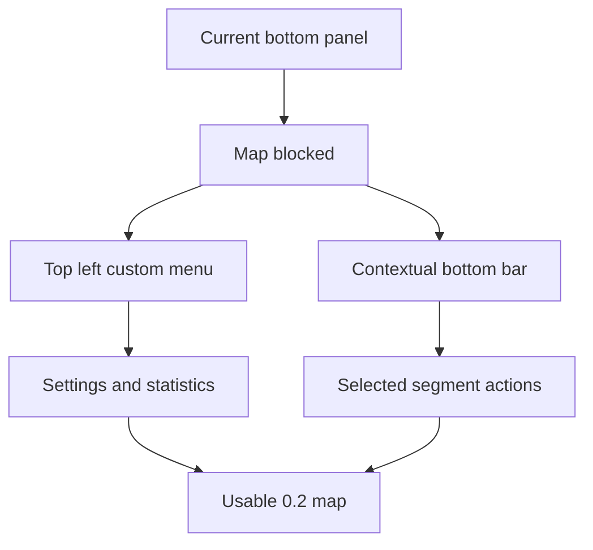

# Backlog 0019: Android 0.2 Menu and Contextual Actions

From version: 0.1.0

Status: Implemented

Understanding: 94%

Confidence: 90%

Progress: 95%

Complexity: High

Theme: Android UX

## Source

- Request: `docs/request/0004-prepare-version-0-2-mobile-ux-and-product-hardening.md`

## Context

The Android app currently uses a large bottom panel that hides too much of the
map on mobile. Version 0.2 should keep the map as the main surface, expose a
small custom top-left menu for secondary navigation, and use a contextual bottom
bar only when map actions are useful.

## Description

Replace the always-visible Android bottom panel with a map-first interaction
model: a custom top-left menu for settings and statistics, no empty selection
UI when nothing is selected, and a compact bottom bar for selected-segment
actions.

## Scope

In:

- Add a top-left custom menu button over the Android map.
- Open a compact custom menu panel from the button.
- Link the menu to settings and a full-screen statistics view.
- Remove the empty "0 segment selected" style UI when no segment is selected.
- Add a contextual bottom bar for map actions when segments are selected.
- Keep complete, uncomplete, and clear selection actions one tap away.
- Add a simple snackbar undo for complete and uncomplete actions.
- Keep segment selection behavior compatible with existing multi-selection.

Out:

- Do not move completion actions into the top-left menu.
- Do not add a full Material drawer unless the custom panel proves insufficient.
- Do not add accounts, cloud sync, GPS validation, or backend services.

## Acceptance Criteria

- The Android map is not blocked by a large always-visible bottom panel.
- No empty selection UI is shown when no segment is selected.
- A top-left custom menu button is visible and opens a compact menu.
- The menu links to settings and the full-screen statistics view.
- Selection actions appear in a compact bottom bar when segments are selected.
- Complete, uncomplete, and clear selection remain available.
- Completion and uncompletion actions show a snackbar undo.
- The menu and bottom bar can be dismissed without disrupting the map.
- `assembleDebug` succeeds.

## Priority

Priority: Must

Impact: High

Urgency: High

## Notes

This item is the main structural UX change for 0.2. Other 0.2 features should
fit into this interaction model rather than reintroducing permanent panels over
the map.

Implementation note: delivered in task
`docs/tasks/0005-deliver-android-0-2-mobile-ux-and-product-hardening.md`.

## Task Coverage

- `docs/tasks/0005-deliver-android-0-2-mobile-ux-and-product-hardening.md`

## Risks

- A custom menu can become inconsistent if settings, statistics, search, and
  filters are not clearly separated.
- The bottom bar must stay compact enough to avoid recreating the original
  screen-blocking problem.
