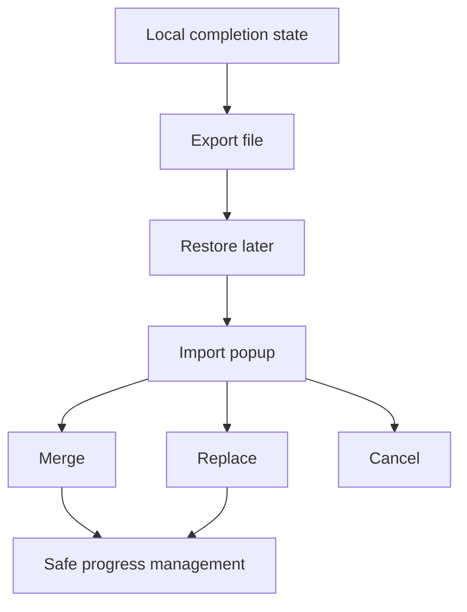

# Backlog 0020: Android 0.2 Import Export and Progress Safety

From version: 0.1.0

Status: Ready

Understanding: 94%

Confidence: 88%

Progress: 0%

Complexity: High

Theme: Data UX

## Source

- Request: `docs/request/0004-prepare-version-0-2-mobile-ux-and-product-hardening.md`

## Context

The app is local-first, so user progress must be easy to protect and restore.
Android currently persists completion state locally in Room, but it does not
provide import/export or explicit reset controls.

## Description

Add Android import/export for completed `logical_segment_id` values, place the
actions inside settings, and add progress-safety controls such as reset with
confirmation and clear import conflict choices.

## Scope

In:

- Export completed `logical_segment_id` values to a user-accessible JSON file.
- Import completed `logical_segment_id` values from a previous export.
- Put import/export inside settings.
- On import conflicts, show a popup menu with merge, replace, and cancel.
- Show import/export success and failure feedback.
- Include counts for exported, imported, merged, replaced, or ignored ids.
- Add reset-all-progress in settings with a confirmation dialog.
- Keep source segment geometry separate from user completion state.

Out:

- Do not add cloud sync.
- Do not add accounts.
- Do not export the source GeoJSON as user progress.
- Do not silently replace local progress during import.

## Acceptance Criteria

- Settings includes export completion state.
- Settings includes import completion state.
- Export produces a JSON file containing completed logical segment ids.
- Import reads a compatible export file.
- Import conflict handling offers merge, replace, and cancel.
- Merge preserves existing completed ids and adds imported completed ids.
- Replace clears local progress before applying imported ids.
- Cancel leaves local progress unchanged.
- Reset all progress requires confirmation.
- `assembleDebug` succeeds.

## Priority

Priority: Must

Impact: High

Urgency: High

## Notes

The export schema should be documented enough that future versions can maintain
compatibility.

## Task Coverage

- `docs/tasks/0005-deliver-android-0-2-mobile-ux-and-product-hardening.md`

## Risks

- Android file picker and document permissions can add implementation overhead.
- Import replace must be guarded carefully to avoid accidental progress loss.
