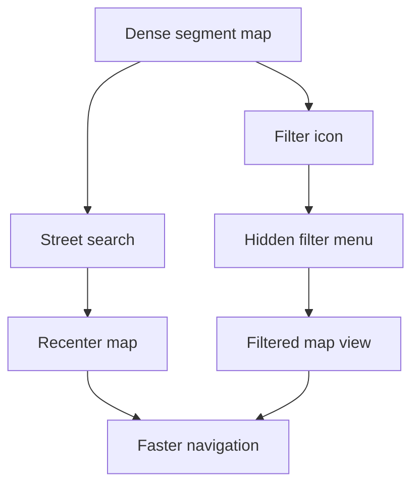

# Backlog 0021: Android 0.2 Search and Filter Controls

From version: 0.1.0

Status: Implemented

Understanding: 94%

Confidence: 88%

Progress: 95%

Complexity: High

Theme: Android UX

## Source

- Request: `docs/request/0004-prepare-version-0-2-mobile-ux-and-product-hardening.md`

## Context

The generated Paris dataset is dense enough that manual map panning is not
enough. Version 0.2 should provide street search and filters while keeping the
map uncluttered.

## Description

Add Android street search and a separate filter control. Search should recenter
the map only, without automatically selecting segments. Filters should stay
hidden until the filter icon is pressed.

## Scope

In:

- Add street search in Android.
- Support accent-insensitive partial matches.
- Sort search results by best match and arrondissement proximity if available.
- Recenter the map on selected search results.
- Do not auto-select search results.
- Add a visible filter icon.
- Open a hidden filter menu only when the filter icon is pressed.
- Support filters for completed, not completed, selected, arrondissement, and
  street where practical.
- Hide filters again when the user closes the filter menu.
- Do not keep active filter chips visible after the filter menu closes.

Out:

- Do not add route planning.
- Do not add GPS validation.
- Do not add persistent active-filter chips over the map.
- Do not make filters part of the top-left settings/statistics menu.

## Acceptance Criteria

- The Android app has a street search entry point.
- Partial street-name searches return useful results.
- Accent-insensitive search works for common French street names.
- Selecting a search result recenters the map without selecting segments.
- A separate filter icon is visible.
- Pressing the filter icon opens the filter menu.
- Closing the filter menu hides filter controls from the map.
- Filters can narrow the visible or actionable segment set.
- `assembleDebug` succeeds.

## Priority

Priority: Must

Impact: High

Urgency: High

## Notes

Filter UI should be powerful enough for 0.2 without overwhelming the map. If a
filter is active but hidden, the current user decision is to avoid persistent
chips; the implementation should still avoid confusing destructive behavior.

Implementation note: delivered in task
`docs/tasks/0005-deliver-android-0-2-mobile-ux-and-product-hardening.md`.

## Task Coverage

- `docs/tasks/0005-deliver-android-0-2-mobile-ux-and-product-hardening.md`

## Risks

- Filtering dense segments can create confusing map states if the UI does not
  clearly show when a filter is active.
- Search performance may need indexing if direct scans become slow.
