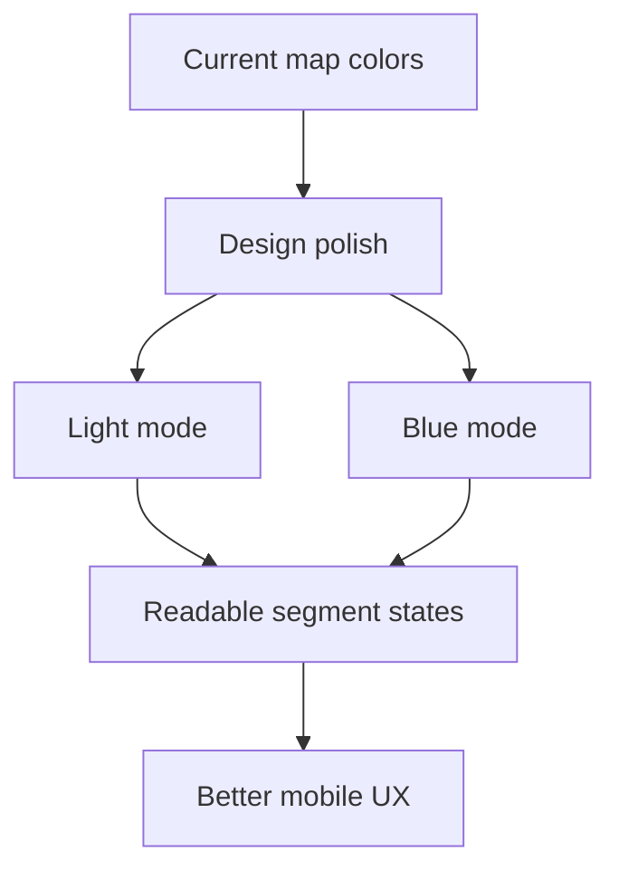

# Backlog 0022: Android 0.2 Map Modes and Color Polish

From version: 0.1.0

Status: Ready

Understanding: 94%

Confidence: 88%

Progress: 0%

Complexity: Medium

Theme: Android UX

## Source

- Request: `docs/request/0004-prepare-version-0-2-mobile-ux-and-product-hardening.md`

## Context

The app should be more comfortable to use on mobile. Colors need to be clearer
and calmer, and the app should offer both light and blue map modes from the
menu while preserving street readability.

## Description

Polish Android map colors and add selectable light and blue map modes. Use
expert product design judgment rather than fixed color prescriptions, while
keeping selected, completed, and not completed states easy to distinguish.

## Scope

In:

- Add light and blue map mode choices in the menu.
- Preserve street labels when possible.
- Start blue mode as a blue-tinted treatment if it keeps labels readable.
- Move to a local simplified basemap only if readability is better.
- Tune completed, not completed, and selected segment colors.
- Keep selected segments immediately visible.
- Avoid overly aggressive uncompleted colors.
- Ensure text and button contrast is acceptable.
- Keep the palette close to the `[Image #1]` identity direction.

Out:

- Do not add a dedicated color-blind mode.
- Do not make a one-off decorative theme that harms map readability.
- Do not remove the light map mode.

## Acceptance Criteria

- Users can choose light map mode.
- Users can choose blue map mode.
- The selected map mode persists or behaves predictably during app use.
- Completed, not completed, and selected segments are visually distinct.
- Segment colors remain readable over both map modes.
- Blue mode preserves street label readability or uses a better local approach.
- `assembleDebug` succeeds.

## Priority

Priority: Must

Impact: Medium

Urgency: High

## Notes

The visual target is practical mobile readability, not a full branding redesign.

## Task Coverage

- `docs/tasks/0005-deliver-android-0-2-mobile-ux-and-product-hardening.md`

## Risks

- Blue styling can reduce map-label readability if applied too heavily.
- Color changes should be validated on the Google Pixel 8 baseline device.
