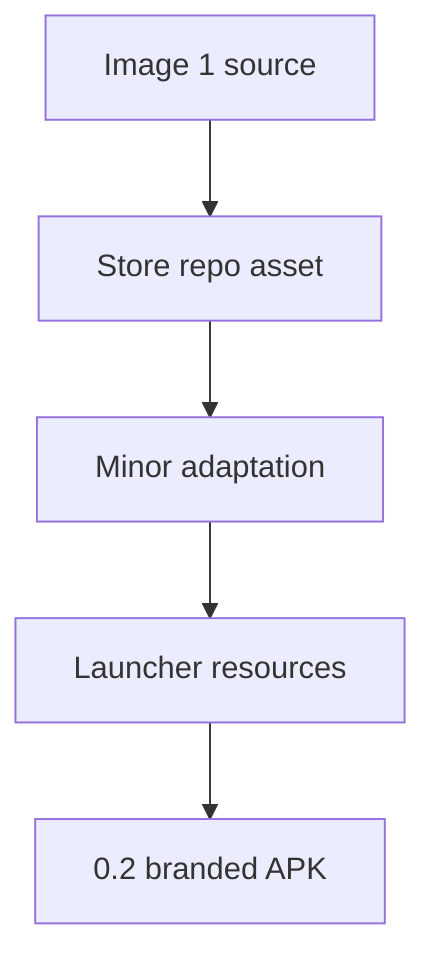

# Backlog 0023: Rebuild Android Icon From Image 1

From version: 0.1.0

Status: Implemented

Understanding: 94%

Confidence: 90%

Progress: 95%

Complexity: Medium

Theme: Android UX

## Source

- Request: `docs/request/0004-prepare-version-0-2-mobile-ux-and-product-hardening.md`

## Context

The current app icon is too different from the original visual direction. The
0.2 icon should restart from `[Image #1]` and modify it only as much as Android
launcher constraints require.

## Description

Store `[Image #1]` in the repository and regenerate Android launcher icon
resources while preserving the dark navy rounded-square map identity and bright
completed-route accent.

## Scope

In:

- Store the source raster image in the repo.
- Generate Android launcher resources from the source image.
- Apply only minor modifications: crop, resize, adaptive-icon safe area, density
  export, and very light contrast cleanup.
- Preserve the dark navy background.
- Preserve the simplified map-line concept.
- Preserve the bright cyan or green completed path accent.
- Update Android manifest/resources if needed.
- Validate that the debug APK uses the updated icon.

Out:

- Do not replace the icon with a materially different style.
- Do not create Play Store listing graphics.
- Do not redesign the brand beyond Android launcher adaptation.

## Acceptance Criteria

- `[Image #1]` or its source raster equivalent is stored in the repo.
- Android launcher resources are generated from that image.
- The resulting icon remains visually close to `[Image #1]`.
- The icon is recognizable at launcher size.
- The debug APK no longer uses the divergent current icon.
- `assembleDebug` succeeds.

## Priority

Priority: Must

Impact: Medium

Urgency: High

## Notes

The source image is part of the product direction and should not be treated as a
temporary chat attachment.

Implementation note: delivered in task
`docs/tasks/0005-deliver-android-0-2-mobile-ux-and-product-hardening.md`.

## Task Coverage

- `docs/tasks/0005-deliver-android-0-2-mobile-ux-and-product-hardening.md`

## Risks

- Adaptive icon masks may crop the map shape if the safe area is wrong.
- The image should be checked at small sizes, not only at source resolution.
