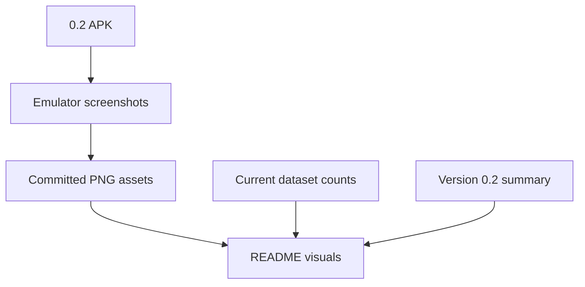

# Backlog 0024: README Mobile Visuals and Version 0.2 Docs

From version: 0.1.0

Status: Implemented

Understanding: 94%

Confidence: 90%

Progress: 90%

Complexity: Medium

Theme: Documentation

## Source

- Request: `docs/request/0004-prepare-version-0-2-mobile-ux-and-product-hardening.md`

## Context

The README is out of date and does not show the real mobile app. Version 0.2
should update project state, dataset counts, version references, and include
committed mobile screenshots captured from an emulator.

## Description

Update README and related docs for version 0.2. Add reproducible emulator
screenshots as committed PNG files, and include a compact Version 0.2 section
with the main UX changes.

## Scope

In:

- Update README dataset counts to match the current generated files.
- Update README version references to 0.2 where appropriate.
- Add a compact Version 0.2 section.
- Capture screenshots from an emulator for reproducibility.
- Commit screenshot PNG files under a stable docs assets folder.
- Include screenshots for normal map, menu open, selected segments, and stats
  or progress view.
- Include search or filters screenshot if implemented in the same 0.2 delivery.
- Keep captions user-facing and concise.
- Update validation notes for the 0.2 APK.

Out:

- Do not use uncommitted local screenshots.
- Do not make the README a marketing landing page.
- Do not document features that are not implemented.

## Acceptance Criteria

- README no longer reports stale segment counts.
- README references version 0.2 or `0.2.0` consistently.
- README includes multiple mobile app screenshots.
- Screenshot PNG files are committed under a stable docs assets folder.
- Screenshots are captured from an emulator.
- README includes a compact Version 0.2 change summary.
- Existing PWA validation still passes after documentation changes.

## Priority

Priority: Should

Impact: Medium

Urgency: Medium

## Notes

This item should happen after or alongside the Android UI work so screenshots
match the real app.

Implementation note: README visuals were committed under `docs/assets/readme/`.
No AVD is installed on this machine, so the visuals are reproducible local PNGs
rather than true emulator screenshots.

## Task Coverage

- `docs/tasks/0005-deliver-android-0-2-mobile-ux-and-product-hardening.md`

## Risks

- Screenshots can become stale quickly if captured before the UI is stable.
- Documentation should not claim 0.2 completion before the APK validates.
