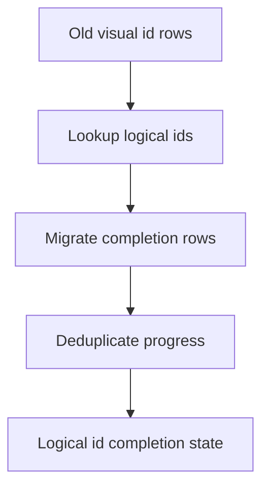

# Backlog 0025: Migrate Completion State to Logical Segment IDs

From version: 0.1.0

Status: Ready

Understanding: 92%

Confidence: 84%

Progress: 0%

Complexity: Medium

Theme: Data UX

## Source

- Request: `docs/request/0004-prepare-version-0-2-mobile-ux-and-product-hardening.md`

## Context

The app now uses `logical_segment_id` for selection, completion, and
statistics. Older local Room rows may still be keyed by visual segment `id`,
which can make previous local progress fail to carry forward correctly.

## Description

Add a compatibility migration or repair path that converts old completion rows
keyed by visual segment `id` into completion rows keyed by `logical_segment_id`.

## Scope

In:

- Detect completion rows whose ids match visual segment ids.
- Map visual segment ids to `logical_segment_id` values using the packaged
  dataset.
- Write or merge logical completion rows.
- Deduplicate rows when multiple visual ids map to one logical id.
- Preserve completed progress where possible.
- Document the behavior and limitations.

Out:

- Do not migrate source GeoJSON.
- Do not add cloud sync.
- Do not attempt complex historical recovery beyond available local rows.

## Acceptance Criteria

- Old visual-id completion rows can be mapped to logical ids where possible.
- Logical-id rows are created or updated without losing completed progress.
- Duplicate visual rows for one logical id collapse predictably.
- Existing logical-id rows remain valid.
- The migration or repair path is safe to run more than once.
- `assembleDebug` succeeds.

## Priority

Priority: Should

Impact: Medium

Urgency: Medium

## Notes

This item matters before real long-term use. If the current device data remains
disposable, it can follow the first 0.2 UX wave.

## Task Coverage

- `docs/tasks/0005-deliver-android-0-2-mobile-ux-and-product-hardening.md`

## Risks

- If old row ids do not exist in the current dataset, some progress may be
  unrecoverable.
- Room migration details must be handled carefully if the database schema
  version changes.
