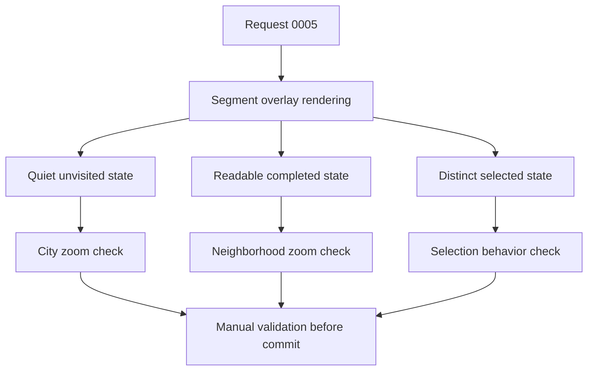

# Backlog 0026: Improve Main Map Segment Readability

From version: 0.2.1

Status: Ready

Understanding: 95%

Confidence: 90%

Progress: 0%

Complexity: Medium

Theme: Android Map UI

## Source

- Request: `docs/request/0005-improve-main-map-ui-readability-and-interaction-states.md`

## Context

The Android 0.2.1 map uses the correct segment state model, but the visual
weight of unvisited segments can dominate the map. The next delivery slice is a
small rendering-only improvement: reduce visual noise and make unvisited,
completed, and selected states easier to distinguish.



## Description

Refine the Android segment overlay colors, opacity, and stroke widths so the
map remains readable at full Paris zoom and at neighborhood zoom. The work
should keep all existing state and interaction logic unchanged.

## Scope

In:

- Update Android segment rendering styles for unvisited, completed, and
  selected segments.
- Make unvisited segments visually quieter using either muted red/rose or a
  neutral grey.
- Make completed segments immediately identifiable using mint/teal green.
- Make selected segments distinct from completed segments, preferably cyan or
  purple with high opacity and optional halo.
- Tune stroke widths so the overlay remains readable without visually flooding
  the basemap.
- Centralize map segment style constants in the rendering component if useful.

Out:

- Do not change data loading.
- Do not change Room persistence.
- Do not change completion storage.
- Do not change selection or multi-selection logic.
- Do not add screens or modify menu/search/filter/settings/statistics panels.
- Do not change the current map provider.
- Do not regenerate the segment dataset.

## Acceptance Criteria

- Non-completed segments are visually quieter than in 0.2.1.
- Completed segments are immediately identifiable.
- Selected segments cannot be confused with completed segments.
- The map remains usable at full Paris zoom.
- Individual segments remain readable around the 18e arrondissement zoom level.
- Multi-selection still works.
- Completing and uncompleting selected segments still works.
- No data-loading or persistence code is modified.
- A debug APK builds successfully.
- Manual mobile validation is completed before committing the implementation.

## Priority

Priority: Must

Impact: High

Urgency: High

## Notes

Likely primary file:

- `app/src/main/java/com/jilanos/mappingparis/ui/ParisMapOverlays.kt`

Possible secondary files:

- `app/src/main/java/com/jilanos/mappingparis/ui/MappingParisApp.kt`
- Android theme/color files only if shared constants already exist or are
  clearly justified.

Preferred implementation direction:

- Keep visual state derivation based on existing `completionStates`,
  `selectedSegmentIds`, and `logicalSegmentId`.
- Use a quieter base style for unvisited segments.
- Keep completed state green/teal.
- Use cyan or purple for selected state so selection is not mistaken for
  completion.
- Consider zoom-aware stroke width only if the current static stroke values
  cannot satisfy both city and neighborhood zoom readability.

## Risks

- Making unvisited segments too quiet could make the mesh feel incomplete.
- Making completed segments too bright could hide street labels.
- A selected color too close to completed teal could confuse the completion
  state.
- Zoom-aware width tuning could add complexity; prefer a simple static style
  unless manual validation shows it is insufficient.

## Validation Plan

Automated:

```powershell
git status --short --branch
.\gradlew.bat --no-daemon --stacktrace assembleDebug
```

Device install, if a phone is connected:

```powershell
tools\build-and-install-debug-apk.cmd
```

Manual:

- Open the map at full Paris zoom and verify unvisited segments no longer
  dominate the view.
- Zoom into the 18e arrondissement and verify individual segments remain
  readable.
- Mark a segment completed and verify completed state is clearly visible.
- Select one segment and verify selected state is distinct from completed
  state.
- Multi-select several segments and verify selected state remains clear.
- Complete and uncomplete selected segments and verify behavior is unchanged.

## Task Guidance

Create one implementation task from this backlog item. The task should not
include dataset, persistence, import/export, or menu work.

## Task Coverage

- `docs/tasks/0006-improve-android-segment-rendering-readability.md`
