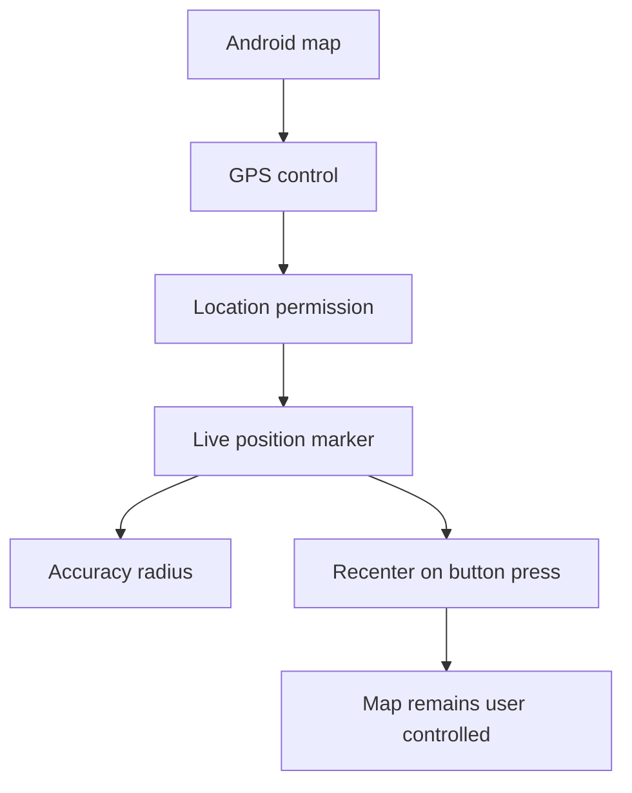

# Backlog 0027: Android 0.3 Foreground GPS Position

From version: 0.2.4

Status: In progress

Understanding: 94%

Confidence: 88%

Progress: 100%

Complexity: Medium

Theme: Android GPS

## Source

- Request: `docs/request/0006-show-gps-position-on-map-0-3.md`

## Context

Version 0.3 should show the user's live GPS position on the Android map while
the app is open. The app must remain usable if location permission is denied or
GPS is unavailable.

## Description

Add foreground location permission handling, a current-position marker with
accuracy radius, and a GPS button that recenters the map on demand without
locking the camera to the user.

## Scope

In:

- Add foreground Android location permission handling.
- Ask for location permission when the GPS feature is used.
- Show the current GPS position on the map while the app is open.
- Show a subtle accuracy radius when accuracy is available.
- Add a compact always-visible GPS button on the map.
- Recenter the map only when the GPS button is pressed.
- Keep the live marker updating without forcing continuous camera recentering.
- Show non-blocking denied, disabled, unavailable, and loading states.

Out:

- Do not add background tracking after the app is closed.
- Do not auto-complete segments.
- Do not upload location data.
- Do not add GPS behavior to the PWA.

## Acceptance Criteria

- The app requests location permission when the GPS feature is used.
- If permission is granted, current position appears on the map.
- A visible GPS button recenters the map on the current position.
- The marker updates as the user moves while the app is open.
- The map camera does not stay locked to the current position.
- Accuracy radius is visible when available.
- Denied or unavailable location does not block map usage.
- The marker is readable in light and blue map modes.
- A debug APK builds successfully.

## Priority

Priority: Must

Impact: High

Urgency: High

## Notes

This item is about position display and recenter behavior only. GPS-based
segment proposal is covered separately.

## Task Coverage

- `docs/tasks/0007-deliver-android-0-3-gps-position-and-segment-proposals.md`

## Risks

- Android permission behavior varies by version and must be tested on the
  target phone.
- Location update frequency must balance responsiveness and battery usage.
