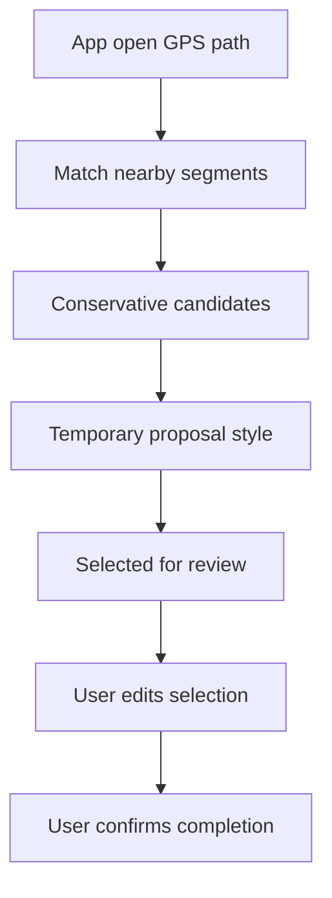

# Backlog 0028: Android 0.3 GPS Path Segment Proposals

From version: 0.2.4

Status: In progress

Understanding: 94%

Confidence: 84%

Progress: 90%

Complexity: High

Theme: Android GPS

## Source

- Request: `docs/request/0006-show-gps-position-on-map-0-3.md`

## Context

GPS should not validate segments automatically. Instead, while the app is open,
the captured path can propose likely covered segments by selecting them for user
review. The user can then adjust the selection before marking segments
completed.

## Description

Capture the app-open GPS path locally and use it to select likely covered
segments as editable validation proposals. The feature must be conservative and
avoid guessing across parallel streets.

## Scope

In:

- Track the GPS path only while the app is open and GPS-assisted behavior is
  enabled.
- Discard the captured GPS path when the app closes.
- Match captured path points to nearby logical segments.
- Use conservative matching for version 0.3.
- Select likely covered candidate segments for user review.
- Use a distinct temporary visual style for GPS-proposed segments.
- Let the user deselect or modify proposed segments through normal selection
  behavior.
- Require user confirmation before completion is stored.

Out:

- Do not automatically complete segments.
- Do not persist long-term route history in 0.3.
- Do not upload location or path data.
- Do not add a separate clear-proposal action; normal deselection is enough.

## Acceptance Criteria

- GPS path data can propose likely covered segments.
- Proposed segments are selected but not completed.
- Proposed segments have a distinct temporary visual style before validation.
- The user can edit the proposed selection before confirming.
- No segment is completed until the user confirms completion.
- The captured path is discarded when the app closes.
- Matching is conservative enough to avoid obvious parallel-street mistakes.
- A debug APK builds successfully.

## Priority

Priority: Must

Impact: High

Urgency: High

## Notes

This item is the riskiest 0.3 slice. If exact matching is uncertain, prefer
under-proposing over over-proposing.

## Task Coverage

- `docs/tasks/0007-deliver-android-0-3-gps-position-and-segment-proposals.md`

## Risks

- Dense Paris streets and parallel carriageways can make GPS matching
  ambiguous.
- Raw GPS accuracy may be poor in narrow streets or near tall buildings.
- The proposal style must not be confused with completed or manually selected
  states.
