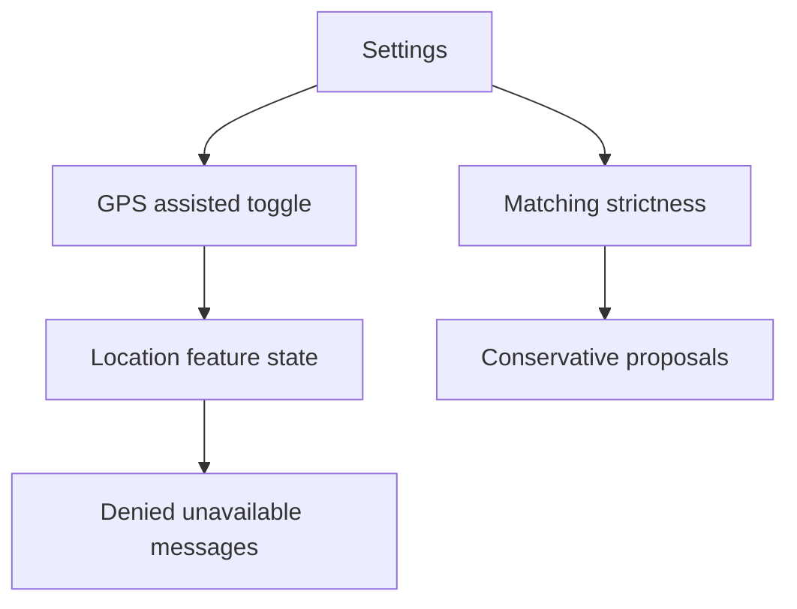

# Backlog 0029: Android 0.3 GPS Settings and States

From version: 0.2.4

Status: In progress

Understanding: 94%

Confidence: 88%

Progress: 100%

Complexity: Medium

Theme: Android Settings

## Source

- Request: `docs/request/0006-show-gps-position-on-map-0-3.md`

## Context

The GPS feature needs user control. GPS-assisted behavior should not be enabled
by default on first install, and matching strictness should be adjustable from
settings.

## Description

Add GPS settings and non-blocking states for permission denied, GPS disabled,
GPS unavailable, and GPS loading.

## Scope

In:

- Add a settings toggle for GPS-assisted behavior.
- Keep GPS-assisted behavior disabled by default on first install.
- Add adjustable GPS-to-segment matching strictness in settings.
- Persist GPS settings locally.
- Show clear non-blocking permission denied state.
- Show clear non-blocking GPS disabled or unavailable state.
- Let the user retry from the GPS button.
- Keep the map usable without GPS.

Out:

- Do not add account-based settings sync.
- Do not add background location settings.
- Do not make GPS required for manual tracking.

## Acceptance Criteria

- Settings includes a GPS-assisted behavior toggle.
- GPS-assisted behavior is off by default on first install.
- Settings includes an adjustable matching strictness parameter.
- The strictness setting affects proposal behavior.
- Permission denied state is clear and non-blocking.
- GPS disabled or unavailable state is clear and non-blocking.
- The user can retry GPS from the map GPS button.
- Manual segment tracking remains usable without GPS.
- A debug APK builds successfully.

## Priority

Priority: Must

Impact: Medium

Urgency: High

## Notes

Settings should stay understandable and not expose implementation-specific
distance math unless needed.

## Task Coverage

- `docs/tasks/0007-deliver-android-0-3-gps-position-and-segment-proposals.md`

## Risks

- Too many settings can make a personal app feel heavier than needed.
- The strictness control needs labels that are understandable on mobile.
