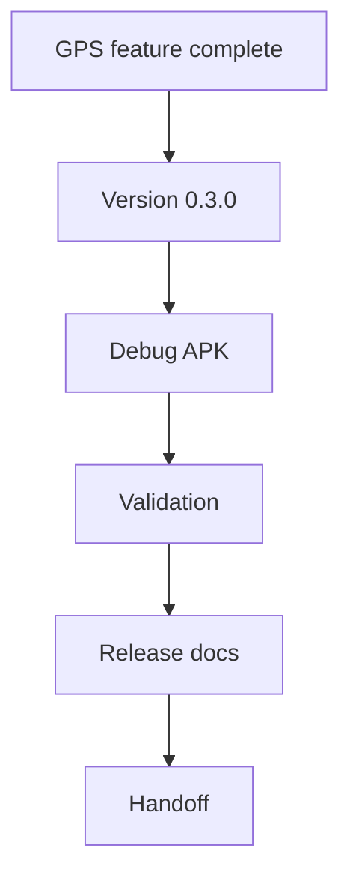

# Backlog 0030: Version 0.3 GPS Release Docs and Validation

From version: 0.2.4

Status: In progress

Understanding: 94%

Confidence: 88%

Progress: 95%

Complexity: Medium

Theme: Release

## Source

- Request: `docs/request/0006-show-gps-position-on-map-0-3.md`

## Context

The GPS feature should ship as version 0.3 with a validated debug APK, updated
handoff, and release documentation.

## Description

Bump the app to version 0.3.0, validate the GPS release, and update README,
release notes, and handoff documentation.

## Scope

In:

- Bump Android `versionName` to `0.3.0`.
- Bump Android `versionCode`.
- Generate `mapping-paris-0.3.0-debug.apk`.
- Run dataset, PWA, and Android build validation.
- Verify the APK signature.
- Update README with 0.3 GPS behavior if useful.
- Create release documentation for 0.3.
- Update `docs/development/handoff-next-codex.md`.
- Document manual GPS test checklist.

Out:

- Do not publish to Play Store.
- Do not create release signing setup.
- Do not add cloud services.

## Acceptance Criteria

- Android version is `0.3.0`.
- Debug APK is named `mapping-paris-0.3.0-debug.apk`.
- Required validation commands pass.
- APK signature verification passes.
- Handoff references the 0.3 APK and GPS behavior.
- Release documentation exists for 0.3.
- Manual GPS validation checklist is documented.

## Priority

Priority: Should

Impact: Medium

Urgency: Medium

## Notes

This item should be completed after the GPS implementation items are done.

## Task Coverage

- `docs/tasks/0007-deliver-android-0-3-gps-position-and-segment-proposals.md`

## Risks

- GPS manual validation depends on a real device and real location behavior.
