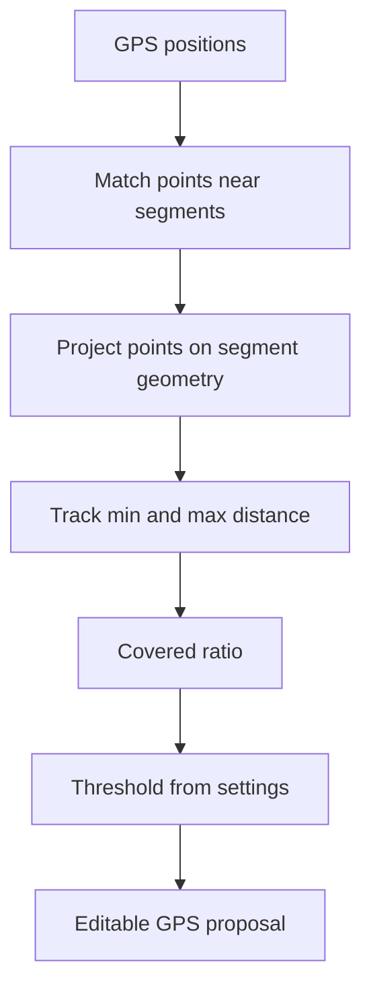

# Backlog 0031: GPS Segment Coverage Threshold

From version: 0.3.2

Status: Done

Understanding: 92%

Confidence: 84%

Progress: 100%

Complexity: High

Theme: Android GPS

## Source

- Request: `docs/request/0007-improve-gps-segment-validation-threshold-controls-and-zoom-performance.md`

## Context

GPS-assisted segment proposals currently behave too eagerly: a segment can be
selected after a location point comes within matching range. The expected
behavior is stricter. A segment should be proposed only when the recorded GPS
positions show enough progress along that segment.

## Description

Replace proximity-only GPS proposals with a coverage-based rule. A segment is
proposed only when at least two matched GPS positions on that segment are
separated along the segment by at least the configured coverage percentage.

## Scope

In:

- Add a configurable GPS segment coverage threshold.
- Default threshold to `70%`.
- Add a settings slider for the threshold.
- Use a practical slider range, suggested `30%` to `95%`.
- Use a practical slider step, suggested `5%`.
- Persist the threshold using the existing local settings mechanism.
- Project GPS positions onto candidate segment geometry.
- Track the minimum and maximum projected distance reached per logical segment
  during active GPS tracking.
- Compute segment coverage ratio as covered distance divided by segment length.
- Propose a segment only when at least two matched positions satisfy the
  configured coverage threshold.
- Keep proposals as editable selections.
- Keep manual validation as the only completion action.

Out:

- Do not change the source segment dataset.
- Do not change completion persistence unless required by existing settings
  storage.
- Do not automatically complete segments from GPS.
- Do not add cloud sync or route upload.
- Do not change map rendering or control placement in this backlog item.

## Acceptance Criteria

- GPS proposals require at least two matched positions on a segment.
- Matched positions are evaluated by projected distance along the segment.
- A segment is proposed only when matched positions span at least the configured
  percentage of the segment length.
- Default threshold is `70%`.
- The threshold is configurable from settings through a slider.
- The threshold setting persists across app restarts.
- Lowering the threshold makes proposals easier.
- Raising the threshold makes proposals stricter.
- A short pass near only one end of a segment does not propose that segment.
- A pass spanning most of a segment proposes that segment.
- Proposed segments remain editable selections.
- No segment is completed without explicit user validation.

## Priority

Priority: Must

Impact: High

Urgency: High

## Notes

Use `logical_segment_id` as the proposal and completion unit. The visual
geometry id should not become the user-facing completion key.

Implemented in Android `0.3.3`.

## Task Coverage

- `docs/tasks/0008-deliver-android-0-3-3-gps-qol-and-zoom-performance.md`

## Risks

- GPS accuracy can be poor in dense Paris streets, so the projection logic must
  remain conservative.
- Sparse GPS samples may miss short segments unless the threshold and matching
  distance are tuned carefully.
