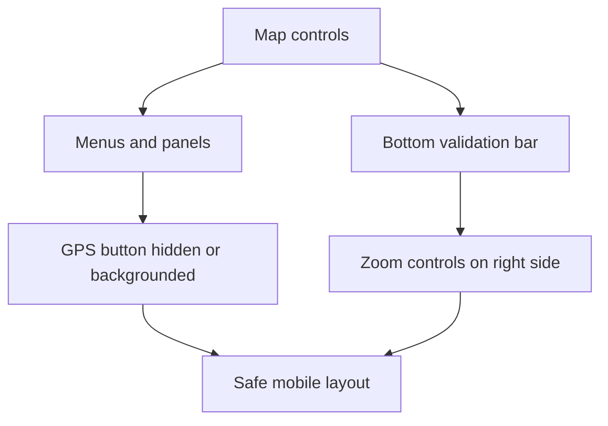

# Backlog 0032: Map Control Placement and Safe Areas

From version: 0.3.2

Status: Done

Understanding: 94%

Confidence: 90%

Progress: 100%

Complexity: Medium

Theme: Android UX

## Source

- Request: `docs/request/0007-improve-gps-segment-validation-threshold-controls-and-zoom-performance.md`

## Context

The map UI has two current control clashes:

- the geolocation button can compete with close buttons when menus or panels
  are open;
- the contextual bottom validation bar can overlap or visually clash with the
  plus and minus zoom buttons.

## Description

Reposition and conditionally hide map controls so the GPS button, close buttons,
zoom controls, and bottom validation bar remain usable without visual overlap.

## Scope

In:

- Prevent the GPS button from clashing with open menus or panel close buttons.
- Hide, dim, or move the GPS button behind menus while a menu or panel is open.
- Move plus and minus zoom controls to the right side of the map.
- Position zoom controls above the area used by the contextual bottom
  validation bar.
- Respect status bar, navigation bar, and safe drawing insets.
- Keep controls reachable on the target Android phone.
- Preserve existing GPS, menu, search, filter, and validation behavior.

Out:

- Do not redesign unrelated screens.
- Do not change GPS matching logic.
- Do not change segment rendering.
- Do not change map provider.
- Do not change the bottom validation bar behavior beyond avoiding overlap.

## Acceptance Criteria

- GPS button does not clash with menu close buttons.
- GPS button does not clash with settings, statistics, filter, or search panels.
- Zoom plus and minus controls are placed on the right side of the map.
- Zoom controls sit above the contextual bottom validation bar area.
- Zoom controls remain usable when segments are selected.
- Bottom validation actions remain usable.
- Controls respect Android safe areas.
- Existing menu, search, filter, GPS, and validation interactions still work.

## Priority

Priority: Must

Impact: Medium

Urgency: High

## Notes

This is a layout cleanup item. It should not change business logic.

Implemented in Android `0.3.3`.

## Task Coverage

- `docs/tasks/0008-deliver-android-0-3-3-gps-qol-and-zoom-performance.md`

## Risks

- Moving controls can create new clashes on small screens if insets and bottom
  bar height are not handled consistently.
