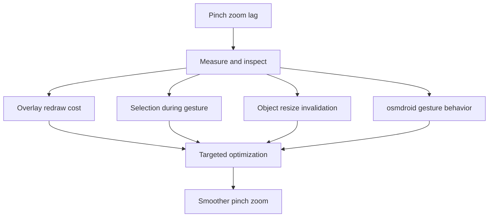

# Backlog 0033: Pinch Zoom Performance Diagnosis and Fix

From version: 0.3.2

Status: Done

Understanding: 90%

Confidence: 78%

Progress: 100%

Complexity: High

Theme: Android Performance

## Source

- Request: `docs/request/0007-improve-gps-segment-validation-threshold-controls-and-zoom-performance.md`

## Context

Pinch zoom currently has heavy lag and visible stutters on the Android map. The
dedicated plus and minus zoom buttons feel responsive, which suggests the issue
is specific to continuous gesture zoom, overlay redraw, hit-testing, or repeated
object resizing during pinch.

## Description

Diagnose the cause of pinch zoom lag and implement a targeted performance fix
without changing map provider or segment data.

## Scope

In:

- Diagnose pinch zoom lag with concrete observations or instrumentation.
- Investigate whether too many segment overlays are redrawn during pinch.
- Investigate whether selection, hit-testing, or GPS proposal work runs during
  pinch gestures.
- Investigate whether too many drawable objects are resized or invalidated on
  each zoom frame.
- Investigate whether osmdroid gesture amplification or overlay invalidation is
  contributing to the lag.
- Implement the smallest targeted fix that improves pinch zoom smoothness.
- Preserve plus and minus zoom button behavior.
- Preserve manual segment selection behavior.
- Preserve GPS proposal behavior except where work must be throttled during
  active gestures.
- Document the identified cause and the chosen fix in handoff or task notes.

Out:

- Do not replace osmdroid.
- Do not change the map tile provider.
- Do not regenerate the segment dataset.
- Do not remove required segment interaction.
- Do not implement offline maps.
- Do not redesign unrelated UI.

## Acceptance Criteria

- The likely cause or causes of pinch zoom lag are documented.
- Pinch zoom is visibly smoother than version 0.3.2.
- Plus and minus zoom buttons remain responsive.
- Map panning remains responsive.
- Manual segment selection still works after pinch zoom.
- GPS proposals still work after the performance fix.
- Segment rendering remains visually acceptable at city and neighborhood zoom.
- No map provider change is introduced.

## Priority

Priority: Must

Impact: High

Urgency: High

## Notes

Prefer targeted optimizations such as throttling gesture-time work, caching
style calculations, batching overlay invalidations, or suppressing expensive
hit-testing while pinch zoom is active.

Implemented in Android `0.3.3`. The likely causes were the custom pinch zoom
amplifier fighting osmdroid native pinch gestures and full segment redraws
during gesture zoom. The fix removes the amplifier and culls segment rendering
to the current viewport.

## Task Coverage

- `docs/tasks/0008-deliver-android-0-3-3-gps-qol-and-zoom-performance.md`

## Risks

- Performance behavior must be validated on the real phone because desktop or
  build-only checks will not expose the pinch gesture lag accurately.
- Over-throttling could make segment visual updates feel delayed after zooming.
