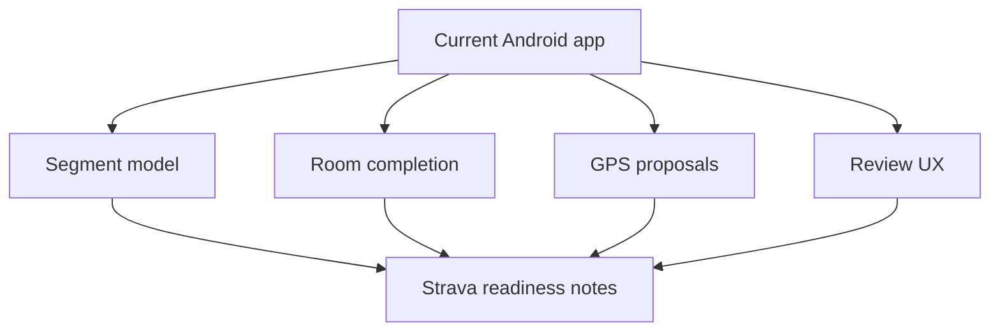

# Backlog 0034: Review Current App Architecture for Strava Readiness

From version: 0.3.3

Status: Ready

Understanding: 90%

Confidence: 84%

Progress: 0%

Complexity: Medium

Theme: Architecture

## Source

- Request: `docs/request/0008-strava-b2-backend-integration-for-gps-segment-proposals.md`

## Context

Before designing B2, the current Android app must be reviewed for integration
readiness: local segment model, logical ids, Room completion state, import and
export behavior, GPS matching, and map review UX.

## Description

Document how the current app can receive B2 proposals without losing the
manual-first local-first behavior.

## Scope

In:

- Review segment ids and `logical_segment_id`.
- Review local Room completion model.
- Review import/export behavior.
- Review GPS proposal model.
- Review map selection and confirmation flow.
- Identify Android surfaces that B2 will need.

Out:

- No runtime code changes.
- No backend code.
- No UI implementation.

## Acceptance Criteria

- Current architecture summary exists.
- Strava readiness gaps are listed.
- Local-first and manual-confirmation constraints are explicit.
- Required Android integration seams are identified.

## Priority

Priority: Must

Impact: High

Urgency: High

## Task Coverage

- `docs/tasks/0009-orchestrate-strava-b2-discovery-and-architecture.md`
