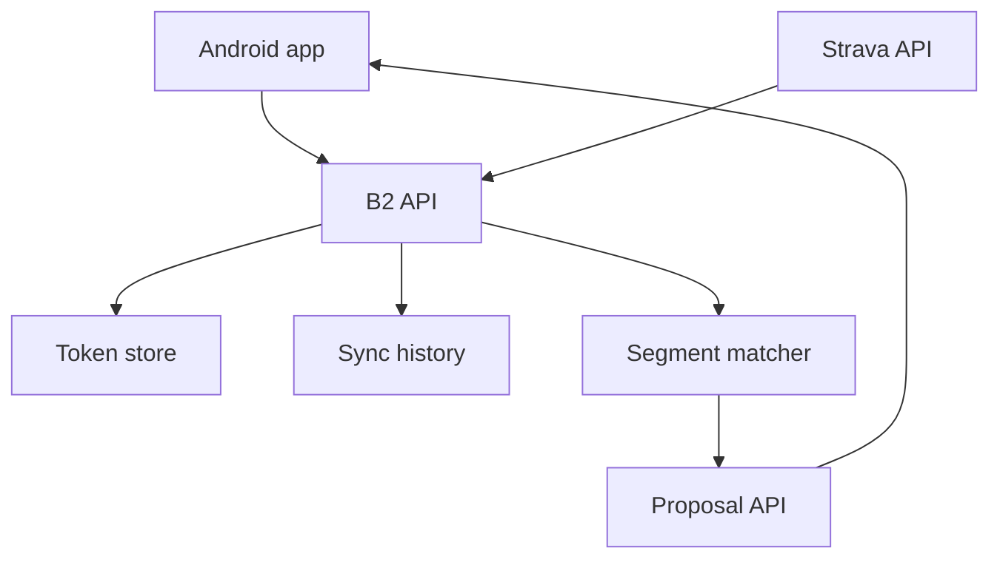

# Backlog 0035: Define Strava B2 Backend Architecture

From version: 0.3.3

Status: Ready

Understanding: 88%

Confidence: 78%

Progress: 0%

Complexity: High

Theme: Backend Architecture

## Source

- Request: `docs/request/0008-strava-b2-backend-integration-for-gps-segment-proposals.md`

## Context

B2 should be evaluated as a full backend, not only a token proxy. It would own
Strava sync, GPS stream processing, matching, sync history, and proposal output.

## Description

Define the target B2 backend responsibilities, boundaries, data stores, and
deployment shape at architecture level.

## Scope

In:

- Backend responsibility boundaries.
- Data store responsibilities.
- Segment dataset ownership.
- Proposal generation pipeline.
- Android/backend trust boundary.
- Deployment options for personal use.

Out:

- No backend implementation.
- No provider-specific provisioning.
- No production deployment.

## Acceptance Criteria

- B2 architecture direction is documented.
- Component boundaries are clear.
- Backend-owned and Android-owned responsibilities are separated.
- Deployment unknowns are listed.

## Priority

Priority: Must

Impact: High

Urgency: High

## Task Coverage

- `docs/tasks/0009-orchestrate-strava-b2-discovery-and-architecture.md`
