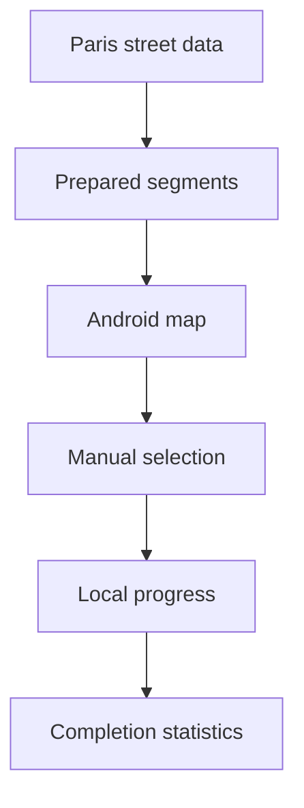

# Request 0001: Deliver Manual Paris Segment Tracking MVP

From version: 0.0.0

Status: Blocked

Understanding: 95%

Confidence: 80%

Progress: 85%

Complexity: High

Theme: MVP

## Context

The project needs a first usable Android MVP for personal tracking of completed street segments in Paris intra-muros.

The MVP must stay local-first, manual, and maintainable. It should provide a useful representation of Paris street progress without aiming for perfect GIS accuracy.

## Need

As the project owner, I want an Android app that displays Paris street segments and lets me manually mark completed segments, so I can reliably track my personal progress through Paris over time.

## Scope

- Prepare a local segment dataset for Paris intra-muros from OpenStreetMap.
- Exclude the Bois de Boulogne and the Bois de Vincennes.
- Use predefined stable segment ids.
- Allow approximate arrondissement attribution when needed.
- Allow simplified segment geometry when it keeps the map understandable.
- Create the Android app skeleton with Kotlin, Jetpack Compose, simple MVVM, osmdroid, and Room.
- Load the local segment dataset in the app.
- Display an online OSM map.
- Render street segments on the map.
- Support selecting one segment.
- Support toggling completion manually.
- Store completion state locally and separately from segment source data.
- Compute global progress statistics.
- Compute progress statistics by arrondissement.
- Generate a local APK.

## Non-goals

- GPS validation.
- Automatic route tracking.
- Backend services.
- User accounts.
- Cloud synchronization.
- Play Store publication.
- Offline map tiles.
- Perfect GIS completeness or exact street geometry.

## Acceptance criteria

- The app can be installed from a generated APK.
- The app displays a 2D online OSM map centered on Paris intra-muros.
- The app loads a local preprocessed segment dataset.
- The segment dataset excludes the Bois de Boulogne and the Bois de Vincennes.
- Rendered segments are visually distinguishable from the base map.
- The user can select one segment and manually toggle its completed state.
- Completed state persists locally after app restart.
- Segment source data does not contain user completion state.
- The app shows global completion statistics.
- The app shows completion statistics by arrondissement.
- The V1 contains no GPS validation, backend, account system, or cloud sync.

## Backlog coverage

This request is split into smaller backlog items. Initial seed coverage remains in `docs/backlog/0001-initial-backlog.md`.

Required MVP backlog:

- `docs/backlog/0002-mvp-segment-data-contract.md`
- `docs/backlog/0003-mvp-osm-segment-dataset.md`
- `docs/backlog/0004-mvp-android-map-foundation.md`
- `docs/backlog/0005-mvp-segment-loading-rendering-selection.md`
- `docs/backlog/0006-mvp-local-completion-state.md`
- `docs/backlog/0007-mvp-statistics-and-apk.md`

Nice-to-have or post-MVP slices:

- Support multi-selection
- Prepare offline map strategy
- Evaluate future GPS validation

## Decision references

- Product brief: `docs/product/product-brief.md`
- Data source and segment model ADR: `docs/adr/0001-data-source-and-segment-model.md`

## Task coverage

- `docs/tasks/0002-deliver-manual-paris-segment-tracking-mvp.md`

## Open questions

- Which simple OpenStreetMap filtering rules should be used first to keep normal streets, pedestrian ways, and cycleable paths while excluding clearly private, inaccessible, or irrelevant ways?
- Should multi-selection be included in the first APK MVP or handled immediately after the single-segment flow works?
