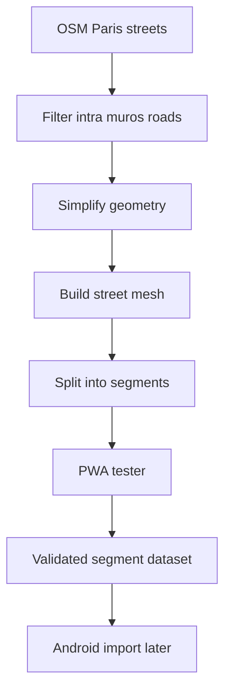

# Request 0002: Generate Full Paris Segment Mesh and PWA Tester

From version: 0.1.0

Status: Ready

Understanding: 95%

Confidence: 85%

Progress: 0%

Complexity: High

Theme: Segment Generation

## Context

The current debug app uses a very small seed dataset with one representative segment per arrondissement. That is not the target product model.

The real requirement is to generate the full Paris intra-muros street mesh from OpenStreetMap, transform that mesh into many individual clickable segments, then use that definitive segment file as the imported dataset for the app.

## Need

As the project owner, I want the project to generate an exhaustive Paris intra-muros street segment mesh and provide a Chrome PWA tester, so I can inspect, click, validate, and refine the definitive segment dataset before it is imported into the Android app.

## Corrected product direction

The target dataset must not contain one segment per arrondissement or a small illustrative sample.

The target is a dense street network with a large number of segments, likely several hundred segments per arrondissement. Each line segment in the resulting mesh must be an individual data element that can be clicked, validated, and later persisted as completed or not completed in the app.

## Scope

In:

- Extract Paris intra-muros roads and streets from OpenStreetMap.
- Exclude areas outside Paris intra-muros.
- Exclude the Bois de Boulogne and the Bois de Vincennes.
- Keep roads, streets, pedestrian streets, cycleable paths, and walkable public ways relevant to street traversal.
- Remove clearly private, inaccessible, service-only, or irrelevant ways.
- Simplify geometry enough to reduce noise while preserving the general shape of each road.
- Convert the filtered road network into a mesh-like architecture.
- Split the mesh into individual segments.
- Give each segment a stable id.
- Store each segment as a separate clickable element.
- Produce a definitive segment dataset for later Android import.
- Build a Chrome-compatible PWA tester to visualize the generated segment mesh.
- In the PWA, allow clicking a segment.
- In the PWA, allow validating or unvalidating a clicked segment.
- In the PWA, show enough metadata to inspect the generated segment.
- Use the PWA primarily to test generation, segmentation, visual quality, and validation UX before continuing Android work.

Out:

- Do not keep the one-segment-per-arrondissement seed as the target dataset.
- Do not continue Android UX work before the segment generation and tester path is corrected.
- Do not add GPS validation.
- Do not add backend services.
- Do not add user accounts.
- Do not require Play Store publication.
- Do not require offline mobile map support in this request.
- Do not aim for perfect GIS accuracy if a simpler geometry remains visually close to the road shape.

## Acceptance criteria

- The generated dataset contains a dense Paris intra-muros segment mesh, not a small sample.
- The dataset contains many individual segments per arrondissement where street density requires it.
- Each segment is an independent element with a stable id.
- Each segment can be clicked in the PWA tester.
- A clicked segment can be marked as validated.
- A previously validated segment can be unvalidated.
- Segment validation state in the tester is separate from the source segment geometry.
- Geometry simplification preserves the general visual shape of roads.
- The Bois de Boulogne and the Bois de Vincennes are excluded.
- The generation process is documented and repeatable.
- The PWA runs in Chrome locally.
- The PWA allows visual inspection of the street mesh before the Android app imports it.
- The Android dataset import is deferred until the segment dataset shape is validated.

## Data model expectations

Each generated segment should include:

- stable segment id
- street name when available
- arrondissement when available or assigned pragmatically
- length in meters
- geometry as a simplified polyline
- source metadata useful for debugging
- no `completed`, `validated`, or user progress field in the source dataset

Tester validation state should be stored separately from the generated source dataset.

## PWA tester expectations

The PWA tester should support:

- loading the generated segment dataset;
- displaying the full Paris segment mesh;
- zooming and panning in Chrome;
- clicking an individual segment;
- highlighting selected, validated, and unvalidated segments;
- toggling validation state;
- showing segment metadata;
- displaying basic counts such as total segments and validated segments.

The PWA is a validation tool for the segment generation process, not the final Android app.

## Backlog guidance

This request is promoted into several backlog items rather than a single implementation block.

Backlog coverage:

- `docs/backlog/0008-correct-full-segment-generation-contract.md`
- `docs/backlog/0009-build-osm-extraction-filtering-pipeline.md`
- `docs/backlog/0010-simplify-and-segment-paris-street-mesh.md`
- `docs/backlog/0011-export-definitive-segment-dataset.md`
- `docs/backlog/0012-build-chrome-pwa-segment-mesh-tester.md`
- `docs/backlog/0013-add-pwa-segment-validation-state.md`
- `docs/backlog/0014-add-segment-dataset-quality-checks.md`

## Decision references

- Product brief: `docs/product/product-brief.md`
- Existing ADR to revise or supersede: `docs/adr/0001-data-source-and-segment-model.md`
- Existing Android MVP request affected by this correction: `docs/request/0001-deliver-manual-paris-segment-tracking-mvp.md`

## Task coverage

- `docs/tasks/0003-generate-full-paris-segment-mesh-and-pwa-tester.md`

## Open questions

- What exact Paris boundary source should be used for intra-muros clipping?
- Which OSM `highway` values should be included in the first full extraction?
- Should the PWA tester persist validation state in browser local storage, a local file export, or both?
- What format should be considered definitive for Android import: GeoJSON, compact JSON, or another derived format?
- What quality threshold defines an acceptable simplification level for the first generated mesh?
