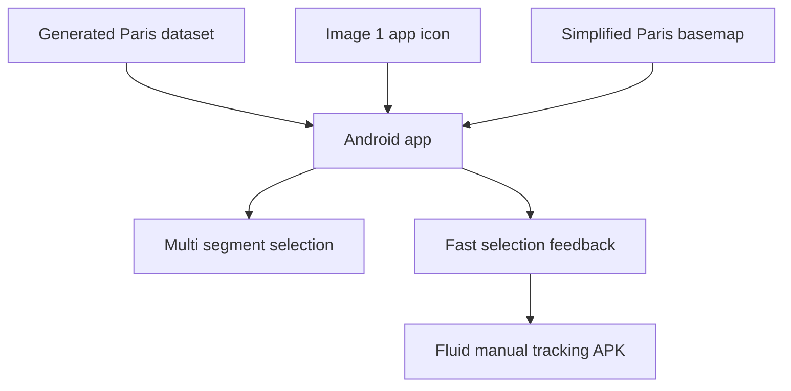

# Request 0003: Polish Android Map Visuals and Segment Interaction

From version: 0.1.0

Status: Ready

Understanding: 92%

Confidence: 88%

Progress: 0%

Complexity: High

Theme: Android UX

## Context

The generated Paris segment dataset is now visually acceptable in the PWA and
is packaged in the Android APK. The Android app can load the dense generated
dataset, but the first mobile experience still feels like an early technical
proof:

- the app icon and visual identity are not aligned with the project;
- the Android map background still uses detailed OSM tiles;
- the PWA supports multi-segment selection, but the Android app still selects
  one segment at a time;
- segment selection and switching in the Android app has a noticeable delay.

The next step is to make the Android app feel like the actual personal tracking
tool, not only a data-loading prototype.



## Need

As the project owner, I want the Android APK to use the provided app image,
display a simplified Paris-specific map background, support multi-segment
selection, and respond quickly when selecting or changing selected segments, so
the app becomes usable for real manual tracking instead of only validating the
dataset.

## Scope

In:

- Add the user-provided image `[Image #1]` as the Android app image/icon.
- Store the source image inside the app/project folder so it is not lost when
  the local downloads folder is cleaned up.
- Produce Android launcher icon assets from the image in the required densities.
- The source image may be cropped, adapted, or processed into Android adaptive
  icon assets if needed.
- Keep the app image visually consistent with the dark blue Paris-map icon
  supplied in the request.
- Replace or hide the current detailed OSM tile background in the Android app.
- Provide a simplified Paris map background in the same visual family as the app
  image: blue-toned, restrained, and focused on orientation.
- Show the Paris outline, the Seine, and Paris canals clearly.
- Show street names where useful for navigation without reproducing the full
  detailed OSM visual noise.
- Show major landmarks and orientation anchors with labels, such as large
  churches, train stations, parks, Elysee, and other recognizable monuments.
- Keep the generated segment overlay as the primary interactive surface.
- Bring multi-segment selection from the PWA concept into the Android app.
- Allow selecting and deselecting multiple segments on Android.
- Allow validating/completing or unvalidating/uncompleting the selected segment
  set.
- Display useful selected-set information such as count, total length, and
  mixed arrondissement state.
- Audit why segment selection or segment switching is slow in the Android app.
- Optimize the real bottleneck before adding cosmetic workarounds.
- Keep source segment geometry separate from user progress state.
- Produce a new debug APK after implementation.
- Name generated APK files with the `mapping-paris-<version>-<buildType>.apk`
  pattern.

Out:

- Do not add GPS validation.
- Do not add backend services.
- Do not add user accounts.
- Do not add cloud sync.
- Do not require Play Store release assets.
- Do not restore the detailed OSM basemap as the dominant visual layer.
- Do not alter the generated source dataset just to solve Android rendering
  performance unless the dataset itself is proven to be the bottleneck.

## App Image Expectations

The app image should use `[Image #1]` from this request as the source visual.

Expected output:

- Android launcher icon assets are generated and referenced by the app manifest.
- The icon works on current Android launchers.
- The icon remains recognizable at small sizes.
- No unrelated brand or placeholder icon remains visible.

## Simplified Map Background Expectations

The Android app should no longer depend visually on the fully detailed OSM tile
background as the main map surface.

Acceptable directions include:

- a simplified local vector or bitmap background of Paris;
- a custom low-detail tile or static Paris basemap generated from project data;
- a blue-toned map surface with Paris outline, waterways, streets, and selected
  landmark labels;
- any approach that keeps orientation while making the colored segment network
  the main visual information.

The simplified background must still make it possible to understand where the
selected segments are in Paris.

Required orientation elements:

- Paris outline;
- Seine;
- Canal Saint-Martin and other visible canals where relevant;
- useful street names;
- large parks;
- major train stations;
- major churches and monuments;
- Elysee or similar high-value landmarks.

## Multi-Selection Expectations

The Android app should support the same core workflow as the PWA:

- tap a segment to add it to the selection;
- tap a selected segment again to remove it from the selection;
- long-press a segment to enter multi-selection mode if the app is not already
  in that mode;
- keep several selected segments highlighted at once;
- show selected count and total selected length;
- mark all selected segments completed;
- if all selected segments are already completed, allow marking them incomplete;
- clear the current selection.

## Performance Audit Expectations

The current Android app has a noticeable delay before selection feedback appears
or before changing the selected segment. The implementation task must identify
the source of this delay before optimizing.

Potential causes to verify:

- rebuilding all map overlays on every selection change;
- recreating thousands of `Polyline` objects during Compose updates;
- osmdroid overlay invalidation cost;
- JSON parsing or data loading on the main path;
- completion-state flow updates causing broad recomposition;
- inefficient lookup of selected segment metadata;
- excessive work in the map `AndroidView` update block.

The final implementation should keep selection feedback fluid on the generated
15,295 segment dataset.

## Acceptance Criteria

- The Android APK uses `[Image #1]` as its app icon or launcher image.
- The debug APK no longer presents the app with the old default placeholder
  icon.
- The Android map background is simplified and no longer visually dominated by
  detailed OSM map tiles.
- The segment network remains readable over the simplified map background.
- The Android app supports selecting multiple segments.
- The Android app supports deselecting individual selected segments.
- The Android app supports clearing the full selection.
- The Android app can complete or uncomplete the full selected segment set.
- User completion state remains stored separately from the source GeoJSON.
- Selection feedback is visibly faster than the current APK.
- The implementation includes a short performance finding explaining the
  original delay source.
- A debug APK can be built successfully after the changes.
- The generated APK file is named with the
  `mapping-paris-<version>-<buildType>.apk` pattern, for example
  `mapping-paris-0.1.0-debug.apk`.
- The source app image is stored in the repository under the Android app folder.

## Validation Expectations

Minimum validation commands:

```powershell
py -3 tools\segment_pipeline\validate_segments.py app\src\main\assets\paris_segments.geojson
.\gradlew.bat --no-daemon --stacktrace assembleDebug
```

APK naming validation:

- confirm the produced APK can be found under a stable output path;
- confirm its filename starts with `mapping-paris-`;
- confirm the version suffix matches the app version used by Gradle;
- confirm the build type suffix is present, such as `debug` or `release`.

Recommended manual validation:

- install the debug APK on a device;
- confirm the launcher icon changed;
- open the app and confirm the simplified map background is visible;
- tap several neighboring segments and confirm all stay selected;
- toggle completion for the selected set;
- change selection repeatedly and confirm the UI remains responsive.

## Backlog Guidance

This request should likely split into several backlog items:

- Android launcher icon and app identity assets.
- Simplified Paris basemap strategy and implementation.
- Android multi-segment selection and completion UX.
- Android map interaction performance audit and optimization.

These slices can be implemented together only if the resulting task remains
small enough to validate with one debug APK build and one manual device pass.

## Backlog Coverage

- `docs/backlog/0015-add-android-app-icon-and-apk-naming.md`
- `docs/backlog/0016-build-simplified-blue-paris-basemap.md`
- `docs/backlog/0017-add-android-multi-segment-selection.md`
- `docs/backlog/0018-optimize-android-segment-selection-performance.md`

## Decision References

- Product brief: `docs/product/product-brief.md`
- Segment contract: `docs/data/segment-contract.md`
- Android build notes: `docs/development/android-build.md`
- PWA tester behavior: `docs/development/pwa-segment-tester.md`
- Prior dataset task: `docs/tasks/0003-generate-full-paris-segment-mesh-and-pwa-tester.md`

## Open Questions

- Should the simplified Paris background be generated from local project data,
  bundled as a static asset, or drawn directly in the Android app?
- Which landmark source should be used first: a manually curated list, OSM
  extraction, or a small bundled GeoJSON?
- Should drag/lasso selection be considered later after tap and long-press
  multi-selection are stable?
- What device should be used as the baseline for "fluid" selection performance?
