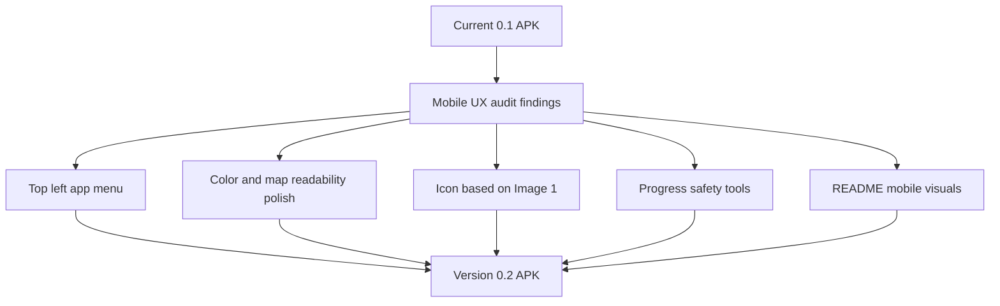

# Request 0004: Prepare Version 0.2 Mobile UX and Product Hardening

From version: 0.1.0

Status: Implemented

Understanding: 94%

Confidence: 90%

Progress: 95%

Complexity: High

Theme: Android UX

## Context

The 0.1 Android APK and PWA tester now provide the core local-first Paris
segment tracking model: a generated segment dataset, a map renderer, manual
selection, completion state, and basic statistics. The project audit surfaced
that the next useful step is not another dataset pass, but a broader mobile UX
and product hardening pass before real personal use.

The current Android bottom panel covers a meaningful part of the map on mobile.
The app also needs a clearer option/menu structure, more user-safe progress
management, updated documentation, and a version bump to 0.2. The current app
icon is visually too different from the original direction and should restart
from the provided `[Image #1]` with only minor adaptations.



## Need

As the project owner, I want the Android app to move from a working 0.1
prototype to a more usable 0.2 mobile app, so I can use it on a phone without
the control panel blocking the map, with clearer actions, safer progress
management, an app identity close to the original icon, and documentation that
shows the real mobile experience.

## User Remarks To Preserve

- The mobile panel is indeed badly placed and hides part of the screen.
- The app should use a small menu that opens access to the different options
  and menus.
- The menu should be placed at the top left, like in most apps.
- When no segment is selected, the app should not show any empty state UI such
  as "0 segment selected" over the map.
- The top-left menu is only for secondary navigation such as settings and the
  statistics view.
- Main map actions should use a bottom bar, not the top-left menu.
- Import must be included.
- Street search must be included.
- Filters should live in a separate hidden menu exposed by a visible icon; that
  filter menu opens only when the icon is pressed.
- Colors should be made more UX-compatible, but without adding a color-blind
  mode in this request.
- Color choices should follow expert product design judgment rather than a
  fixed color prescription.
- Both light and blue map modes should be available, with the choice exposed in
  the menu.
- The current app icon is too different from the initial visual direction.
- The icon work should restart from `[Image #1]` and modify it only slightly.
- The source icon asset should be stored in the repository.
- The README should include several visuals of the mobile app.
- README screenshots should be reproducible from emulator captures.
- README screenshot PNG files should be committed to the repository.
- The app should move to version `0.2`.
- Undo after completion should be implemented as a simple snackbar-style undo.
- The main 0.2 effort should remain Android-focused.
- Manual mobile validation baseline should be Google Pixel 8 with the latest
  Android version available for it.

## Scope

In:

- Replace the large always-visible Android bottom control panel with a compact
  mobile navigation/control model.
- Add a small top-left menu button on the map.
- Open an app menu or drawer from that top-left button.
- Provide access from the top-left menu to secondary navigation only, including
  settings and the statistics view.
- Keep main map actions in a bottom contextual bar.
- Keep key map interactions directly accessible and avoid hiding too much map
  area.
- Hide all empty selection UI when no segment is selected.
- Preserve the selected segment action flow: select, mark completed, mark not
  completed, clear selection.
- Show the bottom contextual action bar only when it is useful, especially when
  one or more segments are selected.
- Add Android import and export of completed `logical_segment_id` values.
- Add street search in Android.
- Add a separate filter control as a visible icon that opens a hidden filter
  menu when pressed.
- Support both a light map mode and a blue map mode, selectable from the menu.
- Improve the visual color system for readability and hierarchy on a phone.
- Keep the segment states easy to distinguish without introducing a dedicated
  color-blind mode.
- Rework the Android app icon from `[Image #1]` with only minor adaptations
  needed for Android launcher requirements.
- Store the source icon asset and generated icon assets in the repo.
- Add several mobile app visuals to the README.
- Refresh README counts and project state so they match the current dataset and
  version.
- Bump the app version to `0.2.0`.
- Produce a debug APK named with the existing
  `mapping-paris-<version>-<buildType>.apk` pattern.
- Add or update validation notes for the new 0.2 APK.

Product hardening items to consider in the same 0.2 wave or as direct follow-up:

- Undo after completing or uncompleting a selected set using a simple snackbar.
- First-use help or lightweight onboarding for tap, long press, and menu usage.
- Migration or compatibility handling for old completion rows keyed by visual
  segment `id` instead of `logical_segment_id`.
- Offline or network-error state for online map tiles.
- More useful progress stats, such as remaining kilometers and arrondissement
  progress summaries.

Out:

- Do not add GPS validation.
- Do not add backend services.
- Do not add accounts.
- Do not add cloud sync.
- Do not add a color-blind mode in this request.
- Do not redesign the app into a marketing-style landing page.
- Do not regenerate the Paris segment dataset unless a defect requires it.
- Do not replace the manual local-first model.
- Do not make the icon visually unrelated to `[Image #1]`.

## Android Menu Expectations

The Android app should no longer rely on a large permanent bottom panel for all
controls. The map should remain the primary screen.

Expected direction:

- a top-left menu button over the map;
- a custom compact menu panel that opens from that button;
- direct access to settings and statistics from that menu;
- light map mode and blue map mode selection available from the menu;
- no empty selection UI shown when no segment is selected;
- selection actions available from a contextual bottom action bar when one or
  more segments are selected;
- the selected state should remain visible enough without covering the map;
- the menu should be easy to close and should not trap the user away from the
  map.

Selected implementation direction:

- small custom menu sheet anchored from the top-left button;
- top-left menu for settings and statistics only;
- separate filter icon with its own deployable filter menu;
- compact bottom action bar for map actions and selected-segment actions.

The top-left menu must not become the primary action surface for completing
segments. It is navigation and configuration, while the bottom bar is the map
action surface.

## Search, Filters, Import, And Export Expectations

Android 0.2 should include the product tools needed for real local use:

- export completed `logical_segment_id` values to a user-accessible file;
- import completed `logical_segment_id` values from a previous export;
- show import feedback with counts and conflicts if applicable;
- provide street search with a result list and map recentering;
- provide filters for completed, not completed, selected, arrondissement, and
  street where practical;
- keep filters behind a dedicated filter icon so the map remains uncluttered;
- open the filter menu only when the filter icon is pressed;
- make active filters visible enough that the user understands why the map may
  show fewer segments.

## Color And Readability Expectations

The color pass should make the app more comfortable and legible on mobile:

- segment states should be visually clear over the chosen basemap;
- selected segments should remain immediately visible;
- completed and not completed states should not feel visually aggressive;
- text and buttons should have adequate contrast;
- map labels should remain readable under segment overlays where possible;
- the palette should stay close to the app identity direction from `[Image #1]`.
- support both light map mode and blue map mode;
- expose the light or blue mode choice from the menu.

This request explicitly excludes a full color-blind mode, but the default
palette should still avoid poor contrast and ambiguous states.

Exact colors are intentionally left to product design judgment. The final
implementation should choose a calm, readable palette that fits the icon and
does not overemphasize uncompleted segments.

## Icon Expectations

The source visual direction is `[Image #1]`: a dark navy rounded-square app icon
with a simplified Paris-like street map and bright cyan/green completed paths.

Expected handling:

- use `[Image #1]` as the source direction;
- modify only what is necessary for Android launcher constraints;
- store the source raster asset in the repository;
- preserve the dark navy background;
- preserve the simplified map-line concept;
- preserve the bright completed-route accent;
- avoid replacing it with a materially different icon style;
- keep the icon recognizable at small launcher sizes.

## README Visual Expectations

The README should show the real app, not only describe it.

Expected additions:

- one or more Android map screenshots;
- one screenshot with the top-left menu closed;
- one screenshot with the menu open;
- one screenshot showing selected segments or completion actions;
- one screenshot showing search or filters if implemented in the same 0.2
  delivery;
- optionally one PWA tester screenshot if useful;
- short captions focused on what the user sees, not implementation details.

Screenshots should be stored under a stable repo path such as
`docs/assets/readme/` or another documented assets folder.

Screenshots should be captured from an emulator so they can be reproduced in
future updates. The screenshot PNG files should be committed directly so GitHub
renders the README without a generation step.

## Acceptance Criteria

- The Android app version is bumped to `0.2.0`.
- The debug APK output is named `mapping-paris-0.2.0-debug.apk`.
- The Android map is no longer blocked by a large always-visible bottom panel.
- A top-left menu button is visible and usable on the map.
- The top-left menu uses a custom compact menu implementation.
- The top-left menu provides access to settings and statistics.
- Light and blue map mode can be selected from the menu.
- No empty selection panel is shown when no segment is selected.
- Selection actions remain available in a contextual bottom bar when segments
  are selected.
- The user can close the menu and return to the full map quickly.
- A separate filter icon opens a hidden filter menu.
- Street search is available in Android.
- Android can export completion state.
- Android can import completion state.
- Completion and uncompletion actions provide a simple snackbar-style undo.
- The color system is updated for clearer mobile readability.
- No dedicated color-blind mode is added.
- The launcher icon is rebuilt from `[Image #1]` with only minor adaptations.
- The README includes several current mobile app visuals.
- README dataset counts and version references are updated.
- README screenshot PNG files are committed to the repository.
- Source segment geometry remains separate from user completion state.
- Existing PWA validation still passes after documentation and asset changes.
- A debug Android APK builds successfully.

## Validation Expectations

Minimum validation commands:

```powershell
git status --short --branch
py -3 tools\segment_pipeline\validate_segments.py data\generated\paris_segments.geojson
py -3 tools\segment_pipeline\validate_segments.py app\src\main\assets\paris_segments.geojson
npm run check:pwa
py -3 tools\segment_pipeline\validate_pwa.py
.\gradlew.bat --no-daemon --stacktrace assembleDebug
```

Recommended APK checks:

```powershell
& "$env:LOCALAPPDATA\Android\Sdk\build-tools\35.0.0\apksigner.bat" verify --print-certs app\build\outputs\apk\debug\mapping-paris-0.2.0-debug.apk
```

Manual validation:

- install the 0.2 debug APK on a phone;
- confirm the map is usable without the old bottom panel blocking it;
- open and close the top-left menu several times;
- switch between light and blue map modes;
- open and close the filter menu from the filter icon;
- search for a street and confirm the map recenters or exposes useful results;
- select one segment and several segments;
- complete and uncomplete selected segments;
- undo a completion or uncompletion from the snackbar;
- export completion state;
- import completion state from an export;
- confirm colors remain readable in normal indoor and outdoor brightness;
- confirm the launcher icon resembles `[Image #1]`;
- confirm README screenshots match the current app.

Baseline manual device:

- Google Pixel 8.
- Latest Android version available for that device at validation time.

## Backlog Guidance

This request should likely split into several backlog items:

- Android top-left menu and panel rework.
- Android color and map readability polish.
- App icon rebuild from `[Image #1]`.
- Android export/import and progress safety.
- Android search and filters.
- README mobile visuals and version 0.2 documentation.
- Completion-state migration for `logical_segment_id`.

The first 0.2 wave should include menu, colors, icon, README visuals, version
bump, import/export, search, filters, and snackbar undo. If this becomes too
large for one implementation task, split it into multiple backlog items under
the same 0.2 request instead of dropping the features.

## Backlog Coverage

- `docs/backlog/0019-android-0-2-menu-and-contextual-actions.md`
- `docs/backlog/0020-android-0-2-import-export-and-progress-safety.md`
- `docs/backlog/0021-android-0-2-search-and-filter-controls.md`
- `docs/backlog/0022-android-0-2-map-modes-and-color-polish.md`
- `docs/backlog/0023-rebuild-android-icon-from-image-1.md`
- `docs/backlog/0024-readme-mobile-visuals-and-version-0-2-docs.md`
- `docs/backlog/0025-migrate-completion-state-to-logical-segment-ids.md`

## Decision References

- Product brief: `docs/product/product-brief.md`
- Segment contract: `docs/data/segment-contract.md`
- Android build notes: `docs/development/android-build.md`
- PWA tester behavior: `docs/development/pwa-segment-tester.md`
- Previous UX request: `docs/request/0003-polish-android-map-visuals-and-segment-interaction.md`
- Current handoff: `docs/development/handoff-next-codex.md`

## Decisions

- Top-left menu style: custom compact menu.
- Empty selection state: show no "0 segment selected" UI over the map.
- Primary map actions: use a contextual bottom bar.
- Top-left menu purpose: settings and statistics.
- Import/export: both required in 0.2.
- Import conflict handling: show a popup menu with merge, replace, and cancel.
- Import/export location: inside settings.
- Street search: required in 0.2.
- Street search behavior: recenter only, do not auto-select results.
- Street search matching: accent-insensitive partial matches, sorted by best
  match and arrondissement proximity if available.
- Filters: separate hidden menu opened from a visible filter icon.
- Filter visibility: show filters only when the filter icon is pressed; do not
  keep active filter chips visible after the filter menu closes.
- Color direction: expert product design judgment, no color-blind mode.
- Map modes: provide both light and blue choices in the menu.
- Blue map mode direction: start with a blue-tinted treatment if it preserves
  street labels; move to a local simplified basemap only if readability is
  better.
- Icon source: store `[Image #1]` in the repo and adapt it only slightly.
- Icon modifications: crop, resize, adaptive-icon safe area, density export,
  and very light contrast cleanup only.
- README screenshots: map normal, menu open, selected segments, and stats or
  progress view.
- Screenshot capture: emulator, to keep future updates reproducible.
- Screenshot storage: commit PNG files under a stable docs assets folder.
- Versioning: use Gradle `versionName = "0.2.0"` and refer to the release as
  0.2 in prose.
- Completion migration: migrate old visual `id` rows to `logical_segment_id`
  before real use, split into a task if needed.
- Undo: implement simple snackbar-style undo.
- PWA scope: main effort remains Android; only update PWA colors if needed for
  consistency.
- Manual validation baseline: Google Pixel 8 with the latest Android version
  available for it.
- Statistics view: full-screen view.
- Reset all progress: include in settings with a confirmation dialog, separate
  from import/export.
- README changelog: include a compact Version 0.2 section with screenshots and
  the main UX changes.

## Remaining Open Questions With Suggested Defaults

No open product questions remain from the current clarification pass. The next
step is to split this request into backlog items and executable tasks.
