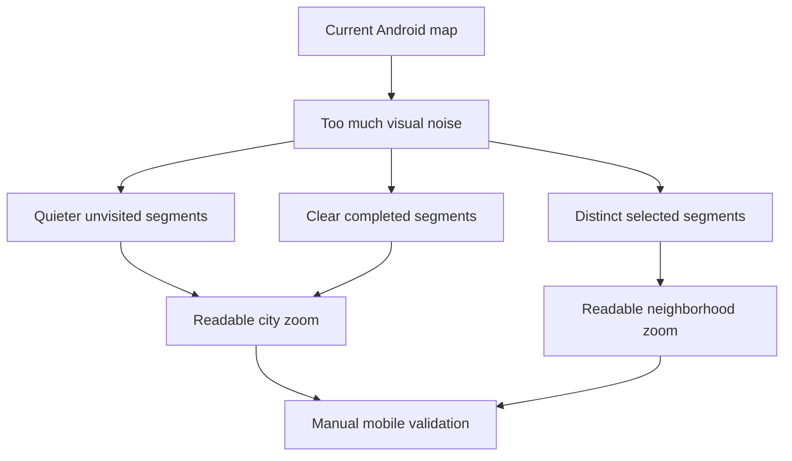

# Request 0005: Improve Main Map UI Readability And Interaction States

From version: 0.2.1

Status: Ready

Understanding: 95%

Confidence: 90%

Progress: 0%

Complexity: Medium

Theme: Android Map UI

## Context

The Android 0.2.1 app now exposes the main mobile controls, search, filters,
settings, statistics, import/export, snackbar undo, and logical segment
completion state. The next mobile readability issue is focused on the map
itself: segment overlays should no longer visually dominate the basemap,
especially at full Paris zoom.

The current map needs clearer visual hierarchy between unvisited, completed,
and selected segments without changing the data model or interaction behavior.



## Need

As the project owner, I want the main map to be easier to read, so I can see
Paris and its street labels while still understanding which segments are
unvisited, completed, or currently selected.

## Goal

Improve segment rendering styles so the map is visually calmer and interaction
states are immediately understandable.

## Scope

In:

- Update segment rendering styles only.
- Tune stroke color, opacity, and width for unvisited, completed, and selected
  segment states.
- Keep strokes readable at high zoom without overloading the map at low zoom.
- Centralize segment rendering constants if practical.
- Keep the current map provider.

Out:

- Do not change data loading.
- Do not change persistence.
- Do not change selection logic.
- Do not add new screens.
- Do not modify unrelated UI panels.
- Do not replace the current map provider.
- Do not commit or push before manual validation.

## Expected Visual States

- Unvisited segments: muted red/rose or neutral grey, low opacity, thin stroke.
- Completed segments: mint/teal green, higher opacity, slightly thicker stroke.
- Selected segments: visually distinct from completed segments, preferably
  purple or cyan, high opacity, with optional halo or thicker stroke.
- Stroke width should remain readable at high zoom but should not visually
  overload the map at full Paris zoom.

## Likely Files To Modify

- `app/src/main/java/com/jilanos/mappingparis/ui/ParisMapOverlays.kt`
- `app/src/main/java/com/jilanos/mappingparis/ui/MappingParisApp.kt` only if
  shared color or rendering constants need to move there.
- Color or theme definition files, only if a reusable map rendering token
  already exists or is clearly useful.

## Constraints

- Keep existing completed and selected state logic.
- Keep existing multi-selection behavior.
- Avoid hardcoding the same colors in multiple files.
- Keep the changes narrowly scoped to segment overlay rendering.
- Preserve current import/export, search, filters, settings, statistics, and
  snackbar behavior.

## Acceptance Criteria

- Non-completed segments are visually quieter.
- Completed segments are immediately identifiable.
- Selected segments are not confused with completed segments.
- The map remains usable at both city zoom and neighborhood zoom.
- Stroke widths remain readable at high zoom without overwhelming the basemap at
  low zoom.
- No regression is introduced in selection behavior.
- No regression is introduced in completion behavior.
- Data loading and persistence remain unchanged.

## Validation Expectations

Automated validation:

```powershell
git status --short --branch
.\gradlew.bat --no-daemon --stacktrace assembleDebug
```

Device validation, if a device is connected:

```powershell
tools\build-and-install-debug-apk.cmd
```

Manual validation:

- Verify at full Paris zoom that the map is no longer dominated by red.
- Verify at 18e zoom that individual segments remain readable.
- Verify completed segments are clearly visible.
- Verify selected segments are visually distinct from completed segments.
- Verify multi-selection still works.
- Verify completing and uncompleting selected segments still works.

## Decision References

- Product brief: `docs/product/product-brief.md`
- Current Android map overlay: `app/src/main/java/com/jilanos/mappingparis/ui/ParisMapOverlays.kt`
- Android 0.2 UX request: `docs/request/0004-prepare-version-0-2-mobile-ux-and-product-hardening.md`
- Android 0.2 implementation task: `docs/tasks/0005-deliver-android-0-2-mobile-ux-and-product-hardening.md`

## Backlog Guidance

This request should become a small Android UI backlog item focused only on
segment overlay rendering. It should not be grouped with menu, import/export,
dataset, or persistence work.

## Backlog Coverage

- `docs/backlog/0026-improve-main-map-segment-readability.md`

## Open Questions

- Should unvisited segments use a muted red/rose to preserve the current
  semantic direction, or a neutral grey to reduce visual noise further?
- Should selected segments use cyan, matching the app icon accent, or purple to
  be more distinct from completed teal?
- Should stroke width vary by zoom level in this pass, or stay static with a
  better compromise value?
