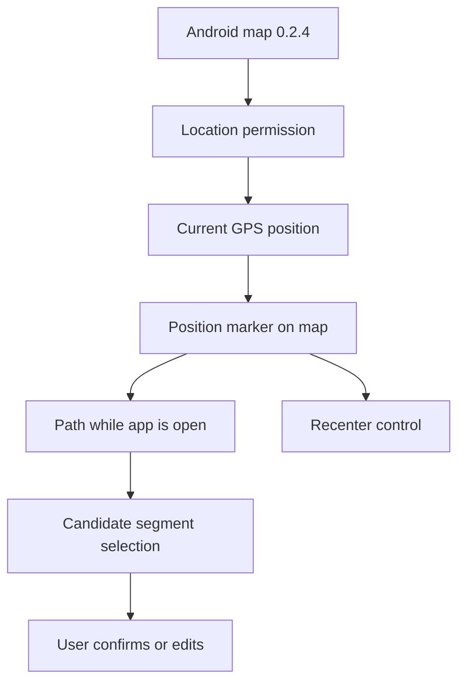

# Request 0006: Show GPS Position on Map for Version 0.3

From version: 0.2.4

Status: In progress

Understanding: 94%

Confidence: 88%

Progress: 95%

Complexity: Medium

Theme: Android UX

## Context

Version 0.2.4 makes the Android app usable as a map-first manual Paris segment
tracker. The next product step is version 0.3, where the user wants their GPS
position visible on the map.

The app should remain local-first and manual-first. GPS position should help
the user orient themselves while walking or cycling. The app may use the path
covered while it is open to propose segment validation, but it must keep the
user in control by selecting candidate segments and letting the user adjust the
selection before confirming completion.



## Need

As the project owner, I want my current GPS position to be visible and followed
while the Android app is open, so I can understand where I am relative to
completed and remaining Paris street segments. I also want the app to propose
segments likely covered from my path, while keeping final validation editable
and under my control.

## Scope

In:

- Add Android location permission handling.
- Request location permission so GPS can run while the app is open.
- Show a clear current-position marker on the map.
- Show location accuracy when available, for example as a radius or secondary
  visual indicator.
- Add a map control to recenter on the current GPS position.
- Follow the user's current position internally while the app is open.
- Do not auto-center the map continuously; center only when the GPS button is
  pressed.
- Add a settings toggle to enable or disable GPS-assisted behavior.
- GPS-assisted behavior should not be enabled by default on first install, but
  the app should still ask for location permission when the GPS feature is used.
- Add an adjustable GPS-to-segment matching strictness parameter in settings.
- Track the path covered while the app is open when GPS-assisted behavior is
  enabled.
- Propose validation for likely covered segments by selecting candidate
  segments.
- Let the user modify the proposed selection before confirming completion.
- Show a clear state when location is disabled, denied, unavailable, or still
  loading.
- Keep GPS data local to the device.
- Keep final segment completion controlled by the user.
- Bump the Android app to version `0.3.0`.
- Generate a debug APK named `mapping-paris-0.3.0-debug.apk`.
- Update README and handoff with the 0.3 GPS behavior after implementation.

Out:

- Do not automatically complete segments without user confirmation.
- Do not record long-term routes beyond the current app-open session for this
  version.
- Do not add background location tracking after the app is closed.
- Do not add account, backend, or cloud sync.
- Do not upload location data.
- Do not require Play Store release assets.

## UX Expectations

- The position marker should be visible without overwhelming the segment layer.
- The marker should be readable in both light and blue map modes.
- The marker should not look like a selectable segment.
- Recenter should be available through a compact map control.
- The GPS button should always be visible on the map.
- The app should follow the live location state while open but should not keep
  the camera locked to the user position.
- Pressing the GPS button should recenter the map on the current position.
- Candidate covered segments should appear as an editable selection, not as an
  irreversible automatic completion.
- GPS-proposed segments should have a distinct temporary visual style before
  validation.
- The app should not repeatedly annoy the user with permission prompts.
- If permission is denied, the map remains usable without GPS.
- If GPS is unavailable, the app should explain that location cannot currently
  be shown.

## Technical Expectations

- Use Android foreground location APIs.
- Add only the permissions needed for foreground map position display.
- Avoid background location after the app is closed.
- Keep the implementation compatible with the current osmdroid map view.
- Preserve existing map controls: menu, search, filter, and contextual bottom
  bar.
- Preserve current segment rendering and completion behavior.
- Keep battery impact low by avoiding unnecessary high-frequency updates.
- Keep path-derived candidate selection local to the device.
- Keep GPS-assisted behavior configurable in settings.
- Keep GPS matching strictness configurable in settings.

## Acceptance Criteria

- Android asks for location permission for app-open GPS usage.
- If permission is granted, the user's current GPS position appears on the map.
- A recenter control moves the map to the current GPS position.
- The app tracks position changes while open when GPS-assisted behavior is
  enabled.
- The map does not continuously auto-center while the user moves.
- The current-position marker remains readable in light mode.
- The current-position marker remains readable in blue mode.
- If permission is denied, the app still works as a manual segment tracker.
- If location is unavailable, the app shows a clear non-blocking message.
- GPS/path data does not automatically mark segments complete.
- GPS/path data can select proposed covered segments for user review.
- The user can modify the proposed selection before confirming completion.
- GPS-assisted behavior can be enabled or disabled from settings.
- No closed-app background tracking is implemented.
- No location data is exported or uploaded.
- The Android version becomes `0.3.0`.
- The debug APK builds as `mapping-paris-0.3.0-debug.apk`.

## Validation Expectations

Minimum validation commands:

```powershell
git status --short --branch
py -3 tools\segment_pipeline\validate_segments.py data\generated\paris_segments.geojson
py -3 tools\segment_pipeline\validate_segments.py app\src\main\assets\paris_segments.geojson
npm run check:pwa
py -3 tools\segment_pipeline\validate_pwa.py
node --check tools\dev-server.mjs
.\gradlew.bat --no-daemon --stacktrace assembleDebug
```

APK verification:

```powershell
& "$env:LOCALAPPDATA\Android\Sdk\build-tools\35.0.0\apksigner.bat" verify --print-certs app\build\outputs\apk\debug\mapping-paris-0.3.0-debug.apk
```

Manual checks:

- Install the 0.3 debug APK on the target Android phone.
- Grant location permission and confirm the position appears.
- Deny location permission and confirm the app remains usable.
- Disable GPS/location services and confirm the unavailable state is clear.
- Tap recenter and confirm the map moves to the current position.
- Move while the app is open and confirm the marker updates without forcing
  continuous camera recentering.
- Confirm likely covered segments are proposed as a selection.
- Edit the proposed selection before validating.
- Adjust GPS matching strictness in settings and confirm proposals change
  conservatively.
- Check marker readability in light and blue map modes.
- Confirm no segment is completed from GPS without user confirmation.

## Backlog Guidance

This request should likely promote into one or more backlog items:

- Android foreground location permission and state handling.
- Current-position marker and recenter map control.
- App-open GPS following and path capture.
- Candidate segment proposal from the covered path.
- GPS unavailable/denied UX states.
- GPS matching strictness setting.
- Version 0.3 documentation and APK validation.

## Backlog Coverage

- `docs/backlog/0027-android-0-3-foreground-gps-position.md`
- `docs/backlog/0028-android-0-3-gps-path-segment-proposals.md`
- `docs/backlog/0029-android-0-3-gps-settings-and-states.md`
- `docs/backlog/0030-version-0-3-gps-release-docs-and-validation.md`

## Decision References

- Product brief: `docs/product/product-brief.md`
- Current handoff: `docs/development/handoff-next-codex.md`
- Current 0.2.4 release: `docs/releases/RELEASE_0.2.4.md`
- Current Android map UI: `app/src/main/java/com/jilanos/mappingparis/ui/MappingParisApp.kt`
- Current map overlay: `app/src/main/java/com/jilanos/mappingparis/ui/ParisMapOverlays.kt`

## Decisions

- Location runs while the app is open when GPS-assisted behavior is enabled.
- GPS-assisted behavior is not enabled by default on first install.
- Location permission should still be requested when the GPS feature is used.
- The live marker follows position changes, but the map camera recenters only
  when the user presses the GPS button.
- Show an accuracy radius when accuracy is available.
- Keep the GPS button visible on the map.
- Use the GPS path to propose likely covered segments.
- Proposed GPS-covered segments are selected for review and can be edited
  before validation.
- Proposed GPS-covered segments should have a distinct temporary visual style.
- Add a settings toggle to enable or disable GPS-assisted behavior.
- Add an adjustable GPS-to-segment matching strictness parameter in settings.
- If permission is refused, keep the app usable and show a non-blocking message.
- If GPS is disabled or unavailable, show a clear non-blocking message and let
  the user retry from the GPS button.
- Do not complete any segment automatically without user confirmation.
- Discard the captured GPS path when the app closes.
- Do not add a dedicated "clear GPS proposal" action; GPS proposals are only
  unvalidated selected segments, so normal deselection is enough.

## Remaining Open Questions With Suggested Defaults

No open product questions remain from the current clarification pass. The next
step is to promote this request into backlog items and write the executable
0.3 task.
