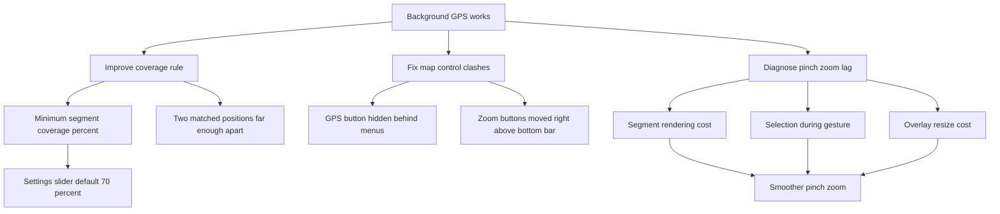

# Request 0007: Improve GPS Segment Validation Threshold, Controls, and Zoom Performance

From version: 0.3.2

Status: Done

Understanding: 92%

Confidence: 86%

Progress: 100%

Complexity: High

Theme: Android UX

## Context

Version 0.3.2 validates that GPS-assisted tracking can keep running while the
phone is locked. The next quality-of-life step is to make GPS segment proposals
more reliable, reduce control clashes on the map, and diagnose the large lag
during pinch zoom.

The current GPS proposal behavior can select a segment as soon as one location
point comes within matching range. This is too permissive: a segment should only
be proposed as covered when the user's tracked positions show meaningful
coverage along that segment.

The current map controls also clash in several states:

- the geolocation button can overlap or compete visually with menu close
  buttons;
- the contextual bottom validation bar can clash with the zoom controls;
- pinch zoom has visible lag and stutters, while the dedicated plus and minus
  zoom buttons feel responsive.



## Need

As the project owner, I want GPS-assisted segment proposals to require enough
real coverage of a segment before selecting it, so the app does not propose
streets that I only briefly passed near. I also want the map controls to avoid
overlap and the pinch zoom to become smooth enough for real mobile use.

## Scope

In:

- Replace the current "one point in range" GPS proposal rule with a coverage
  threshold rule.
- Add a configurable minimum GPS coverage percentage in settings.
- Use `70%` as the default minimum coverage threshold.
- Consider a segment covered only when at least two GPS positions matched to
  the segment are separated along the segment by at least the configured
  percentage of that segment's total length.
- Do not require the whole segment to be continuously in range.
- Preserve the existing GPS matching distance or strictness behavior unless a
  small internal adjustment is required to support the new coverage rule.
- Keep GPS proposals as editable selections; do not auto-complete segments.
- Move or hide the geolocation button while menus or panels are open so it does
  not clash with close buttons.
- Move zoom plus and minus controls to the right side of the map, above the
  vertical space used by the contextual bottom validation bar.
- Keep zoom controls reachable on mobile and safe-area compliant.
- Diagnose pinch zoom lag with concrete evidence before applying performance
  changes.
- Investigate at least these hypotheses:
  - too many segment overlays redrawn during pinch;
  - selection or hit-testing work running during pinch gestures;
  - too many drawable objects being resized or invalidated on each zoom frame;
  - osmdroid overlay invalidation or gesture amplification causing repeated
    expensive redraws.
- Fix the pinch zoom lag while preserving the current plus and minus zoom
  behavior.
- Update documentation or handoff notes with the chosen diagnosis and fix.
- Bump the Android app to the next patch version, expected `0.3.3`, if this
  request is implemented as the next release.

Out:

- Do not change the source segment dataset.
- Do not change the Room completion schema unless strictly necessary.
- Do not add cloud sync, backend, account, or route upload.
- Do not automatically validate segments without user confirmation.
- Do not replace osmdroid or change the map provider in this request.
- Do not implement offline map support.
- Do not redesign unrelated menus or statistics screens.

## UX Expectations

- The settings screen exposes a clear slider for the minimum GPS coverage
  threshold.
- The slider default is `70%`.
- The slider range should be practical, for example around `30%` to `95%`, with
  readable percentage feedback.
- The setting should be understandable without technical GIS vocabulary.
- GPS-proposed segments should feel less noisy and less eager than in 0.3.2.
- A short pass near one end of a segment should not select the whole segment.
- A walk that covers most of a segment should select it even if GPS points are
  sparse.
- Menus and panels should not visually fight with the GPS button.
- The bottom validation bar should not overlap zoom controls.
- Pinch zoom should feel close to the responsiveness of the plus and minus
  buttons.

## Technical Expectations

- Project GPS points onto candidate segment geometry to estimate progress along
  the segment.
- Store or derive the minimum and maximum projected distance reached per
  logical segment during the active GPS tracking session.
- Compute covered ratio as:

```text
(maxProjectedDistance - minProjectedDistance) / segmentLengthMeters
```

- Select a GPS proposal only when the covered ratio is greater than or equal to
  the configured threshold.
- Use logical segment ids for proposal state, completion, and statistics.
- Keep the current manual completion flow unchanged.
- Persist the threshold setting locally with the existing settings mechanism.
- Avoid excessive per-frame work during pinch zoom.
- Prefer batching, throttling, caching, or temporarily reducing overlay work
  during active pinch gestures over changing business logic.
- Keep plus and minus zoom buttons behavior unchanged except for their new
  position.

## Acceptance Criteria

- GPS segment proposals require at least two matched positions on the segment.
- The two matched positions must be separated along the segment by at least the
  configured coverage threshold.
- The default threshold is `70%`.
- The threshold can be changed from settings with a slider.
- Changing the threshold affects subsequent GPS proposals.
- A short GPS pass near only one end of a segment does not propose that segment.
- A GPS pass spanning at least the configured percentage of a segment proposes
  that segment.
- Proposed segments remain editable selections and are not completed
  automatically.
- Existing manual selection and completion behavior still works.
- The GPS button no longer clashes with menu or panel close buttons.
- Zoom plus and minus buttons are on the right side above the contextual bottom
  validation bar area.
- The zoom buttons remain usable when segments are selected.
- Pinch zoom lag is diagnosed and the chosen cause or causes are documented.
- Pinch zoom is visibly smoother than in 0.3.2.
- Plus and minus zoom buttons remain responsive.
- No map provider change is introduced.

## Validation Expectations

Minimum validation commands:

```powershell
git status --short --branch
.\gradlew.bat --no-daemon --stacktrace assembleDebug
cmd /c tools\build-and-install-debug-apk.cmd
```

Manual GPS checks:

- Set the GPS coverage threshold to `70%`.
- Walk near only one end of a known segment and confirm it is not proposed.
- Walk a path spanning most of the same segment and confirm it is proposed.
- Lower the threshold and confirm proposals become easier.
- Raise the threshold and confirm proposals become stricter.
- Lock the phone during a walk and confirm background GPS tracking still feeds
  proposals after unlock.
- Confirm no proposed segment is completed before explicit validation.

Manual UI checks:

- Open each top menu or panel and confirm the GPS button does not clash with the
  close action.
- Select segments and confirm the bottom validation bar does not clash with
  zoom controls.
- Use plus and minus zoom controls and confirm they remain responsive.
- Pinch zoom repeatedly around dense Paris areas and confirm lag and stutters
  are reduced.
- Confirm map panning and manual segment selection still work after pinch zoom.

## Backlog Guidance

This request should likely promote into three backlog items:

- GPS segment coverage threshold and settings slider.
- Map control placement and safe-area cleanup.
- Pinch zoom performance diagnosis and optimization.

## Backlog Coverage

- `docs/backlog/0031-gps-segment-coverage-threshold.md`
- `docs/backlog/0032-map-control-placement-and-safe-areas.md`
- `docs/backlog/0033-pinch-zoom-performance-diagnosis-and-fix.md`

## Decision References

- Current handoff: `docs/development/handoff-next-codex.md`
- GPS request: `docs/request/0006-show-gps-position-on-map-0-3.md`
- GPS task: `docs/tasks/0007-deliver-android-0-3-gps-position-and-segment-proposals.md`
- Android UI: `app/src/main/java/com/jilanos/mappingparis/ui/MappingParisApp.kt`
- Map overlays: `app/src/main/java/com/jilanos/mappingparis/ui/ParisMapOverlays.kt`
- View model: `app/src/main/java/com/jilanos/mappingparis/ui/MappingParisViewModel.kt`

## Decisions

- Background GPS behavior is considered validated for the current prototype.
- GPS proposals should become coverage-based, not proximity-only.
- Default required segment coverage is `70%`.
- Coverage can be approximated from two or more projected GPS positions on a
  segment.
- The user does not need to be in range of every point on a segment.
- Segment completion remains manual and explicit.
- The GPS button may be hidden or visually backgrounded while menus are open.
- Zoom buttons should move to the right side above the bottom action area.
- Pinch zoom performance must be diagnosed before choosing the optimization.

## Open Questions With Suggested Defaults

- Slider range: default to `30%` through `95%`.
- Slider step: default to `5%`.
- Threshold storage: default to the existing local settings persistence.
- Pinch optimization strategy: diagnose first, then prefer overlay throttling or
  cached rendering over changing data or map provider.
