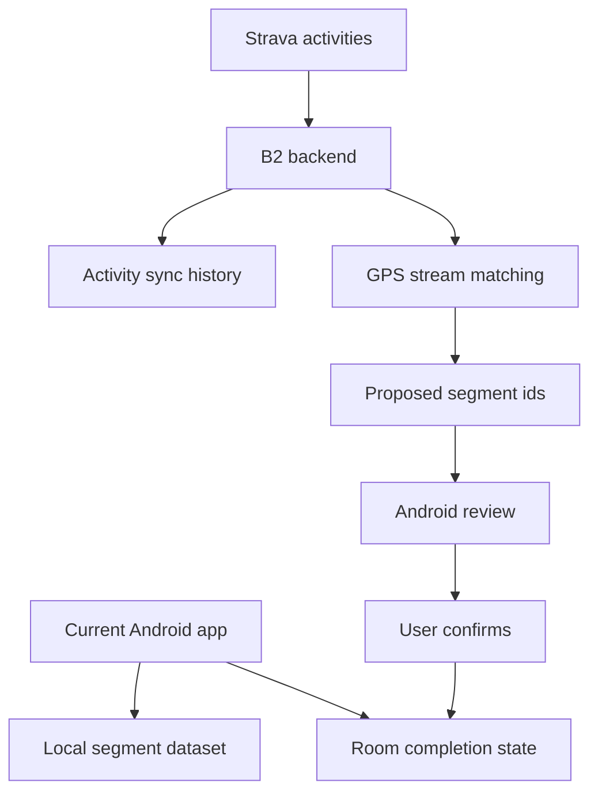

# Request 0008: Strava B2 Backend Integration for GPS-Based Segment Proposals

From version: 0.3.3

Status: Ready

Understanding: 90%

Confidence: 82%

Progress: 0%

Complexity: High

Theme: Backend Architecture

## Context

`mapping_Paris` is currently a local-first Android app for tracking completed
Paris street segments. The app uses a local segment dataset, manual completion,
local statistics, and map-based interaction.

Current app architecture summary:

- Android stack: Kotlin, Jetpack Compose, simple MVVM.
- Data source: packaged `assets/paris_segments.geojson` generated outside the
  app from OpenStreetMap.
- Segment model: `StreetSegment` with `id`, `logicalSegmentId`, street name,
  arrondissement, length, polyline geometry, and optional accessibility.
- Completion persistence: Room database `mapping-paris.db`, table
  `segment_completion`, keyed by logical segment ids.
- Settings persistence: Android `SharedPreferences` for map/GPS settings.
- Map rendering: osmdroid `MapView` inside Compose, plus custom
  `SegmentNetworkOverlay`, current location overlay, and optional blue basemap.
- Statistics: computed locally from logical segment representatives and Room
  completion state, globally and by arrondissement.
- GPS state: foreground service captures current positions, persists recent
  points temporarily, and the ViewModel proposes editable GPS segment
  selections.
- GPS matching: local Android matching currently projects GPS points against
  local segment geometry and proposes segments after configurable coverage.
- Product rule: no automatic segment completion; the user must explicitly
  validate proposed segments.

The next major chantier is "B2": evaluate a full Strava backend that can sync
Strava activities, process GPS streams, match traces against Paris street
segments, and return proposed completed segments to Android for review.

## Problem

I want to use my Strava running and cycling activities to help validate which
Paris street segments I have already covered. The current app is manual-first.
The new backend should analyze Strava GPS traces and propose completed segments
while preserving user confirmation.

## Scope To Evaluate

In:

- Strava OAuth.
- Backend token storage.
- Strava API synchronization.
- Activity filtering for runs and rides.
- GPS stream download.
- GPS trace to segment matching.
- Proposed segment review flow.
- Android/backend API contract.
- Security and privacy risks.
- Deployment strategy.
- Rate limit handling.
- Sync history.
- Rollback and manual override.

Out:

- No backend implementation in this request.
- No Android UI implementation in this request.
- No production deployment.
- No automatic segment validation.
- No public multi-user service.
- No Play Store publication.
- No offline map changes.
- No Strava client id or client secret in the repository.

## Product Principle

Strava can propose segments, but it must not mark segments completed without
explicit user confirmation. Android remains the place where the user reviews,
edits, accepts, or rejects proposed segments.

## Expected B2 Direction

B2 should be evaluated as a dedicated backend responsible for:

- Strava OAuth token handling.
- Secure token storage and refresh.
- Activity synchronization and deduplication.
- GPS stream download.
- GPS trace to Paris segment matching.
- Sync history and failure tracking.
- Proposed segment output for Android.
- A narrow Android/backend API contract.

Android should remain mostly focused on:

- authentication entry point or handoff;
- displaying sync status;
- reviewing proposed segments on the map;
- manual confirmation into local completion state;
- import/export and local progress safety.

## Acceptance Criteria

- Current app architecture is summarized for Strava readiness.
- A Strava B2 backend request exists.
- Initial backlog items exist and link back to this request.
- High-level orchestration tasks are drafted but not executed.
- An ADR draft exists for the B2 backend direction.
- A backend responsibilities and Android/backend contract spec draft exists.
- No runtime app behavior is changed.
- No dependencies are added.
- No backend code is created.
- No secret, Strava client id, or Strava client secret is committed.
- Open questions are listed before implementation.

## Backlog Coverage

- `docs/backlog/0034-review-current-app-architecture-for-strava-readiness.md`
- `docs/backlog/0035-define-strava-b2-backend-architecture.md`
- `docs/backlog/0036-define-strava-oauth-and-token-storage-strategy.md`
- `docs/backlog/0037-define-strava-activity-and-stream-sync-model.md`
- `docs/backlog/0038-define-gps-trace-to-segment-matching-strategy.md`
- `docs/backlog/0039-define-android-backend-api-contract.md`
- `docs/backlog/0040-define-android-proposed-segment-review-flow.md`
- `docs/backlog/0041-define-b2-security-privacy-and-deployment-constraints.md`
- `docs/backlog/0042-define-b2-validation-and-test-strategy.md`
- `docs/backlog/0043-prepare-b2-implementation-plan-for-release-0-4-or-0-5.md`
- `docs/backlog/0044-create-strava-b2-fastapi-backend-skeleton.md`
- `docs/backlog/0045-add-b2-configuration-and-secret-loading.md`
- `docs/backlog/0046-add-strava-oauth-and-token-storage.md`
- `docs/backlog/0047-add-strava-activity-and-stream-sync.md`
- `docs/backlog/0048-add-segment-dataset-ingestion-for-b2.md`
- `docs/backlog/0049-add-b2-gps-trace-matching-service.md`
- `docs/backlog/0050-expose-b2-proposals-api.md`
- `docs/backlog/0051-add-android-b2-client-integration-later.md`

## Task Coverage

- `docs/tasks/0009-orchestrate-strava-b2-discovery-and-architecture.md`
- `docs/tasks/0010-orchestrate-strava-b2-contract-security-and-validation.md`
- `docs/tasks/0011-orchestrate-strava-b2-release-planning.md`
- `docs/tasks/0012-prepare-strava-b2-implementation-plan.md`

## Decision References

- ADR: `docs/adr/0002-use-dedicated-strava-b2-backend-for-activity-sync-and-segment-proposals.md`
- Spec: `docs/specs/0001-strava-b2-backend-responsibilities-and-android-contract.md`
- Spec: `docs/specs/0002-strava-b2-backend-architecture-and-data-model.md`
- Product brief: `docs/product/product-brief.md`
- Current handoff: `docs/development/handoff-next-codex.md`

## Open Questions

- Where should B2 be deployed for personal use?
- Should the backend keep a copy of the segment dataset or receive a versioned
  dataset from Android/tools?
- What segment dataset versioning contract is required between Android and B2?
- What is the acceptable sync frequency under Strava rate limits?
- How should revoked Strava access be surfaced in Android?
- How should proposed segments be versioned, audited, rejected, and retried?
- Should accepted B2 proposals write directly to Room, or pass through the
  existing Android confirmation path only?
- What token encryption mechanism should be used for SQLite in the first
  milestone?
- When, if ever, should SQLite move to PostgreSQL?
