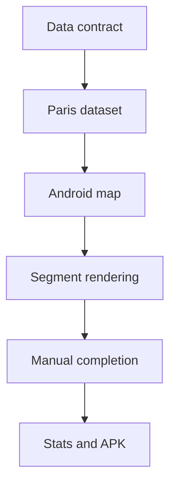

# Task 0002: Deliver Manual Paris Segment Tracking MVP

From version: 0.0.0

Status: Done

Understanding: 95%

Confidence: 90%

Progress: 100%

Complexity: High

Theme: MVP

## Goal

Deliver the first usable Android MVP for personal manual tracking of completed street segments in Paris intra-muros.

## Links

- Request: `docs/request/0001-deliver-manual-paris-segment-tracking-mvp.md`
- Derived from `docs/backlog/0002-mvp-segment-data-contract.md`
- Derived from `docs/backlog/0003-mvp-osm-segment-dataset.md`
- Derived from `docs/backlog/0004-mvp-android-map-foundation.md`
- Derived from `docs/backlog/0005-mvp-segment-loading-rendering-selection.md`
- Derived from `docs/backlog/0006-mvp-local-completion-state.md`
- Derived from `docs/backlog/0007-mvp-statistics-and-apk.md`
- Product brief: `docs/product/product-brief.md`
- ADR: `docs/adr/0001-data-source-and-segment-model.md`

## Context

The MVP spans data preparation and Android implementation. The work should proceed in coherent waves so each stage leaves the repository in a usable state.

## Scope

In:

- Define the segment data contract.
- Prepare a repeatable first OSM-to-segments dataset approach.
- Generate or include the first Paris intra-muros segment dataset.
- Create the Android project skeleton.
- Display an online OSM map centered on Paris.
- Load and render local segments.
- Select one segment.
- Toggle completion manually.
- Store completion state locally and separately from segment source data.
- Show global and arrondissement progress statistics.
- Produce a local APK.

Out:

- GPS validation.
- Automatic route tracking.
- Backend services.
- User accounts.
- Cloud synchronization.
- Play Store publication.
- Offline map tiles.
- Perfect GIS completeness or exact street geometry.

## Plan

- [x] Wave 1: segment contract
  - [x] Write the concrete segment schema and example record.
  - [x] Confirm stable id, arrondissement, length, geometry, and optional metadata rules.
  - [x] Confirm that user completion state is stored separately from source segment data.
- [x] Wave 2: Paris segment dataset
  - [x] Define pragmatic OSM filtering rules for the first dataset.
  - [x] Exclude Bois de Boulogne and Bois de Vincennes.
  - [x] Generate a local Paris intra-muros seed segment dataset.
  - [x] Document how to regenerate the future full dataset.
- [x] Wave 3: Android map foundation
  - [x] Initialize the Kotlin Android project with Jetpack Compose.
  - [x] Add osmdroid and display an online OSM map.
  - [x] Center the initial viewport on Paris intra-muros.
  - [x] Keep the structure simple and MVVM-compatible.
- [x] Wave 4: segment loading, rendering, and selection
  - [x] Load the local segment dataset in the app.
  - [x] Render segments over the map.
  - [x] Add visual states for default and selected segments.
  - [x] Support selecting one segment by user interaction.
- [x] Wave 5: local completion state
  - [x] Add local persistence for completion state, likely with Room.
  - [x] Store completion by stable segment id.
  - [x] Toggle completion manually for the selected segment.
  - [x] Reflect completed and not completed states in rendering.
  - [x] Build path ready for device or emulator persistence verification.
- [x] Wave 6: statistics and APK
  - [x] Compute global completion distance and percentage.
  - [x] Compute completion distance and percentage by arrondissement.
  - [x] Display statistics in a simple UI.
  - [x] Generate a local APK.
  - [x] Document the build command and artifact location.

## Acceptance criteria

- The Android app builds locally.
- A generated APK can be installed for personal use.
- The app displays an online OSM map centered on Paris intra-muros.
- The app loads a local preprocessed Paris segment dataset.
- The dataset excludes the Bois de Boulogne and the Bois de Vincennes.
- Segment source data contains no user completion state.
- The user can select one segment.
- The user can manually mark a selected segment as completed or not completed.
- Completion state persists locally after app restart.
- Completed and not completed segments are visually distinct.
- The app shows global completion statistics.
- The app shows completion statistics by arrondissement.
- The V1 does not include GPS validation, backend, account system, cloud sync, Play Store publication, or offline map tiles.

## Validation

Executed checks:

- `git status --short --branch`
- `Get-Content -Raw app\src\main\assets\paris_segments_seed.geojson | ConvertFrom-Json`
- XML parse of `app/src/main/AndroidManifest.xml`
- XML parse of `app/src/main/res/values/styles.xml`
- `rg` checks for key decisions and implementation surfaces
- `git diff --check`
- `.\gradlew.bat assembleDebug`
- `.\gradlew.bat lintDebug`
- `adb devices`

## Report

Implemented:

- Added Android Gradle project files.
- Added Kotlin/Jetpack Compose Android app skeleton.
- Added osmdroid online map screen centered on Paris.
- Added local GeoJSON seed dataset with 21 Paris segment features.
- Added GeoJSON parser and segment domain model.
- Added Room persistence for completion state keyed by stable segment id.
- Added single-segment selection and manual completion toggle.
- Added completed, selected, and default segment rendering states.
- Added global and arrondissement completion statistics.
- Added segment contract documentation.
- Added OSM dataset generation notes.
- Added Android build notes with local toolchain paths.
- Installed local JDK, Gradle, and Android SDK command-line tooling.
- Generated `app/build/outputs/apk/debug/app-debug.apk`.

Remaining manual validation:

- No Android device or emulator was connected when `adb devices` was checked, so installation and restart persistence should be verified on a connected device.

## Non-goals

- Do not build post-MVP features during this task unless explicitly promoted.
- Do not include multi-selection unless the single-segment MVP loop is already working and the scope is reopened.
- Do not add GPS validation, offline tiles, backend services, or account features.
