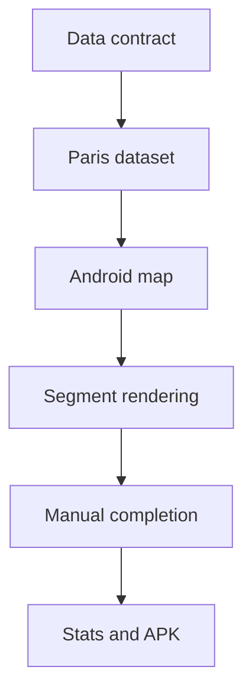

# Task 0002: Deliver Manual Paris Segment Tracking MVP

From version: 0.0.0

Status: Ready

Understanding: 95%

Confidence: 85%

Progress: 0%

Complexity: High

Theme: MVP

## Goal

Deliver the first usable Android MVP for personal manual tracking of completed street segments in Paris intra-muros.

## Links

- Request: `docs/request/0001-deliver-manual-paris-segment-tracking-mvp.md`
- Derived from `docs/backlog/0002-mvp-segment-data-contract.md`
- Derived from `docs/backlog/0003-mvp-osm-segment-dataset.md`
- Derived from `docs/backlog/0004-mvp-android-map-foundation.md`
- Derived from `docs/backlog/0005-mvp-segment-loading-rendering-selection.md`
- Derived from `docs/backlog/0006-mvp-local-completion-state.md`
- Derived from `docs/backlog/0007-mvp-statistics-and-apk.md`
- Product brief: `docs/product/product-brief.md`
- ADR: `docs/adr/0001-data-source-and-segment-model.md`

## Context

The MVP spans data preparation and Android implementation. The work should proceed in coherent waves so each stage leaves the repository in a usable state.

## Scope

In:

- Define the segment data contract.
- Prepare a repeatable first OSM-to-segments dataset approach.
- Generate or include the first Paris intra-muros segment dataset.
- Create the Android project skeleton.
- Display an online OSM map centered on Paris.
- Load and render local segments.
- Select one segment.
- Toggle completion manually.
- Store completion state locally and separately from segment source data.
- Show global and arrondissement progress statistics.
- Produce a local APK.

Out:

- GPS validation.
- Automatic route tracking.
- Backend services.
- User accounts.
- Cloud synchronization.
- Play Store publication.
- Offline map tiles.
- Perfect GIS completeness or exact street geometry.

## Plan

- [ ] Wave 1: segment contract
  - [ ] Write the concrete segment schema and example record.
  - [ ] Confirm stable id, arrondissement, length, geometry, and optional metadata rules.
  - [ ] Confirm that user completion state is stored separately from source segment data.
- [ ] Wave 2: Paris segment dataset
  - [ ] Define pragmatic OSM filtering rules for the first dataset.
  - [ ] Exclude Bois de Boulogne and Bois de Vincennes.
  - [ ] Generate a local Paris intra-muros segment dataset.
  - [ ] Document how to regenerate the dataset.
- [ ] Wave 3: Android map foundation
  - [ ] Initialize the Kotlin Android project with Jetpack Compose.
  - [ ] Add osmdroid and display an online OSM map.
  - [ ] Center the initial viewport on Paris intra-muros.
  - [ ] Keep the structure simple and MVVM-compatible.
- [ ] Wave 4: segment loading, rendering, and selection
  - [ ] Load the local segment dataset in the app.
  - [ ] Render segments over the map.
  - [ ] Add visual states for default and selected segments.
  - [ ] Support selecting one segment by user interaction.
- [ ] Wave 5: local completion state
  - [ ] Add local persistence for completion state, likely with Room.
  - [ ] Store completion by stable segment id.
  - [ ] Toggle completion manually for the selected segment.
  - [ ] Reflect completed and not completed states in rendering.
  - [ ] Verify persistence after app restart.
- [ ] Wave 6: statistics and APK
  - [ ] Compute global completion distance and percentage.
  - [ ] Compute completion distance and percentage by arrondissement.
  - [ ] Display statistics in a simple UI.
  - [ ] Generate a local APK.
  - [ ] Document the build command and artifact location.

## Acceptance criteria

- The Android app builds locally.
- A generated APK can be installed for personal use.
- The app displays an online OSM map centered on Paris intra-muros.
- The app loads a local preprocessed Paris segment dataset.
- The dataset excludes the Bois de Boulogne and the Bois de Vincennes.
- Segment source data contains no user completion state.
- The user can select one segment.
- The user can manually mark a selected segment as completed or not completed.
- Completion state persists locally after app restart.
- Completed and not completed segments are visually distinct.
- The app shows global completion statistics.
- The app shows completion statistics by arrondissement.
- The V1 does not include GPS validation, backend, account system, cloud sync, Play Store publication, or offline map tiles.

## Validation

Expected validation commands will be finalized after Android project initialization.

Current task-level checks:

- `git status --short --branch`
- list generated data files and documentation updates
- verify no secrets, local-only files, or build artifacts are staged

After Android initialization:

- run the project formatter if configured
- run Android unit tests if configured
- run Android lint if configured
- run a local debug APK build
- manually install or inspect the APK artifact

## Report

Not started.

## Non-goals

- Do not build post-MVP features during this task unless explicitly promoted.
- Do not include multi-selection unless the single-segment MVP loop is already working and the scope is reopened.
- Do not add GPS validation, offline tiles, backend services, or account features.
