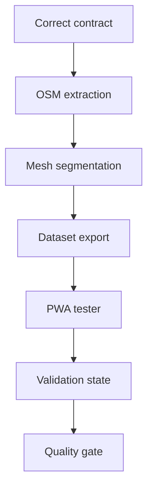

# Task 0003: Generate Full Paris Segment Mesh and PWA Tester

From version: 0.1.0

Status: Ready

Understanding: 95%

Confidence: 85%

Progress: 0%

Complexity: High

Theme: Segment Generation

## Goal

Replace the incorrect one-segment-per-arrondissement seed direction with a real full Paris intra-muros segment generation flow and a Chrome PWA tester for inspecting, clicking, validating, and unvalidating generated segments.

## Links

- Request: `docs/request/0002-generate-full-paris-segment-mesh-and-pwa-tester.md`
- Derived from `docs/backlog/0008-correct-full-segment-generation-contract.md`
- Derived from `docs/backlog/0009-build-osm-extraction-filtering-pipeline.md`
- Derived from `docs/backlog/0010-simplify-and-segment-paris-street-mesh.md`
- Derived from `docs/backlog/0011-export-definitive-segment-dataset.md`
- Derived from `docs/backlog/0012-build-chrome-pwa-segment-mesh-tester.md`
- Derived from `docs/backlog/0013-add-pwa-segment-validation-state.md`
- Derived from `docs/backlog/0014-add-segment-dataset-quality-checks.md`
- Product brief: `docs/product/product-brief.md`
- ADR to revise or supersede: `docs/adr/0001-data-source-and-segment-model.md`

## Context

The Android MVP currently proves a technical loop with a tiny seed dataset, but the product needs a definitive dense Paris street segment dataset first. This task shifts execution back to segment generation and visual validation before further Android import work.

## Scope

In:

- Revise the segment contract for a dense Paris intra-muros mesh.
- Revise or supersede the existing ADR if needed.
- Build a repeatable OSM extraction/filtering pipeline.
- Exclude areas outside Paris intra-muros.
- Exclude the Bois de Boulogne and the Bois de Vincennes.
- Simplify road geometry while preserving general street shapes.
- Segment the road mesh into many individual clickable elements.
- Export a definitive segment dataset.
- Build a Chrome PWA tester for visual inspection.
- Add PWA segment click, selection, validate, and unvalidate behavior.
- Keep tester validation state separate from source geometry.
- Add dataset quality checks and an inspection report.

Out:

- Android import replacement implementation.
- GPS validation.
- Backend services.
- User accounts.
- Play Store publication.
- Offline mobile map support.
- Perfect GIS accuracy.

## Plan

- [ ] Wave 1: corrected contract and architecture decision
  - [ ] Update `docs/data/segment-contract.md` for the dense full Paris mesh.
  - [ ] Revise or supersede `docs/adr/0001-data-source-and-segment-model.md`.
  - [ ] Explicitly document that the current 21-segment seed is not target data.
  - [ ] Define source geometry fields and separate validation/progress state.
- [ ] Wave 2: OSM extraction and filtering
  - [ ] Choose the first Paris intra-muros boundary source.
  - [ ] Implement or document the OSM extract input path.
  - [ ] Define included OSM `highway` values.
  - [ ] Filter out private, inaccessible, service-only, irrelevant, and excluded-woods ways.
  - [ ] Produce a raw filtered network artifact.
- [ ] Wave 3: simplification and segmentation
  - [ ] Implement geometry simplification with a documented tolerance.
  - [ ] Split the filtered network into individual segment elements.
  - [ ] Generate stable segment ids.
  - [ ] Preserve street name, arrondissement, length, and source-debug metadata.
  - [ ] Export the first dense generated segment dataset.
- [ ] Wave 4: dataset export and quality checks
  - [ ] Validate required segment fields.
  - [ ] Validate unique segment ids.
  - [ ] Check that source data has no `completed`, `validated`, or user state fields.
  - [ ] Report total segment count and distribution by arrondissement where available.
  - [ ] Document how to regenerate the dataset.
- [ ] Wave 5: Chrome PWA tester foundation
  - [ ] Create a local PWA surface.
  - [ ] Load the generated dataset in Chrome.
  - [ ] Render the full dense Paris segment mesh.
  - [ ] Support pan and zoom.
  - [ ] Support clicking one segment and showing metadata.
- [ ] Wave 6: PWA validation state
  - [ ] Add selected, validated, and unvalidated visual states.
  - [ ] Toggle validation for the selected segment.
  - [ ] Persist validation state separately from source data.
  - [ ] Show total segment and validated segment counts.
  - [ ] Provide reset/export behavior if needed for inspection.
- [ ] Wave 7: inspection report and handoff
  - [ ] Add a visual inspection checklist.
  - [ ] Produce an initial quality report.
  - [ ] Decide whether the generated dataset can replace the Android seed.
  - [ ] Update request/backlog/task progress and validation evidence.

## Acceptance criteria

- The generated dataset is a dense Paris intra-muros segment mesh, not a small sample.
- The dataset contains many individual segments per arrondissement where street density requires it.
- The Bois de Boulogne and the Bois de Vincennes are excluded.
- Each segment is an independent source element with a stable id.
- Each segment has simplified polyline geometry that remains close to the road's general shape.
- Source segment data contains no validation, completion, or user progress state.
- A local Chrome PWA tester loads the generated dataset.
- The PWA displays the full segment mesh.
- The user can click a segment in the PWA.
- The PWA can validate and unvalidate a clicked segment.
- PWA validation state is stored separately from the generated source dataset.
- Dataset quality checks run locally and report useful counts/errors.
- The generation and validation flow is documented enough to rerun.
- Further Android import work is deferred until the generated segment shape is accepted.

## Validation

Expected commands will be finalized once implementation choices are made.

Initial validation targets:

- `git status --short --branch`
- `git diff --check`
- dataset schema validation command
- unique segment id validation command
- source-state separation validation command
- segment count and arrondissement distribution command
- PWA build or static validation command
- local Chrome smoke test or Playwright smoke test if a test runner is added

Existing Android validation is not the main gate for this task.

## Report

Not started.

## Non-goals

- Do not continue expanding Android behavior until the generated segment dataset and PWA tester direction are validated.
- Do not preserve the 21-segment seed as target data.
- Do not add GPS validation, backend, account, Play Store, or offline map features.
- Do not block on perfect GIS topology when the generated mesh is visually and operationally useful.
