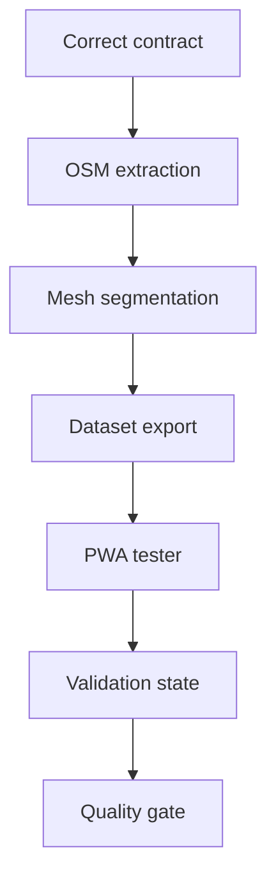

# Task 0003: Generate Full Paris Segment Mesh and PWA Tester

From version: 0.1.0

Status: Done

Understanding: 95%

Confidence: 90%

Progress: 100%

Complexity: High

Theme: Segment Generation

## Goal

Replace the incorrect one-segment-per-arrondissement seed direction with a real full Paris intra-muros segment generation flow and a Chrome PWA tester for inspecting, clicking, validating, and unvalidating generated segments.

## Links

- Request: `docs/request/0002-generate-full-paris-segment-mesh-and-pwa-tester.md`
- Derived from `docs/backlog/0008-correct-full-segment-generation-contract.md`
- Derived from `docs/backlog/0009-build-osm-extraction-filtering-pipeline.md`
- Derived from `docs/backlog/0010-simplify-and-segment-paris-street-mesh.md`
- Derived from `docs/backlog/0011-export-definitive-segment-dataset.md`
- Derived from `docs/backlog/0012-build-chrome-pwa-segment-mesh-tester.md`
- Derived from `docs/backlog/0013-add-pwa-segment-validation-state.md`
- Derived from `docs/backlog/0014-add-segment-dataset-quality-checks.md`
- Product brief: `docs/product/product-brief.md`
- ADR to revise or supersede: `docs/adr/0001-data-source-and-segment-model.md`

## Context

The Android MVP currently proves a technical loop with a tiny seed dataset, but the product needs a definitive dense Paris street segment dataset first. This task shifts execution back to segment generation and visual validation before further Android import work.

## Scope

In:

- Revise the segment contract for a dense Paris intra-muros mesh.
- Revise or supersede the existing ADR if needed.
- Build a repeatable OSM extraction/filtering pipeline.
- Exclude areas outside Paris intra-muros.
- Keep streets inside the Boulevard Peripherique, which excludes the Bois de Boulogne and the Bois de Vincennes without cutting into Auteuil or Bel-Air.
- Simplify road geometry while preserving general street shapes.
- Segment the road mesh into many individual clickable elements.
- Export a definitive segment dataset.
- Build a Chrome PWA tester for visual inspection.
- Add PWA segment click, selection, validate, and unvalidate behavior.
- Keep tester validation state separate from source geometry.
- Add dataset quality checks and an inspection report.

Out:

- Further Android UI refinement after dense dataset import.
- GPS validation.
- Backend services.
- User accounts.
- Play Store publication.
- Offline mobile map support.
- Perfect GIS accuracy.

## Plan

- [x] Wave 1: corrected contract and architecture decision
  - [x] Update `docs/data/segment-contract.md` for the dense full Paris mesh.
  - [x] Revise `docs/adr/0001-data-source-and-segment-model.md`.
  - [x] Explicitly document that the current 21-segment seed is not target data.
  - [x] Define source geometry fields and separate validation/progress state.
- [x] Wave 2: OSM extraction and filtering
  - [x] Choose the first Paris intra-muros boundary approach.
  - [x] Implement and document the OSM extract input path.
  - [x] Define included OSM `highway` values.
  - [x] Filter out private, inaccessible, service-only, irrelevant, and excluded-woods ways.
  - [x] Produce a raw filtered network artifact under ignored local data.
- [x] Wave 3: simplification and segmentation
  - [x] Implement geometry simplification with a documented tolerance.
  - [x] Split the filtered network into individual segment elements.
  - [x] Generate stable segment ids.
  - [x] Preserve street name, arrondissement, length, and source-debug metadata.
  - [x] Export the first dense generated segment dataset.
- [x] Wave 4: dataset export and quality checks
  - [x] Validate required segment fields.
  - [x] Validate unique segment ids.
  - [x] Check that source data has no `completed`, `validated`, or user state fields.
  - [x] Report total segment count and distribution by arrondissement where available.
  - [x] Document how to regenerate the dataset.
- [x] Wave 5: Chrome PWA tester foundation
  - [x] Create a local PWA surface.
  - [x] Load the generated dataset in Chrome.
  - [x] Render the full dense Paris segment mesh.
  - [x] Support pan and zoom.
  - [x] Support clicking one segment and showing metadata.
- [x] Wave 6: PWA validation state
  - [x] Add selected, validated, and unvalidated visual states.
  - [x] Toggle validation for the selected segment.
  - [x] Persist validation state separately from source data.
  - [x] Show total segment and validated segment counts.
  - [x] Provide reset/export behavior for inspection.
- [x] Wave 7: inspection report and handoff
  - [x] Add a visual inspection checklist.
  - [x] Produce an initial quality report.
  - [x] Replace the Android seed asset after visual acceptance.
  - [x] Update request/backlog/task progress and validation evidence.

## Acceptance criteria

- The generated dataset is a dense Paris intra-muros segment mesh, not a small sample.
- The dataset contains many individual segments per arrondissement where street density requires it.
- Streets outside the Boulevard Peripherique are excluded.
- Each segment is an independent source element with a stable id.
- Each segment has simplified polyline geometry that remains close to the road's general shape.
- Source segment data contains no validation, completion, or user progress state.
- A local Chrome PWA tester loads the generated dataset.
- The PWA displays the full segment mesh.
- The user can click a segment in the PWA.
- The PWA can validate and unvalidate a clicked segment.
- PWA validation state is stored separately from the generated source dataset.
- Dataset quality checks run locally and report useful counts/errors.
- The generation and validation flow is documented enough to rerun.
- The accepted generated segment shape is imported into the Android asset set.

## Validation

Executed:

- `py -3 tools/segment_pipeline/generate_paris_segments.py`
- `py -3 tools/segment_pipeline/validate_segments.py`
- `py -3 tools/segment_pipeline/validate_pwa.py`
- `node --check pwa\app.js`
- `git diff --check`
- local HTTP smoke test with `py -3 -m http.server 5173`
- `GET http://localhost:5173/pwa/`
- `HEAD http://localhost:5173/data/generated/paris_segments.geojson`

Result:

- Dataset generated successfully: 96,583 segments, 5,695.86 km total length.
- Segment ids are unique.
- Source segment data contains no `completed`, `validated`, or user progress field.
- PWA shell and dataset path are reachable through a local static server.
- Android debug APK build validates that the generated asset can be packaged.

## Report

Completed.

Implemented a corrected dense Paris segment generation path and a Chrome PWA tester:

- `tools/segment_pipeline/generate_paris_segments.py` extracts and filters Paris OSM highways through Overpass, excludes the two woods pragmatically, simplifies geometry, assigns stable segment ids, and exports GeoJSON.
- `tools/segment_pipeline/validate_segments.py` validates required fields, unique ids, geometry shape, and separation from user validation state.
- `tools/segment_pipeline/validate_pwa.py` checks that the static PWA files and dataset reference are present.
- `data/generated/paris_segments.geojson` contains the first generated dense mesh.
- `docs/data/generated-segment-summary.md` records the initial generation statistics.
- `pwa/` contains the local Chrome tester with map rendering, segment click selection, validate/unvalidate behavior, local storage state, reset, and export.

Known limitations:

- Arrondissement assignment is approximate and uses nearest arrondissement center logic.
- Intra-muros filtering now uses a pragmatic Boulevard Peripherique polygon instead of broad Bois exclusion boxes.
- The first extraction is intentionally broad and includes many `footway` and `steps` features; the next practical step is visual inspection in Chrome and filter refinement if the mesh is too dense or includes irrelevant micro-ways.

## Non-goals

- Do not continue expanding Android behavior beyond packaging the accepted generated dataset.
- Do not restore the 21-segment seed as target data.
- Do not add GPS validation, backend, account, Play Store, or offline map features.
- Do not block on perfect GIS topology when the generated mesh is visually and operationally useful.
