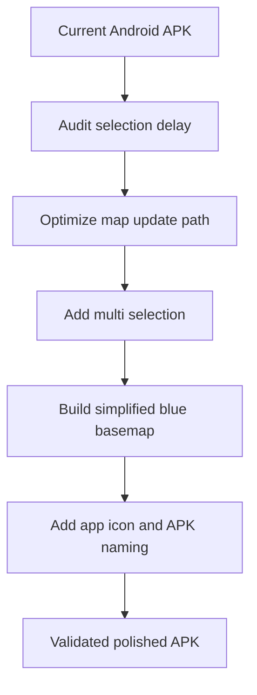

# Task 0004: Polish Android Map Visuals and Interactions

From version: 0.1.0

Status: Implemented

Understanding: 92%

Confidence: 84%

Progress: 95%

Complexity: High

Theme: Android UX

## Goal

Turn the Android APK from a dense-dataset proof into a usable personal tracking
app by improving selection performance, adding multi-segment selection, replacing
the detailed OSM background with a simplified blue Paris basemap, applying the
provided app image as the app icon, and producing a clearly versioned APK file.

## Links

- Request: `docs/request/0003-polish-android-map-visuals-and-segment-interaction.md`
- Derived from `docs/backlog/0015-add-android-app-icon-and-apk-naming.md`
- Derived from `docs/backlog/0016-build-simplified-blue-paris-basemap.md`
- Derived from `docs/backlog/0017-add-android-multi-segment-selection.md`
- Derived from `docs/backlog/0018-optimize-android-segment-selection-performance.md`
- Product brief: `docs/product/product-brief.md`
- Segment contract: `docs/data/segment-contract.md`
- Android build notes: `docs/development/android-build.md`
- PWA behavior reference: `docs/development/pwa-segment-tester.md`

## Context

The Android app now packages the accepted generated Paris segment dataset, but
the app still has prototype-level interaction and map presentation. Selection is
slow, only one segment can be selected, the map background is still detailed OSM
tiles, and the APK does not yet carry the provided visual identity or versioned
output name.



## Scope

In:

- Audit the Android segment selection delay.
- Optimize the map update path so selection feedback is fluid on 15,295
  segments.
- Add tap and long-press multi-segment selection behavior.
- Add batch complete and uncomplete behavior for selected segments.
- Add selected-set UI details: count, total length, and mixed arrondissement
  state.
- Replace the visually dominant detailed OSM background with a simplified blue
  Paris basemap.
- Include Paris outline, Seine, canals, useful street names, parks, train
  stations, churches, Elysee, and similar high-value landmarks where practical.
- Keep the generated segment overlay as the primary interactive layer.
- Store the provided app image in the Android app/project area.
- Generate and wire Android launcher icon assets from that image.
- Configure APK output naming as `mapping-paris-<version>-<buildType>.apk`.
- Produce and validate a debug APK.

Out:

- GPS validation.
- Backend services.
- User accounts.
- Cloud sync.
- Play Store listing graphics.
- Release signing setup.
- Drag or lasso selection in this task.
- Full cartographic accuracy or complete OSM label coverage.

## Plan

- [x] Wave 1: performance audit and render-path fix
  - [x] Inspect `MappingParisApp.kt`, `MappingParisViewModel.kt`, and osmdroid
        overlay usage.
  - [x] Confirm whether selection currently rebuilds all segment overlays.
  - [x] Add temporary measurement or targeted logging if needed.
  - [x] Refactor map update behavior to avoid unnecessary `Polyline`
        recreation on selection changes.
  - [x] Keep completion-state persistence behavior unchanged.
  - [x] Record the performance finding in this task report.
- [x] Wave 2: Android multi-segment selection
  - [x] Replace single selected id state with a selected id set.
  - [x] Support tap-to-toggle selection.
  - [x] Support long-press entry into multi-selection mode.
  - [x] Highlight all selected segments.
  - [x] Add selected count, total selected length, and mixed arrondissement
        display.
  - [x] Add selected-set complete and uncomplete behavior.
  - [x] Add clear selection behavior.
- [x] Wave 3: simplified blue Paris basemap
  - [x] Choose the smallest viable basemap strategy for this APK.
  - [x] Implement a blue-toned background aligned with the app image.
  - [x] Include Paris outline, Seine, canals, useful street names, and selected
        landmarks.
  - [x] Ensure the segment network remains readable over the background.
  - [x] Remove or visually demote detailed OSM tiles.
- [x] Wave 4: app image, launcher icon, and APK naming
  - [x] Store the app icon source under the Android app/project folder.
  - [x] Generate launcher icon resources from the image direction.
  - [x] Update manifest/resource references for the app icon.
  - [x] Configure APK output filename as
        `mapping-paris-<version>-<buildType>.apk`.
  - [x] Confirm generated debug APK filename includes version and build type.
- [x] Wave 5: validation and documentation
  - [x] Update relevant docs and backlog task coverage.
  - [x] Run dataset validation against the packaged Android asset.
  - [x] Run Android debug APK build.
  - [x] Verify the APK contains expected assets.
  - [x] Document manual device validation steps and any remaining risks.

## Acceptance Criteria

- The source of the original Android selection delay is identified and
  documented.
- Segment selection feedback is visibly faster than the current APK.
- Selection changes do not unnecessarily rebuild thousands of map overlay
  objects.
- The Android app supports selecting multiple segments.
- Tapping a selected segment removes it from the selection.
- Long-pressing a segment enters or supports multi-selection mode.
- The UI displays selected count and total selected length.
- The UI can complete the selected segment set.
- The UI can uncomplete the selected segment set when all selected segments are
  already complete.
- The UI can clear the current selection without changing completion state.
- Completion state remains stored separately from source GeoJSON.
- The Android map background is simplified and blue-toned.
- The simplified background includes Paris outline, Seine, relevant canals, and
  useful orientation labels.
- The segment overlay remains the dominant interactive layer.
- The provided app image is stored in the repository under the Android app area.
- Android launcher icons are generated from the provided app image.
- The APK no longer uses the old default placeholder icon.
- The debug APK output is named with the
  `mapping-paris-<version>-<buildType>.apk` pattern.
- A debug APK builds successfully.

## Validation

Required commands:

```powershell
py -3 tools\segment_pipeline\validate_segments.py app\src\main\assets\paris_segments.geojson
npm run check:pwa
node --check tools\dev-server.mjs
.\gradlew.bat --no-daemon --stacktrace assembleDebug
```

APK checks:

```powershell
$sdkRoot = "$env:LOCALAPPDATA\Android\Sdk"
& "$sdkRoot\build-tools\35.0.0\apksigner.bat" verify --print-certs app\build\outputs\apk\debug\mapping-paris-0.1.0-debug.apk
```

Manual checks:

- Install the debug APK on a device.
- Confirm the launcher icon uses the provided image direction.
- Confirm the map background is blue-toned and simplified.
- Confirm Paris outline, waterways, and major labels help with orientation.
- Tap several segments and confirm all remain selected.
- Long-press a segment and confirm multi-selection behavior is discoverable.
- Complete and uncomplete a selected segment set.
- Change selected segments repeatedly and confirm selection feedback is fluid.

## Report

Implemented on 2026-05-18.

Performance finding:

- `SegmentMap(...)` previously executed `mapView.overlays.clear()` inside
  `AndroidView(update = { ... })`.
- Every selection state change then recreated one osmdroid `Polyline` for each
  loaded segment.
- With the packaged 15,295 segment dataset, this meant thousands of overlay
  allocations and listener registrations on the selection path.

Implementation:

- Added `SegmentNetworkOverlay`, a single custom osmdroid overlay that draws
  the segment network directly on canvas.
- `AndroidView(update)` now updates the overlay state and invalidates the map
  instead of rebuilding all segment overlay objects.
- Added hit-testing inside the custom overlay for tap and long-press selection.
- Replaced single selected segment state with a selected segment id set.
- Added batch complete/uncomplete behavior for the selected set while keeping
  completion state in Room, separate from source GeoJSON.
- Added selected count, total selected length, mixed arrondissement display, and
  clear selection action.
- Disabled detailed OSM tile rendering and added a lightweight blue
  `ParisBasemapOverlay` with Paris outline, Seine, canals, parks, and landmark
  labels.
- Added Android launcher icon resources and manifest references.
- Configured debug APK naming as `mapping-paris-0.1.0-debug.apk`.

Validation results:

```powershell
py -3 tools\segment_pipeline\validate_segments.py app\src\main\assets\paris_segments.geojson
# OK: 15,295 features, duplicate_id_count 0

npm run check:pwa
# OK

node --check tools\dev-server.mjs
# OK

.\gradlew.bat --no-daemon --stacktrace assembleDebug
# BUILD SUCCESSFUL

& "$env:LOCALAPPDATA\Android\Sdk\build-tools\35.0.0\apksigner.bat" verify --print-certs app\build\outputs\apk\debug\mapping-paris-0.1.0-debug.apk
# OK: Android Debug certificate

& "$env:LOCALAPPDATA\Android\Sdk\build-tools\35.0.0\aapt.exe" list app\build\outputs\apk\debug\mapping-paris-0.1.0-debug.apk
# Verified: assets/paris_segments.geojson and launcher icon resources are packaged
```

APK output:

- `app/build/outputs/apk/debug/mapping-paris-0.1.0-debug.apk`

Remaining manual checks:

- Install the APK on a phone.
- Confirm tap and long-press segment selection feel fluid on device.
- Confirm the simplified blue basemap and launcher icon are visually acceptable.

Known limitation:

- The original chat-provided app image was not available as a local file in this
  execution context. A repo-stored vector icon source aligned with the requested
  dark blue Paris-map direction was added instead. Replace
  `app/src/main/res/drawable/app_icon_source.xml` with the original image-derived
  asset if the source image is reattached later.

## Non-Goals

- Do not add GPS validation, backend, accounts, cloud sync, or Play Store
  publication.
- Do not build drag/lasso selection in this task.
- Do not replace the generated source dataset unless the performance audit
  proves the dataset format is the bottleneck.
- Do not let the basemap visually dominate the segment network.
