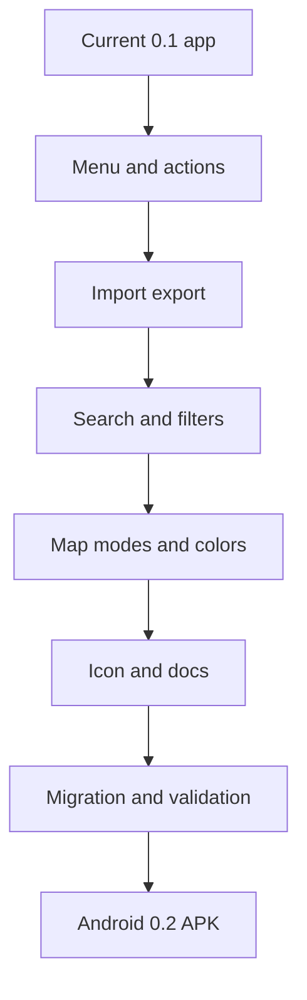

# Task 0005: Deliver Android 0.2 Mobile UX and Product Hardening

From version: 0.1.0

Status: Ready

Understanding: 94%

Confidence: 88%

Progress: 0%

Complexity: High

Theme: Android UX

## Goal

Deliver the Android 0.2 app wave by replacing the screen-blocking mobile panel,
adding the top-left menu and contextual map actions, adding import/export,
street search, filters, map modes, the corrected icon, reproducible README
visuals, and the completion-state migration path.

## Links

- Request: `docs/request/0004-prepare-version-0-2-mobile-ux-and-product-hardening.md`
- Derived from `docs/backlog/0019-android-0-2-menu-and-contextual-actions.md`
- Derived from `docs/backlog/0020-android-0-2-import-export-and-progress-safety.md`
- Derived from `docs/backlog/0021-android-0-2-search-and-filter-controls.md`
- Derived from `docs/backlog/0022-android-0-2-map-modes-and-color-polish.md`
- Derived from `docs/backlog/0023-rebuild-android-icon-from-image-1.md`
- Derived from `docs/backlog/0024-readme-mobile-visuals-and-version-0-2-docs.md`
- Derived from `docs/backlog/0025-migrate-completion-state-to-logical-segment-ids.md`
- Product brief: `docs/product/product-brief.md`
- Segment contract: `docs/data/segment-contract.md`
- Android build notes: `docs/development/android-build.md`
- Current handoff: `docs/development/handoff-next-codex.md`

## Context

The 0.1 app has the core local-first tracking model, but the mobile UX still
blocks too much of the map and lacks the tools needed for real progress
management. The next delivery should become version 0.2 and keep Android as the
main focus.



## Scope

In:

- Replace the large always-visible Android bottom panel.
- Add a top-left custom menu for settings and statistics.
- Add a full-screen statistics view.
- Hide empty selection UI when no segment is selected.
- Add a contextual bottom bar for selected-segment actions.
- Add snackbar undo for complete and uncomplete actions.
- Add Android export and import of completed `logical_segment_id` values.
- Add import conflict choices: merge, replace, cancel.
- Add reset-all-progress in settings with confirmation.
- Add Android street search with accent-insensitive partial matches.
- Recenter on search result without auto-selecting segments.
- Add a separate filter icon and hidden filter menu.
- Add light and blue map modes selectable from the menu.
- Polish segment colors using product design judgment.
- Store `[Image #1]` in the repo and rebuild launcher icons from it.
- Bump Gradle version to `0.2.0`.
- Generate `mapping-paris-0.2.0-debug.apk`.
- Capture emulator screenshots and commit README PNG assets.
- Update README dataset counts, version references, screenshots, and 0.2 notes.
- Add or run a migration path from old visual `id` completion rows to
  `logical_segment_id`.

Out:

- GPS validation.
- Backend services.
- User accounts.
- Cloud sync.
- Dedicated color-blind mode.
- Play Store release assets.
- Route planning.
- Regenerating the Paris segment dataset unless a defect requires it.

## Plan

- [ ] Wave 1: Android interaction shell
  - [ ] Inspect current `MappingParisApp.kt`, `MappingParisViewModel.kt`, and
        `ParisMapOverlays.kt`.
  - [ ] Replace the always-visible bottom panel with map-first UI.
  - [ ] Add top-left custom menu for settings and statistics.
  - [ ] Add full-screen statistics view.
  - [ ] Add contextual bottom action bar for selected segments.
  - [ ] Remove empty selection UI when no segment is selected.
  - [ ] Add snackbar undo for complete and uncomplete actions.
  - [ ] Run a targeted Android build after the shell change.
- [ ] Wave 2: progress safety
  - [ ] Add export JSON for completed `logical_segment_id` values.
  - [ ] Add import JSON from a previous export.
  - [ ] Place import/export in settings.
  - [ ] Add merge, replace, and cancel import conflict choices.
  - [ ] Add reset-all-progress with confirmation.
  - [ ] Document export schema or behavior.
  - [ ] Run Android build and relevant manual checks.
- [ ] Wave 3: search and filters
  - [ ] Add accent-insensitive partial street search.
  - [ ] Recenter on selected search result without auto-selection.
  - [ ] Add filter icon and hidden filter menu.
  - [ ] Add practical filters for completed, not completed, selected,
        arrondissement, and street.
  - [ ] Keep filters hidden when the filter menu is closed.
  - [ ] Verify map performance remains acceptable.
- [ ] Wave 4: map modes and color polish
  - [ ] Add light and blue map mode choices in the menu.
  - [ ] Start blue mode as a blue-tinted treatment if labels stay readable.
  - [ ] Tune selected, completed, and not completed colors.
  - [ ] Check readability over both map modes.
  - [ ] Keep no dedicated color-blind mode.
- [ ] Wave 5: icon and version
  - [ ] Store the `[Image #1]` source asset in the repo.
  - [ ] Regenerate Android launcher resources from the image.
  - [ ] Preserve only minor adaptations for Android launcher constraints.
  - [ ] Bump Android `versionName` to `0.2.0`.
  - [ ] Confirm APK naming produces `mapping-paris-0.2.0-debug.apk`.
- [ ] Wave 6: logical id migration
  - [ ] Detect old completion rows keyed by visual segment `id`.
  - [ ] Map them to `logical_segment_id` values from the packaged dataset.
  - [ ] Deduplicate rows that map to the same logical segment.
  - [ ] Keep migration safe to run more than once.
  - [ ] Document limitations for unrecoverable old ids.
- [ ] Wave 7: README visuals and docs
  - [ ] Capture emulator screenshots for normal map, menu open, selected
        segments, and stats or progress view.
  - [ ] Add search or filter screenshot if implemented visually.
  - [ ] Commit screenshot PNG files under a stable docs assets folder.
  - [ ] Update README counts to the current dataset.
  - [ ] Add compact Version 0.2 README section.
  - [ ] Update handoff or development notes if needed.
- [ ] Wave 8: final validation
  - [ ] Run dataset validation for source and Android asset.
  - [ ] Run PWA static validation.
  - [ ] Build the Android debug APK.
  - [ ] Verify APK signature and output name.
  - [ ] Record manual validation expectations for Google Pixel 8 with latest
        available Android version.
  - [ ] Update this task report with implementation and validation results.

## Acceptance Criteria

- The Android app version is `0.2.0`.
- The debug APK is named `mapping-paris-0.2.0-debug.apk`.
- The Android map is not blocked by a large always-visible bottom panel.
- No empty selection panel is shown when no segment is selected.
- A top-left custom menu opens settings and the full-screen statistics view.
- Main map actions use a contextual bottom bar.
- Complete and uncomplete actions provide snackbar undo.
- Android can export completion state.
- Android can import completion state.
- Import conflict handling offers merge, replace, and cancel.
- Reset all progress exists in settings and requires confirmation.
- Street search is available and recenters without auto-selecting.
- A separate filter icon opens a hidden filter menu.
- Light and blue map modes are selectable.
- Segment colors are readable in both map modes.
- Launcher icon resources are rebuilt from `[Image #1]` with only minor
  adaptations.
- README includes committed emulator screenshots.
- README dataset counts and version references are updated.
- Old visual `id` completion rows are migrated or safely handled.
- Source segment geometry remains separate from user completion state.
- Required validation commands pass.

## Validation

Required commands:

```powershell
git status --short --branch
py -3 tools\segment_pipeline\validate_segments.py data\generated\paris_segments.geojson
py -3 tools\segment_pipeline\validate_segments.py app\src\main\assets\paris_segments.geojson
npm run check:pwa
py -3 tools\segment_pipeline\validate_pwa.py
node --check tools\dev-server.mjs
.\gradlew.bat --no-daemon --stacktrace assembleDebug
```

APK checks:

```powershell
& "$env:LOCALAPPDATA\Android\Sdk\build-tools\35.0.0\apksigner.bat" verify --print-certs app\build\outputs\apk\debug\mapping-paris-0.2.0-debug.apk
```

Manual checks:

- Install the 0.2 debug APK on a Google Pixel 8 with the latest Android version
  available for that device.
- Confirm the map is usable without the old bottom panel.
- Open and close the top-left menu.
- Open settings and statistics.
- Switch between light and blue map modes.
- Open and close the filter menu from the filter icon.
- Search for a street and confirm the map recenters without selecting.
- Select one segment and several segments.
- Complete and uncomplete selected segments.
- Undo a completion or uncompletion from the snackbar.
- Export completion state.
- Import completion state and test merge, replace, and cancel.
- Confirm the launcher icon resembles `[Image #1]`.
- Confirm README screenshots match the current app.

## Report

Not implemented yet.

## Non-Goals

- Do not add GPS validation, backend, accounts, cloud sync, route planning, or
  Play Store publication.
- Do not add a dedicated color-blind mode.
- Do not regenerate the dataset unless required by a defect found during the
  work.
