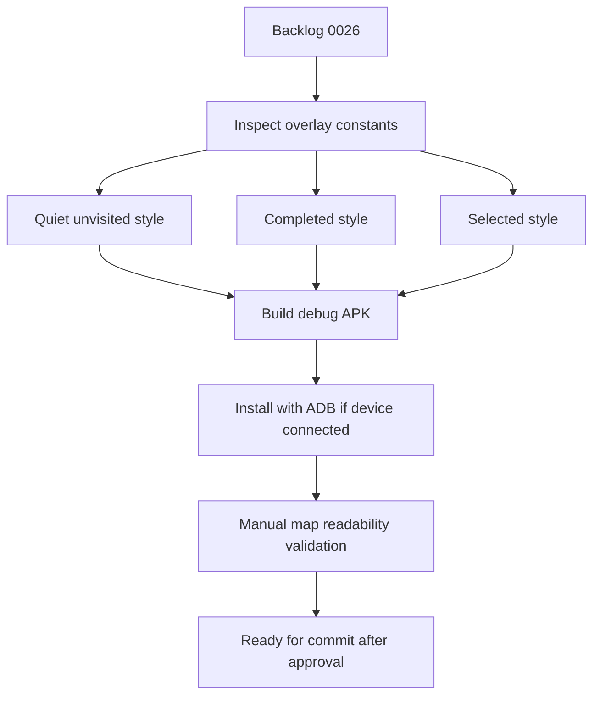

# Task 0006: Improve Android Segment Rendering Readability

From version: 0.2.1

Status: In progress

Understanding: 95%

Confidence: 90%

Progress: 85%

Complexity: Medium

Theme: Android Map UI

## Goal

Make the Android map easier to read by refining segment overlay styles for
unvisited, completed, and selected states, without changing data loading,
persistence, selection logic, or unrelated UI panels.

## Links

- Request: `docs/request/0005-improve-main-map-ui-readability-and-interaction-states.md`
- Derived from `docs/backlog/0026-improve-main-map-segment-readability.md`
- Product brief: `docs/product/product-brief.md`
- Current map overlay: `app/src/main/java/com/jilanos/mappingparis/ui/ParisMapOverlays.kt`
- Android install helper: `tools/build-and-install-debug-apk.cmd`

## Context

The Android 0.2.1 app is functionally usable, but the segment overlay can still
make the full Paris map visually too dense. This task is a focused rendering
pass: quiet unvisited segments, make completed segments readable, and make
selected segments unmistakable.



## Scope

In:

- Inspect `ParisMapOverlays.kt` segment drawing code.
- Centralize segment overlay style values in the rendering component if useful.
- Reduce visual weight of unvisited segments.
- Improve completed segment visibility using a mint/teal green treatment.
- Make selected segments distinct from completed segments, using cyan or purple
  and an optional halo or thicker stroke.
- Tune stroke widths for city zoom and neighborhood zoom readability.
- Build the debug APK.
- Install the APK with ADB if a device is connected.
- Perform manual validation before any implementation commit.

Out:

- Do not change GeoJSON loading.
- Do not change Room persistence.
- Do not change completion state storage.
- Do not change segment selection or multi-selection logic.
- Do not modify menu, search, filters, settings, statistics, import/export, or
  snackbar behavior.
- Do not regenerate the segment dataset.
- Do not change the current map provider.
- Do not commit or push before manual validation confirms the visual result.

## Plan

- [x] Inspect the current segment overlay rendering in
      `app/src/main/java/com/jilanos/mappingparis/ui/ParisMapOverlays.kt`.
- [x] Identify the current colors, opacity values, and stroke widths for
      unvisited, completed, and selected states.
- [x] Define a calmer overlay style set:
      unvisited muted and thin, completed teal and readable, selected distinct
      and high-emphasis.
- [x] Apply the rendering-only changes without touching data, persistence, or
      selection logic.
- [x] Build the debug APK.
- [x] Install the APK with `tools\build-and-install-debug-apk.cmd` if a device
      is connected.
- [ ] Manually validate city zoom, 18e neighborhood zoom, completed state,
      selected state, multi-selection, and complete/uncomplete behavior.
- [x] Update this task report with the chosen colors, validation outcome, and
      any remaining visual concerns.
- [ ] Commit only after manual validation confirms the rendering result.

## Acceptance Criteria Traceability

- AC1: Non-completed segments are visually quieter than in 0.2.1.
  - Covered by Plan steps 3, 4, 7.
- AC2: Completed segments are immediately identifiable.
  - Covered by Plan steps 3, 4, 7.
- AC3: Selected segments cannot be confused with completed segments.
  - Covered by Plan steps 3, 4, 7.
- AC4: The map remains usable at full Paris zoom.
  - Covered by Plan steps 5, 6, 7.
- AC5: Individual segments remain readable around the 18e arrondissement zoom
  level.
  - Covered by Plan steps 5, 6, 7.
- AC6: Multi-selection still works.
  - Covered by Plan step 7.
- AC7: Completing and uncompleting selected segments still works.
  - Covered by Plan step 7.
- AC8: No data-loading or persistence code is modified.
  - Covered by Plan steps 1, 4.
- AC9: A debug APK builds successfully.
  - Covered by Plan step 5.
- AC10: Manual mobile validation is completed before committing the
  implementation.
  - Covered by Plan steps 7, 8, 9.

## Validation

Automated:

```powershell
git status --short --branch
.\gradlew.bat --no-daemon --stacktrace assembleDebug
```

Device install:

```powershell
tools\build-and-install-debug-apk.cmd
```

Manual:

- Full Paris zoom: unvisited segments should no longer dominate the map.
- 18e arrondissement zoom: individual segments should remain readable.
- Completed segment: teal/mint state should be clearly visible.
- Selected segment: selected state should be distinct from completed state.
- Multi-selection: selected state should remain clear for several segments.
- Complete/uncomplete: behavior should remain unchanged.

## Non-Goals

- Dataset changes.
- Performance refactor.
- New screens or panels.
- New interaction model.
- Offline map support.
- Color-blind mode.
- Release or push.

## Report

Implemented and installed on the connected Pixel 8 for manual review.

Changed only `app/src/main/java/com/jilanos/mappingparis/ui/ParisMapOverlays.kt`.

Rendering choices:

- Unvisited light mode: muted grey-rose, low opacity, thinner zoom-aware stroke.
- Unvisited blue mode: muted blue-grey, low opacity, thinner zoom-aware stroke.
- Completed light mode: teal green, stronger opacity, moderately thicker stroke.
- Completed blue mode: mint/cyan green, stronger opacity, moderately thicker stroke.
- Selected light mode: purple stroke with white halo.
- Selected blue mode: cyan stroke with navy halo.
- Stroke widths now scale mildly with zoom to reduce city-level overload while
  preserving readability at neighborhood zoom.

Validation run:

- `tools\build-and-install-debug-apk.cmd`
  - `assembleDebug`: BUILD SUCCESSFUL.
  - Connected device: Pixel 8.
  - `adb install -r`: Success.

Manual validation still pending:

- Full Paris zoom readability.
- 18e neighborhood zoom readability.
- Completed state visibility.
- Selected versus completed distinction.
- Multi-selection behavior.
- Complete/uncomplete behavior.

Follow-up execution from mobile screenshots:

- Top floating controls now use `statusBarsPadding`.
- Contextual bottom bar and snackbar use `navigationBarsPadding`.
- The osmdroid `MapView` uses bottom padding for native zoom controls and
  enables `isTilesScaledToDpi`.
- Segment rendering now increases unvisited opacity and stroke width at high
  zoom while keeping low zoom quieter.
- The filter panel no longer includes the `Rue` field.
- Arrondissement filtering now supports multi-select checkboxes from 1 to 20.
- The progress management view is now a compact bottom card instead of a
  full-screen white panel.
- The launcher foreground vector was brought back toward the original dark
  navy Paris outline direction with one mint highlighted segment.
- The option 2 source icon was preserved as:
  - `app/src/main/assets/original-option-2-source.png`
  - `docs/assets/icon/original-option-2-source.png`

Additional validation run:

- `tools\build-and-install-debug-apk.cmd`
  - `assembleDebug`: BUILD SUCCESSFUL.
  - Connected device: Pixel 8.
  - `adb install -r`: Success.
- Installed package check:
  - `versionName=0.2.1`
  - `versionCode=3`
- APK asset inspection confirms `assets/original-option-2-source.png` is
  packaged.

Map label note:

- `isTilesScaledToDpi` is enabled to improve raster tile scaling where osmdroid
  supports it. Street label size is still ultimately limited by the Carto raster
  tiles; this task intentionally does not add custom labels or change provider.
